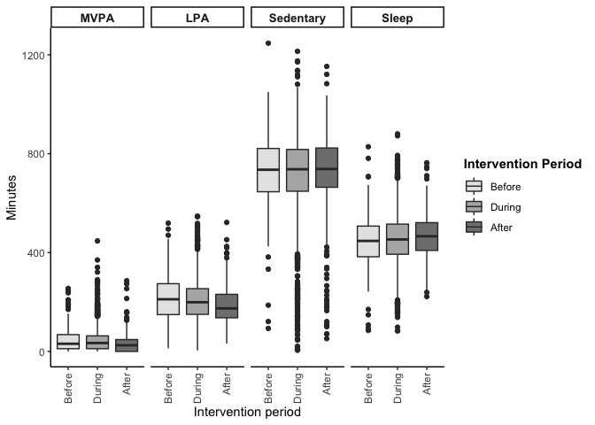
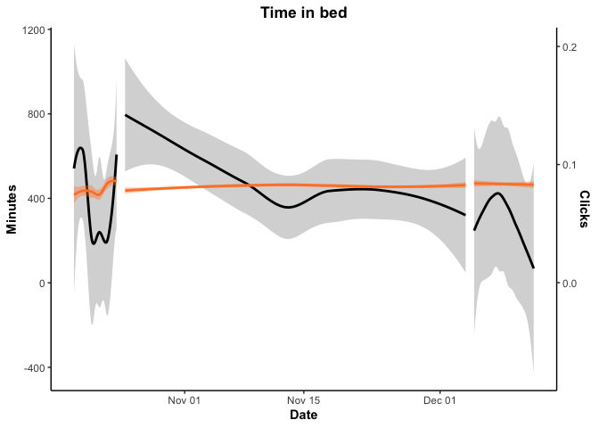
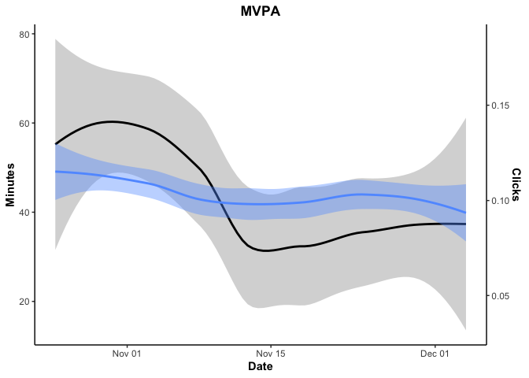
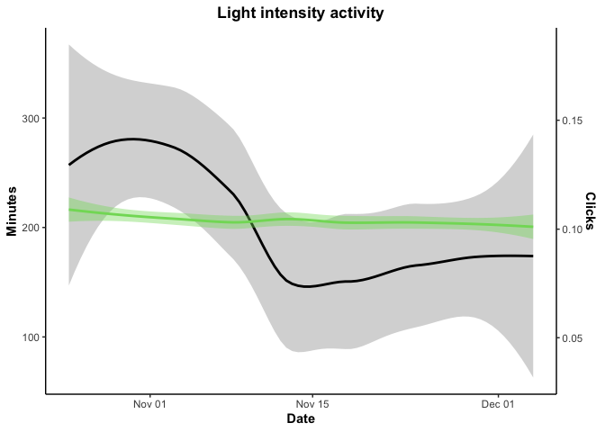

# Fitbit analysis

**Summary**

This script contains a few simplified figures for the CSEP 24 hour movement guideline proof of concept paper. 

**Data processing** steps include: 

1. First, **remove participant-days of data where "TotalTimeInBed" is 0**. Eliminating these records (n~500, need to confirm) also removes all participants-days with 0 total steps, 0 minutes of light physical activity and 1440 minutes of sedentary time. This step happens in the "fitbit-wrangling" file and the records are omitted from the TOP. 
2. Second, **remove participant-days with less than 10 hours of wear time**. Minute-level data was identified as "non-wear time" if the current minute and the previous 9 minutes each had 0 steps, missing heart rate AND were flagged as having "sedentary" intensity. If these conditions are met, all 10 minutes are flagged as "non-wear time". If at least one minute has >0 steps, non-sedentary intensity OR a heart rate value, none of the 10 minutes are flagged as non-wear time. Total non-wear minutes were then summed per participant and day, and days with > 840 minutes of non-wear time were excluded from analysis (n=3). This steps occurs within this script. 
3. Third, **remove the first day of data (October 18, 2021)** because the mean number of non-wear minutes across participant was an order of magnitude higher than the second highest day (~650 minutes vs. ~62 minutes), which led to artificially low light PA, and sleep, but inflated sedentary time. 

**Analysis includes:**

1. Scatter plot and trend (using LOESS) of each movement behaviour (a) over the study period, and (b) seperately before, during and after the intervention period. 
2. Box plot of each behaviour type before, during and after the intervention period. 
3. Trend in daily clicks (any) vs. daily minutes of each movemebt behaviour before, during and after the intervention period (where trends are illustrated using LOESS curves fit to data from each period seperately)
4. Trend in daily clicks (on intervention content specifically) vs. daily minutes of each movement behaviour within the intervention period specifically (again using LOESS curves to illustrate trends) 


### Read in and format data

Read in data

```r
daily <- read.csv("daily-TOP-CSEP.csv")
str(daily$date)
```

```
##  chr [1:3603] "2021-10-19" "2021-10-20" "2021-10-21" "2021-10-22" ...
```

Make sure that the intervention variable and the weekday variables are formatted as factors where the intervention periods and weekdays are ordered correctly (pre, intervention, post; monday, tuesday, etc.)

```r
  daily$weekday<-factor(daily$weekday,
                        levels=c("Monday","Tuesday","Wednesday","Thursday","Friday","Saturday","Sunday"))
  daily$intervention<-factor(daily$intervention,levels=c("pre","intervention","post"))
  daily$date<-as.Date(daily$date)
  str(daily$weekday)
```

```
##  Factor w/ 7 levels "Monday","Tuesday",..: 2 3 4 5 6 7 1 2 3 4 ...
```

```r
  str(daily$intervention)
```

```
##  Factor w/ 3 levels "pre","intervention",..: 1 1 1 1 1 1 2 2 2 2 ...
```

Create person-day-level for plots. Currently, the "daily" dataframe has one row per person-day-article, so if someone engages with two different articles, they have two rows in the dataframe. I want a maximum of one row per person per day for data exploration. 

```r
  dailyForPlots<-daily[!is.na(daily$totalMVPA),] %>% select(-title,-intervention_content,-featured_content,
                                                            -pubdate,-weekofpublish,
                                                            -type,-click,-engage,-clickInt,-engageInt)
  dailyForPlots<-distinct(dailyForPlots)
# tentative: remove particiapnt-days with less than 10 hours of wear time (so 14 hours or more of non-wear time)
  # 14 * 60 = 840 (840 minutes or more of non-wear time) 
```

Remove days where time in bed = 0 

```r
  dailyForPlots<-dailyForPlots[dailyForPlots$TotalTimeInBed!=0,]
```

Remove days with < 10 hours of wear time (14+ hours of non-wear time)

```r
  length(dailyForPlots[dailyForPlots$nonWearMinutes >= 840,]$Id)
```

```
## [1] 3
```

```r
  dailyForPlots<-dailyForPlots[dailyForPlots$nonWearMinutes < 840,]
```

Explore the mean (and max) minutes of non-wear time by day. Numbers on the first day may be influenced by low wear time (e.g., very high sedentary time, low light, low sleep, etc.). Mean non-wear time is an order of magnitude higher on the first day vs. the second highest day (towards the end of the study/during the post-intervention period). As a resul, will also deleted the first day of data

```r
  nonWear<-dailyForPlots %>% select(date,nonWearMinutes) %>% group_by(date) %>% arrange(date) %>%
                             mutate(meanNonWear=mean(nonWearMinutes),
                                    maxNonWear=max(nonWearMinutes)) %>% 
                             select(-nonWearMinutes) %>% distinct() %>% arrange(desc(meanNonWear))
  nonWear
```

```
## # A tibble: 56 × 3
## # Groups:   date [56]
##    date       meanNonWear maxNonWear
##    <date>           <dbl>      <int>
##  1 2021-10-18       659.         716
##  2 2021-12-12        62.7        575
##  3 2021-12-11        56.8        629
##  4 2021-10-31        43.0        478
##  5 2021-12-08        41.4        742
##  6 2021-11-09        38.4        567
##  7 2021-12-10        37.9        275
##  8 2021-10-22        37.6        785
##  9 2021-11-05        35.2        839
## 10 2021-12-06        34.9        550
## # … with 46 more rows
```

```r
  dailyForPlots<-dailyForPlots[dailyForPlots$date>min(dailyForPlots$date),]
```

Explore total minutes of data contributed per particiant day. Should be ~1440 minutes
<!-- -->

## MVPA

<!-- #### Distribution/frequency of MVPA - with and without including 0s -->
<!-- First, lets assess the distribution of MVPA across participant-days. Similar to the engagement metrics, minutes of MVPA is 0 on the majority of participant days. It is easier to see the distribution if you exclude participant-days with 0 minutes if MVPA (right).  -->


### Plot of minutes of MVPA per day over time

#### Trend over study period

Largely stable over time, slight bow (where lower at the beginning and end)
<!-- -->

#### Trend before, during and after intervention

Largely stable over time, particularly during the intervention period. Slightly lower in post-period. 
<!-- -->

<!-- #### Boxplot of MVPA per day and participant, by week -->


## LPA

<!-- #### Distribution/frequency of LPA - with and without including 0s -->
<!-- First, lets assess the distribution of LPA across participant-days. Similar to the engagement metrics, minutes of LPA is 0 on the majority of participant days. It is easier to see the distribution if you exclude participant-days with 0 minutes if LPA (right).  -->


### Plot of minutes of LPA per day over time -- overall and comparing engagers and non-engagers

#### Trend over study period

Slight downward trend in lightly active minutes over time (looks driven by post-period)
<!-- -->

#### Trend before, during and after intervention

Largely stable over time, particularly during the intervention period. Slightly lower in post-period.  
<!-- -->

<!-- #### Boxplot of LPA per day and participant, by week -->


## Sedentary Behaviour

<!-- #### Distribution/frequency of SB - with and without including 0s -->
<!-- First, lets assess the distribution of SB across participant-days. Similar to the engagement metrics, minutes of SB is 0 on the majority of participant days. It is easier to see the distribution if you exclude participant-days with 0 minutes if SB (right).  -->


### Plot of minutes of SB per day over time -- overall and comparing engagers and non-engagers

#### Trend over study period

Slight bow (highest at beginning and end) but more or less stable over time. 
<!-- -->

#### Trend before, during and after intervention

Sedentary time appeared to decrease slightly during the pre-period, otherwise stable over time.  
<!-- -->

<!-- #### Boxplot of SB per day and participant, by week -->


## Sleep

<!-- #### Distribution/frequency of Sleep - with and without including 0s -->
<!-- First, lets assess the distribution of Sleep across participant-days. Similar to the engagement metrics, minutes of Sleep is 0 on the majority of participant days. It is easier to see the distribution if you exclude participant-days with 0 minutes if Sleep (right).  -->


### Plot of minutes of Sleep per day over time -- overall and comparing engagers and non-engagers

#### Trend over study period

Sleep appears to increase slightly over time.
<!-- -->

#### Trend before, during and after intervention

Fit a loess curve to each of the three periods. Appears that sleep increased during each period. 
<!-- -->

<!-- #### Boxplot of SB per day and participant, by week -->


## High-level: All movement behaviours over time 

Plot of all movement behaviours over time

```
## Before During  After 
##   1180  10020   1796
```

<!-- -->

<!-- -->

# Plots

## Line Graph - with engagement and clicks overlayed

### Any clicks across all three periods

The following figures display trends in **clicks on ANY app content compared to trends in each movement behaviour over the course of the study period** (including before, during and after the intervention). The y axis on the left concerns the movement behaviour (colored lines) and the y axis on the right concerns daily clicks on intervention content (black line). 

Re-scale clicks and engagement for plots of each of the four movement behaviours

```r
# MVPA
  dailyForPlots$clickMVPA<-dailyForPlots$dayCountClickAny*(mean(dailyForPlots$totalMVPA)/mean(dailyForPlots$dayCountClickAny))
  dailyForPlots$engageMVPA<-dailyForPlots$dayCountEngageAny*(mean(dailyForPlots$totalMVPA)/mean(dailyForPlots$dayCountEngageAny))

# Lightly Active Minutes
  dailyForPlots$clickLPA<-dailyForPlots$dayCountClickAny*
                          (mean(dailyForPlots$LightlyActiveMinutes)/mean(dailyForPlots$dayCountClickAny))
  dailyForPlots$engageLPA<-dailyForPlots$dayCountEngageAny*
                           (mean(dailyForPlots$LightlyActiveMinutes)/mean(dailyForPlots$dayCountEngageAny))
  
# Sedentary Behavior
  dailyForPlots$clickSB<-dailyForPlots$dayCountClickAny*
                          (mean(dailyForPlots$SedentaryMinutes)/mean(dailyForPlots$dayCountClickAny))
  dailyForPlots$engageSB<-dailyForPlots$dayCountEngageAny*
                          (mean(dailyForPlots$SedentaryMinutes)/mean(dailyForPlots$dayCountEngageAny))
  
# Sleep 
  dailyForPlots$clickSleep<-dailyForPlots$dayCountClickAny*
                            (mean(dailyForPlots$TotalTimeInBed)/mean(dailyForPlots$dayCountClickAny))
  dailyForPlots$engageSleep<-dailyForPlots$dayCountEngageAny*
                            (mean(dailyForPlots$TotalTimeInBed)/mean(dailyForPlots$dayCountEngageAny))
```

<!-- Create a time variable (where Oct 18 = 1, Oct 19 = 2, etc.) -->


#### MVPA
<!-- -->

#### LPA
<!-- -->

#### Sedentary 
<!-- -->

#### Sleep 
<!-- -->
#### Panel figure
<!-- -->


### Intervention clicks during intervention period

The following figures display trends in **clicks on intervention content compared to trends in each movement behaviour over the course of the intervention period**. The y axis on the left concerns the movement behaviour (colored lines) and the y axis on the right concerns daily clicks on intervention content (black line). 

Generate click and engagement variables that are rescaled such that the mean = mean of the respective behaviour for plotting

```r
  dailyInt<-dailyForPlots[dailyForPlots$intervention=="intervention",]

# MVPA
  dailyInt$clickIntMVPA<-dailyInt$dayCountClickInt*
                               (mean(dailyInt$totalMVPA)/mean(dailyInt$dayCountClickInt))
  dailyInt$engageIntMVPA<-dailyInt$dayCountEngageAny*
                               (mean(dailyInt$totalMVPA)/mean(dailyInt$dayCountEngageAny))

# Lightly Active Minutes
  dailyInt$clickIntLPA<-dailyInt$dayCountClickInt*
                          (mean(dailyInt$LightlyActiveMinutes)/mean(dailyInt$dayCountClickInt))
  dailyInt$engageIntLPA<-dailyInt$dayCountEngageAny*
                           (mean(dailyInt$LightlyActiveMinutes)/mean(dailyInt$dayCountEngageAny))
  
# Sedentary Behavior
  dailyInt$clickIntSB<-dailyInt$dayCountClickInt*
                          (mean(dailyInt$SedentaryMinutes)/mean(dailyInt$dayCountClickInt))
  dailyInt$engageIntSB<-dailyInt$dayCountEngageAny*
                          (mean(dailyInt$SedentaryMinutes)/mean(dailyInt$dayCountEngageAny))
  
# Sleep 
  dailyInt$clickIntSleep<-dailyInt$dayCountClickInt*
                            (mean(dailyInt$TotalTimeInBed)/mean(dailyInt$dayCountClickInt))
  dailyInt$engageIntSleep<-dailyInt$dayCountEngageAny*
                            (mean(dailyInt$TotalTimeInBed)/mean(dailyInt$dayCountEngageAny))
```

<!-- Create a time variable (where Oct 18 = 1, Oct 19 = 2, etc.) -->


#### MVPA
<!-- -->

#### Lightly active minutes
<!-- -->

#### Sedentary minutes
<!-- -->

#### Sleep minutes
<!-- -->


#### Panel Figure
<!-- -->

