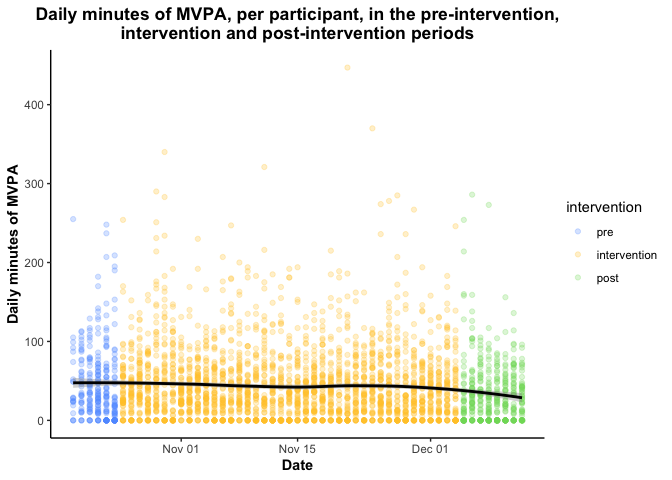
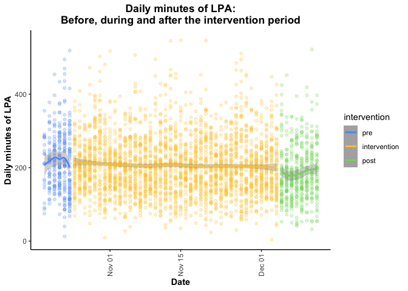
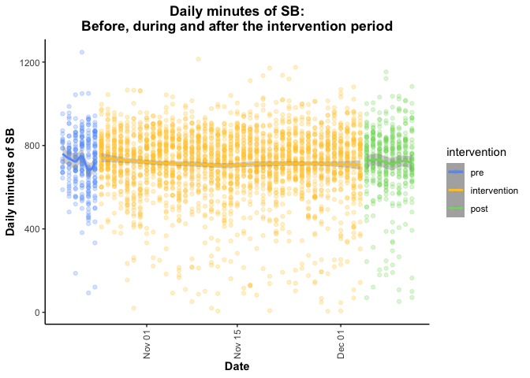
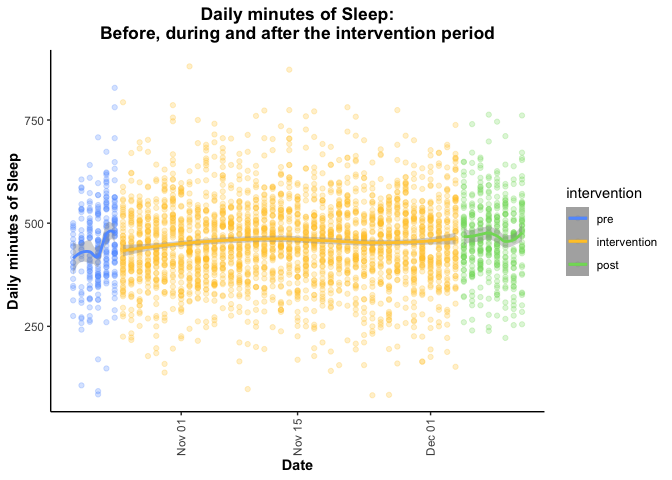
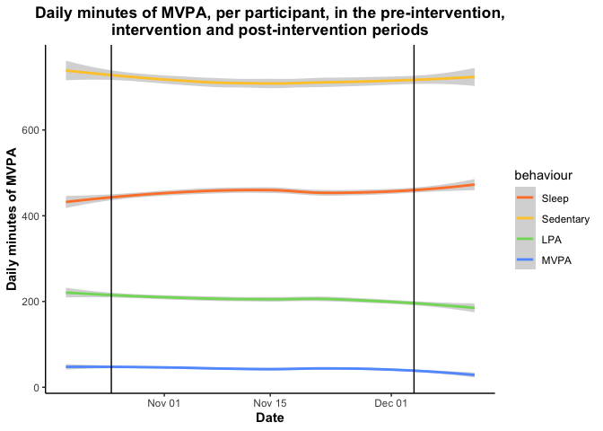
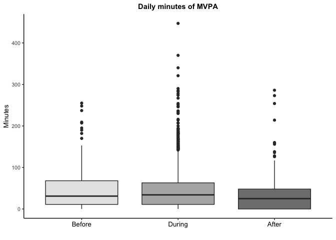
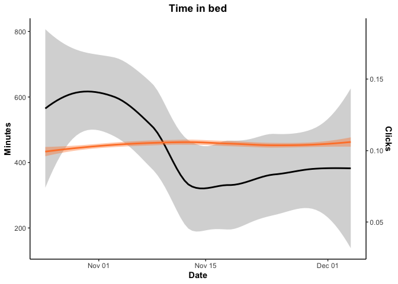

# Fitbit analysis

**Summary**

This script contains a few simplified figures for the CSEP 24 hour movement guideline proof of concept paper. 

**Data processing** steps include: 

1. First, **remove participant-days of data where "TotalTimeInBed" is 0**. Eliminating these records (n~500, need to confirm) also removes all participants-days with 0 total steps, 0 minutes of light physical activity and 1440 minutes of sedentary time. This step happens in the "fitbit-wrangling" file and the records are omitted from the TOP. 
2. Second, **remove participant-days with less than 10 hours of wear time**. Minute-level data was identified as "non-wear time" if the current minute and the previous 9 minutes each had 0 steps, missing heart rate AND were flagged as having "sedentary" intensity. If these conditions are met, all 10 minutes are flagged as "non-wear time". If at least one minute has >0 steps, non-sedentary intensity OR a heart rate value, none of the 10 minutes are flagged as non-wear time. Total non-wear minutes were then summed per participant and day, and days with > 840 minutes of non-wear time were excluded from analysis (n=3). This steps occurs within this script. 
3. Third, **remove the first day of data (October 18, 2021)** because the mean number of non-wear minutes across participant was an order of magnitude higher than the second highest day (~650 minutes vs. ~62 minutes), which led to artificially low light PA, and sleep, but inflated sedentary time. 

**Analysis includes:**

1. Scatter plot and trend (using LOESS) of each movement behaviour (a) over the study period, and (b) seperately before, during and after the intervention period. 
2. Box plot of each behaviour type before, during and after the intervention period. 
3. Trend in daily clicks (any) vs. daily minutes of each movemebt behaviour before, during and after the intervention period (where trends are illustrated using LOESS curves fit to data from each period seperately)
4. Trend in daily clicks (on intervention content specifically) vs. daily minutes of each movement behaviour within the intervention period specifically (again using LOESS curves to illustrate trends) 


### Read in and format data

Read in data

```r
daily <- read.csv("daily-TOP-CSEP.csv")
str(daily$date)
```

```
##  chr [1:3533] "2021-10-19" "2021-10-22" "2021-10-23" "2021-10-24" ...
```

Make sure that the intervention variable and the weekday variables are formatted as factors where the intervention periods and weekdays are ordered correctly (pre, intervention, post; monday, tuesday, etc.)

```r
  daily$weekday<-factor(daily$weekday,
                        levels=c("Monday","Tuesday","Wednesday","Thursday","Friday","Saturday","Sunday"))
  daily$intervention<-factor(daily$intervention,levels=c("pre","intervention","post"))
  daily$date<-as.Date(daily$date)
  str(daily$weekday)
```

```
##  Factor w/ 7 levels "Monday","Tuesday",..: 2 5 6 7 1 3 4 5 6 7 ...
```

```r
  str(daily$intervention)
```

```
##  Factor w/ 3 levels "pre","intervention",..: 1 1 1 1 2 2 2 2 2 2 ...
```

Create person-day-level for plots. Currently, the "daily" dataframe has one row per person-day-article, so if someone engages with two different articles, they have two rows in the dataframe. I want a maximum of one row per person per day for data exploration. 

```r
  dailyForPlots<-daily[!is.na(daily$totalMVPA),] %>% select(-title,-intervention_content,-featured_content,
                                                            -pubdate,-weekofpublish,
                                                            -type,-click,-engage,-clickInt,-engageInt)
  dailyForPlots<-distinct(dailyForPlots)
# tentative: remove particiapnt-days with less than 10 hours of wear time (so 14 hours or more of non-wear time)
  # 14 * 60 = 840 (840 minutes or more of non-wear time) 
```

Recall that we've already removed (a) participant-days with 0 minutes of time in bed (n=), and (b) participant-days with <10 hours of wear time (14+ hours of non-wear time) (n=), and (c) the first day of data for all participants (October 18), since the average number of non-wear minutes across participants was 10 time greater on October 18 (659 minutes) compared to the second highest day (62.7 on December 12, the last day of data collection)

Explore total minutes of data contributed per particiant day. Should be ~1440 minutes
<!-- -->

## MVPA

<!-- #### Distribution/frequency of MVPA - with and without including 0s -->
<!-- First, lets assess the distribution of MVPA across participant-days. Similar to the engagement metrics, minutes of MVPA is 0 on the majority of participant days. It is easier to see the distribution if you exclude participant-days with 0 minutes if MVPA (right).  -->


### Plot of minutes of MVPA per day over time

#### Trend over study period

Largely stable over time, slight bow (where lower at the beginning and end)
<!-- -->

#### Trend before, during and after intervention

Largely stable over time, particularly during the intervention period. Slightly lower in post-period. 
<!-- -->

<!-- #### Boxplot of MVPA per day and participant, by week -->


## LPA

<!-- #### Distribution/frequency of LPA - with and without including 0s -->
<!-- First, lets assess the distribution of LPA across participant-days. Similar to the engagement metrics, minutes of LPA is 0 on the majority of participant days. It is easier to see the distribution if you exclude participant-days with 0 minutes if LPA (right).  -->


### Plot of minutes of LPA per day over time -- overall and comparing engagers and non-engagers

#### Trend over study period

Slight downward trend in lightly active minutes over time (looks driven by post-period)
<!-- -->

#### Trend before, during and after intervention

Largely stable over time, particularly during the intervention period. Slightly lower in post-period.  
<!-- -->

<!-- #### Boxplot of LPA per day and participant, by week -->


## Sedentary Behaviour

<!-- #### Distribution/frequency of SB - with and without including 0s -->
<!-- First, lets assess the distribution of SB across participant-days. Similar to the engagement metrics, minutes of SB is 0 on the majority of participant days. It is easier to see the distribution if you exclude participant-days with 0 minutes if SB (right).  -->


### Plot of minutes of SB per day over time -- overall and comparing engagers and non-engagers

#### Trend over study period

Slight bow (highest at beginning and end) but more or less stable over time. 
<!-- -->

#### Trend before, during and after intervention

Sedentary time appeared to decrease slightly during the pre-period, otherwise stable over time.  
<!-- -->

<!-- #### Boxplot of SB per day and participant, by week -->


## Sleep

<!-- #### Distribution/frequency of Sleep - with and without including 0s -->
<!-- First, lets assess the distribution of Sleep across participant-days. Similar to the engagement metrics, minutes of Sleep is 0 on the majority of participant days. It is easier to see the distribution if you exclude participant-days with 0 minutes if Sleep (right).  -->


### Plot of minutes of Sleep per day over time -- overall and comparing engagers and non-engagers

#### Trend over study period

Sleep appears to increase slightly over time.
<!-- -->

#### Trend before, during and after intervention

Fit a loess curve to each of the three periods. Appears that sleep increased during each period. 
<!-- -->

<!-- #### Boxplot of SB per day and participant, by week -->


## High-level: All movement behaviours over time 

Plot of all movement behaviours over time

```
## Before During  After 
##   1156   9844   1772
```

<!-- -->

<!-- -->


# Plots

## Boxplot - one panel per movement behaviour

#### MVPA
<!-- -->

#### Lightly active minutes
<!-- -->

#### Sedentary time
<!-- -->

#### Sleep
<!-- -->

<!-- -->

## Line Graph - with engagement and clicks overlayed

<!-- ### Any clicks across all three periods -->

<!-- The following figures display trends in **clicks on ANY app content compared to trends in each movement behaviour over the course of the study period** (including before, during and after the intervention). The y axis on the left concerns the movement behaviour (colored lines) and the y axis on the right concerns daily clicks on intervention content (black line).  -->

<!-- Re-scale clicks and engagement for plots of each of the four movement behaviours -->

```r
# # MVPA
#   dailyForPlots$clickMVPA<-dailyForPlots$dayCountClickAny*(mean(dailyForPlots$totalMVPA)/mean(dailyForPlots$dayCountClickAny))
#   dailyForPlots$engageMVPA<-dailyForPlots$dayCountEngageAny*(mean(dailyForPlots$totalMVPA)/mean(dailyForPlots$dayCountEngageAny))
# 
# # Lightly Active Minutes
#   dailyForPlots$clickLPA<-dailyForPlots$dayCountClickAny*
#                           (mean(dailyForPlots$LightlyActiveMinutes)/mean(dailyForPlots$dayCountClickAny))
#   dailyForPlots$engageLPA<-dailyForPlots$dayCountEngageAny*
#                            (mean(dailyForPlots$LightlyActiveMinutes)/mean(dailyForPlots$dayCountEngageAny))
#   
# # Sedentary Behavior
#   dailyForPlots$clickSB<-dailyForPlots$dayCountClickAny*
#                           (mean(dailyForPlots$SedentaryMinutes)/mean(dailyForPlots$dayCountClickAny))
#   dailyForPlots$engageSB<-dailyForPlots$dayCountEngageAny*
#                           (mean(dailyForPlots$SedentaryMinutes)/mean(dailyForPlots$dayCountEngageAny))
#   
# # Sleep 
#   dailyForPlots$clickSleep<-dailyForPlots$dayCountClickAny*
#                             (mean(dailyForPlots$TotalTimeInBed)/mean(dailyForPlots$dayCountClickAny))
#   dailyForPlots$engageSleep<-dailyForPlots$dayCountEngageAny*
#                             (mean(dailyForPlots$TotalTimeInBed)/mean(dailyForPlots$dayCountEngageAny))
```

<!-- Create a time variable (where Oct 18 = 1, Oct 19 = 2, etc.) -->


<!-- #### MVPA -->


<!-- #### LPA -->


<!-- #### Sedentary  -->


<!-- #### Sleep  -->

<!-- #### Panel figure -->


### Intervention clicks during intervention period

The following figures display trends in **clicks on intervention content compared to trends in each movement behaviour over the course of the intervention period**. The y axis on the left concerns the movement behaviour (colored lines) and the y axis on the right concerns daily clicks on intervention content (black line). 

Generate click and engagement variables that are rescaled such that the mean = mean of the respective behaviour for plotting

```r
  dailyInt<-dailyForPlots[dailyForPlots$intervention=="intervention",]

# MVPA
  dailyInt$clickIntMVPA<-dailyInt$dayCountClickInt*
                               (mean(dailyInt$totalMVPA)/mean(dailyInt$dayCountClickInt))
  dailyInt$engageIntMVPA<-dailyInt$dayCountEngageInt*
                               (mean(dailyInt$totalMVPA)/mean(dailyInt$dayCountEngageInt))

# Lightly Active Minutes
  dailyInt$clickIntLPA<-dailyInt$dayCountClickInt*
                          (mean(dailyInt$LightlyActiveMinutes)/mean(dailyInt$dayCountClickInt))
  dailyInt$engageIntLPA<-dailyInt$dayCountEngageInt*
                           (mean(dailyInt$LightlyActiveMinutes)/mean(dailyInt$dayCountEngageInt))
  
# Sedentary Behavior
  dailyInt$clickIntSB<-dailyInt$dayCountClickInt*
                          (mean(dailyInt$SedentaryMinutes)/mean(dailyInt$dayCountClickInt))
  dailyInt$engageIntSB<-dailyInt$dayCountEngageInt*
                          (mean(dailyInt$SedentaryMinutes)/mean(dailyInt$dayCountEngageInt))
  
# Sleep 
  dailyInt$clickIntSleep<-dailyInt$dayCountClickInt*
                            (mean(dailyInt$TotalTimeInBed)/mean(dailyInt$dayCountClickInt))
  dailyInt$engageIntSleep<-dailyInt$dayCountEngageInt*
                            (mean(dailyInt$TotalTimeInBed)/mean(dailyInt$dayCountEngageInt))
```

### Using LOESS smoother

<!-- -->

<!-- -->

<!-- -->

<!-- -->


<!-- -->


### Using multilevel models

Create a time variable (where Oct 18 = 1, Oct 19 = 2, etc.)


#### Clicks 

(a) plot to see what emerges when data is allowed to dictate the shape. *It looks as though there is at least 2 or 3 inflection points... requiring a third or fourth order factor*
<!-- -->

(b) assess models of daily intervention clicks as a function of date/time with and without higher order time parameters. 

```r
# linear, no higher order factors
  test<-lm(dayCountClickInt~nDate,data=dailyInt)
  summary(test)
```

```
## 
## Call:
## lm(formula = dayCountClickInt ~ nDate, data = dailyInt)
## 
## Residuals:
##     Min      1Q  Median      3Q     Max 
## -0.1387 -0.1196 -0.1004 -0.0813  5.9221 
## 
## Coefficients:
##               Estimate Std. Error t value Pr(>|t|)    
## (Intercept)  0.1404164  0.0162173   8.658  < 2e-16 ***
## nDate       -0.0017378  0.0006739  -2.579  0.00997 ** 
## ---
## Signif. codes:  0 '***' 0.001 '**' 0.01 '*' 0.05 '.' 0.1 ' ' 1
## 
## Residual standard error: 0.3964 on 2459 degrees of freedom
## Multiple R-squared:  0.002697,	Adjusted R-squared:  0.002292 
## F-statistic:  6.65 on 1 and 2459 DF,  p-value: 0.009971
```

```r
# linear + quadratic (nDate^2)
  test2<-lm(dayCountClickInt~nDate+I(nDate*nDate),data=dailyInt)
  summary(test2)
```

```
## 
## Call:
## lm(formula = dayCountClickInt ~ nDate + I(nDate * nDate), data = dailyInt)
## 
## Residuals:
##     Min      1Q  Median      3Q     Max 
## -0.1566 -0.1154 -0.0910 -0.0842  5.9163 
## 
## Coefficients:
##                    Estimate Std. Error t value Pr(>|t|)    
## (Intercept)       1.612e-01  2.509e-02   6.423 1.59e-10 ***
## nDate            -4.641e-03  2.763e-03  -1.680   0.0932 .  
## I(nDate * nDate)  6.916e-05  6.385e-05   1.083   0.2788    
## ---
## Signif. codes:  0 '***' 0.001 '**' 0.01 '*' 0.05 '.' 0.1 ' ' 1
## 
## Residual standard error: 0.3964 on 2458 degrees of freedom
## Multiple R-squared:  0.003173,	Adjusted R-squared:  0.002362 
## F-statistic: 3.912 on 2 and 2458 DF,  p-value: 0.02012
```

```r
# linear + cubic (nDate^3)
  test3<-lm(dayCountClickInt~poly(nDate,3),data=dailyInt)
  summary(test3)
```

```
## 
## Call:
## lm(formula = dayCountClickInt ~ poly(nDate, 3), data = dailyInt)
## 
## Residuals:
##     Min      1Q  Median      3Q     Max 
## -0.1412 -0.1236 -0.0941 -0.0793  5.9184 
## 
## Coefficients:
##                 Estimate Std. Error t value Pr(>|t|)    
## (Intercept)      0.10402    0.00799  13.019  < 2e-16 ***
## poly(nDate, 3)1 -1.02216    0.39637  -2.579  0.00997 ** 
## poly(nDate, 3)2  0.42937    0.39637   1.083  0.27880    
## poly(nDate, 3)3  0.34264    0.39637   0.864  0.38744    
## ---
## Signif. codes:  0 '***' 0.001 '**' 0.01 '*' 0.05 '.' 0.1 ' ' 1
## 
## Residual standard error: 0.3964 on 2457 degrees of freedom
## Multiple R-squared:  0.003476,	Adjusted R-squared:  0.002259 
## F-statistic: 2.857 on 3 and 2457 DF,  p-value: 0.03579
```

```r
# compare AIC for the four models
  extractAIC(test)
```

```
## [1]     2.000 -4552.894
```

```r
  extractAIC(test2)
```

```
## [1]     3.000 -4552.068
```

```r
  extractAIC(test3)
```

```
## [1]     4.000 -4550.817
```

(c) models, with random intercept per participant

```r
  click<-lme4::lmer(dayCountClickInt~nDate+(1|Id),data=dailyInt)
```

(d) generate predicted values

```r
  dailyInt$fit_click<-fitted(click)
```

(e) plot predicted value of clicks
<!-- -->

#### Engagement

(a) plot to see what emerges when data is allowed to dictate the shape. 
<!-- -->

(b) assess models of daily intervention engagement as a function of date/time with and without higher order time parameters.  

```r
# linear, no higher order factors
  test<-lm(dayCountEngageInt~nDate,data=dailyInt)
  summary(test)
```

```
## 
## Call:
## lm(formula = dayCountEngageInt ~ nDate, data = dailyInt)
## 
## Residuals:
##     Min      1Q  Median      3Q     Max 
## -0.1042 -0.0868 -0.0695 -0.0537  5.9510 
## 
## Coefficients:
##               Estimate Std. Error t value Pr(>|t|)    
## (Intercept)  0.1057653  0.0131270   8.057 1.21e-15 ***
## nDate       -0.0015772  0.0005455  -2.892  0.00387 ** 
## ---
## Signif. codes:  0 '***' 0.001 '**' 0.01 '*' 0.05 '.' 0.1 ' ' 1
## 
## Residual standard error: 0.3208 on 2459 degrees of freedom
## Multiple R-squared:  0.003389,	Adjusted R-squared:  0.002983 
## F-statistic: 8.361 on 1 and 2459 DF,  p-value: 0.003867
```

```r
# linear + quadratic (nDate^2)
  test2<-lm(dayCountEngageInt~nDate+I(nDate*nDate),data=dailyInt)
  summary(test2)
```

```
## 
## Call:
## lm(formula = dayCountEngageInt ~ nDate + I(nDate * nDate), data = dailyInt)
## 
## Residuals:
##     Min      1Q  Median      3Q     Max 
## -0.1185 -0.0835 -0.0619 -0.0546  5.9463 
## 
## Coefficients:
##                    Estimate Std. Error t value Pr(>|t|)    
## (Intercept)       1.224e-01  2.031e-02   6.025 1.95e-09 ***
## nDate            -3.899e-03  2.237e-03  -1.743   0.0814 .  
## I(nDate * nDate)  5.532e-05  5.168e-05   1.070   0.2845    
## ---
## Signif. codes:  0 '***' 0.001 '**' 0.01 '*' 0.05 '.' 0.1 ' ' 1
## 
## Residual standard error: 0.3208 on 2458 degrees of freedom
## Multiple R-squared:  0.003853,	Adjusted R-squared:  0.003043 
## F-statistic: 4.754 on 2 and 2458 DF,  p-value: 0.008699
```

```r
# linear + cubic (nDate^3)
  test3<-lm(dayCountEngageInt~poly(nDate,3),data=dailyInt)
  summary(test3)
```

```
## 
## Call:
## lm(formula = dayCountEngageInt ~ poly(nDate, 3), data = dailyInt)
## 
## Residuals:
##     Min      1Q  Median      3Q     Max 
## -0.1156 -0.0850 -0.0614 -0.0543  5.9467 
## 
## Coefficients:
##                  Estimate Std. Error t value Pr(>|t|)    
## (Intercept)      0.072735   0.006468  11.245  < 2e-16 ***
## poly(nDate, 3)1 -0.927710   0.320890  -2.891  0.00387 ** 
## poly(nDate, 3)2  0.343442   0.320890   1.070  0.28460    
## poly(nDate, 3)3  0.063484   0.320890   0.198  0.84319    
## ---
## Signif. codes:  0 '***' 0.001 '**' 0.01 '*' 0.05 '.' 0.1 ' ' 1
## 
## Residual standard error: 0.3209 on 2457 degrees of freedom
## Multiple R-squared:  0.003869,	Adjusted R-squared:  0.002653 
## F-statistic: 3.181 on 3 and 2457 DF,  p-value: 0.02305
```

```r
# compare AIC for the four models
  extractAIC(test)
```

```
## [1]     2.000 -5593.446
```

```r
  extractAIC(test2)
```

```
## [1]     3.000 -5592.593
```

```r
  extractAIC(test3)
```

```
## [1]     4.000 -5590.632
```

(c) models, with random intercept per participant

```r
  engage<-lme4::lmer(dayCountEngageInt~nDate+(1|Id),data=dailyInt)
```

(d) generate predicted values

```r
  dailyInt$fit_engage<-fitted(engage)
```

(e) plot predicted values of daily engagement over time
<!-- -->

#### MVPA: 

(a) plot to see what emerges when data is allowed to dictate the shape. 
<!-- -->

(b) assess models of daily intervention engagement as a function of date/time with and without higher order time parameters.  

```r
# linear, no higher order factors
  test<-lm(totalMVPA~nDate,data=dailyInt)
  summary(test)
```

```
## 
## Call:
## lm(formula = totalMVPA ~ nDate, data = dailyInt)
## 
## Residuals:
##    Min     1Q Median     3Q    Max 
## -47.75 -32.80 -10.73  18.52 403.84 
## 
## Coefficients:
##             Estimate Std. Error t value Pr(>|t|)    
## (Intercept) 47.91702    1.86124  25.745   <2e-16 ***
## nDate       -0.16998    0.07734  -2.198   0.0281 *  
## ---
## Signif. codes:  0 '***' 0.001 '**' 0.01 '*' 0.05 '.' 0.1 ' ' 1
## 
## Residual standard error: 45.49 on 2459 degrees of freedom
## Multiple R-squared:  0.001961,	Adjusted R-squared:  0.001555 
## F-statistic: 4.831 on 1 and 2459 DF,  p-value: 0.02805
```

```r
# linear + quadratic (nDate^2)
  test2<-lm(totalMVPA~nDate+I(nDate*nDate),data=dailyInt)
  summary(test2)
```

```
## 
## Call:
## lm(formula = totalMVPA ~ nDate + I(nDate * nDate), data = dailyInt)
## 
## Residuals:
##    Min     1Q Median     3Q    Max 
## -49.59 -32.45 -10.62  18.40 404.49 
## 
## Coefficients:
##                   Estimate Std. Error t value Pr(>|t|)    
## (Intercept)      50.054233   2.879489  17.383   <2e-16 ***
## nDate            -0.469165   0.317137  -1.479    0.139    
## I(nDate * nDate)  0.007128   0.007328   0.973    0.331    
## ---
## Signif. codes:  0 '***' 0.001 '**' 0.01 '*' 0.05 '.' 0.1 ' ' 1
## 
## Residual standard error: 45.49 on 2458 degrees of freedom
## Multiple R-squared:  0.002345,	Adjusted R-squared:  0.001533 
## F-statistic: 2.888 on 2 and 2458 DF,  p-value: 0.05585
```

```r
# linear + cubic (nDate^3)
  test3<-lm(totalMVPA~poly(nDate,3),data=dailyInt)
  summary(test3)
```

```
## 
## Call:
## lm(formula = totalMVPA ~ poly(nDate, 3), data = dailyInt)
## 
## Residuals:
##    Min     1Q Median     3Q    Max 
## -50.79 -32.42 -10.88  18.68 403.91 
## 
## Coefficients:
##                 Estimate Std. Error t value Pr(>|t|)    
## (Intercept)      44.3572     0.9171  48.365   <2e-16 ***
## poly(nDate, 3)1 -99.9831    45.4973  -2.198   0.0281 *  
## poly(nDate, 3)2  44.2515    45.4973   0.973   0.3308    
## poly(nDate, 3)3 -26.3536    45.4973  -0.579   0.5625    
## ---
## Signif. codes:  0 '***' 0.001 '**' 0.01 '*' 0.05 '.' 0.1 ' ' 1
## 
## Residual standard error: 45.5 on 2457 degrees of freedom
## Multiple R-squared:  0.002481,	Adjusted R-squared:  0.001263 
## F-statistic: 2.037 on 3 and 2457 DF,  p-value: 0.1066
```

```r
# compare AIC for the four models
  extractAIC(test)
```

```
## [1]     2.00 18791.77
```

```r
  extractAIC(test2)
```

```
## [1]     3.00 18792.82
```

```r
  extractAIC(test3)
```

```
## [1]     4.00 18794.49
```

(c) models, with random intercept per participant

```r
  mvpa<-lme4::lmer(totalMVPA~nDate+(1|Id),data=dailyInt)
```

(d) generate predicted values

```r
  dailyInt$fit_mvpa<-fitted(mvpa)
```

(e) rescale engagement and click data for plotting with MVPA

```r
  dailyInt$click_mvpa<-dailyInt$fit_click*
                               (mean(dailyInt$fit_mvpa)/mean(dailyInt$fit_click))
  dailyInt$engage_mvpa<-dailyInt$fit_engage*
                               (mean(dailyInt$fit_mvpa)/mean(dailyInt$fit_engage))
```

(f) plot predicted values of MVPA over time + predicted values of intervention clicks
<!-- --><!-- -->


#### Lightly active minutes:

(a) plot to see what emerges when data is allowed to dictate the shape. 
<!-- -->

(b) assess models of daily intervention engagement as a function of date/time with and without higher order time parameters.  

```r
# linear, no higher order factors
  test<-lm(LightlyActiveMinutes~nDate,data=dailyInt)
  summary(test)
```

```
## 
## Call:
## lm(formula = LightlyActiveMinutes ~ nDate, data = dailyInt)
## 
## Residuals:
##     Min      1Q  Median      3Q     Max 
## -201.31  -56.69   -7.46   47.46  341.07 
## 
## Coefficients:
##             Estimate Std. Error t value Pr(>|t|)    
## (Intercept) 212.1879     3.2366   65.56   <2e-16 ***
## nDate        -0.2689     0.1345   -2.00   0.0456 *  
## ---
## Signif. codes:  0 '***' 0.001 '**' 0.01 '*' 0.05 '.' 0.1 ' ' 1
## 
## Residual standard error: 79.11 on 2459 degrees of freedom
## Multiple R-squared:  0.001624,	Adjusted R-squared:  0.001218 
## F-statistic: 3.999 on 1 and 2459 DF,  p-value: 0.04564
```

```r
# linear + quadratic (nDate^2)
  test2<-lm(LightlyActiveMinutes~nDate+I(nDate*nDate),data=dailyInt)
  summary(test2)
```

```
## 
## Call:
## lm(formula = LightlyActiveMinutes ~ nDate + I(nDate * nDate), 
##     data = dailyInt)
## 
## Residuals:
##     Min      1Q  Median      3Q     Max 
## -201.70  -57.02   -7.69   47.94  341.82 
## 
## Coefficients:
##                   Estimate Std. Error t value Pr(>|t|)    
## (Intercept)      214.33475    5.00797  42.799   <2e-16 ***
## nDate             -0.56948    0.55156  -1.032    0.302    
## I(nDate * nDate)   0.00716    0.01274   0.562    0.574    
## ---
## Signif. codes:  0 '***' 0.001 '**' 0.01 '*' 0.05 '.' 0.1 ' ' 1
## 
## Residual standard error: 79.12 on 2458 degrees of freedom
## Multiple R-squared:  0.001752,	Adjusted R-squared:  0.0009396 
## F-statistic: 2.157 on 2 and 2458 DF,  p-value: 0.1159
```

```r
# linear + cubic (nDate^3)
  test3<-lm(LightlyActiveMinutes~poly(nDate,3),data=dailyInt)
  summary(test3)
```

```
## 
## Call:
## lm(formula = LightlyActiveMinutes ~ poly(nDate, 3), data = dailyInt)
## 
## Residuals:
##     Min      1Q  Median      3Q     Max 
## -200.94  -56.52   -7.69   47.47  341.47 
## 
## Coefficients:
##                 Estimate Std. Error t value Pr(>|t|)    
## (Intercept)      206.555      1.595 129.505   <2e-16 ***
## poly(nDate, 3)1 -158.193     79.124  -1.999   0.0457 *  
## poly(nDate, 3)2   44.452     79.124   0.562   0.5743    
## poly(nDate, 3)3  -62.432     79.124  -0.789   0.4302    
## ---
## Signif. codes:  0 '***' 0.001 '**' 0.01 '*' 0.05 '.' 0.1 ' ' 1
## 
## Residual standard error: 79.12 on 2457 degrees of freedom
## Multiple R-squared:  0.002005,	Adjusted R-squared:  0.0007862 
## F-statistic: 1.645 on 3 and 2457 DF,  p-value: 0.1769
```

```r
# compare AIC for the four models
  extractAIC(test)
```

```
## [1]     2.00 21515.06
```

```r
  extractAIC(test2)
```

```
## [1]     3.00 21516.75
```

```r
  extractAIC(test3)
```

```
## [1]     4.00 21518.13
```

(c) models, with random intercept per participant

```r
  LPA<-lme4::lmer(LightlyActiveMinutes~nDate+(1|Id),data=dailyInt)
```

(d) generate predicted values

```r
  dailyInt$fit_LPA<-fitted(LPA)
```

(e) rescale engagement and click data for plotting with LPA

```r
  dailyInt$click_LPA<-dailyInt$fit_click*
                               (mean(dailyInt$fit_LPA)/mean(dailyInt$fit_click))
  dailyInt$engage_LPA<-dailyInt$fit_engage*
                               (mean(dailyInt$fit_LPA)/mean(dailyInt$fit_engage))
```

(f) plot predicted values LPA over time + predicted values of intervention clicks 
<!-- --><!-- -->


#### Sedentary minutes:

(a) plot to see what emerges when data is allowed to dictate the shape. 
<!-- -->

(b) assess models of daily intervention engagement as a function of date/time with and without higher order time parameters.  

```r
# linear, no higher order factors
  test<-lm(SedentaryMinutes~nDate,data=dailyInt)
  summary(test)
```

```
## 
## Call:
## lm(formula = SedentaryMinutes ~ nDate, data = dailyInt)
## 
## Residuals:
##     Min      1Q  Median      3Q     Max 
## -709.59  -65.96   22.61  100.93  496.96 
## 
## Coefficients:
##             Estimate Std. Error t value Pr(>|t|)    
## (Intercept) 724.7499     6.6179 109.514   <2e-16 ***
## nDate        -0.4821     0.2750  -1.753   0.0797 .  
## ---
## Signif. codes:  0 '***' 0.001 '**' 0.01 '*' 0.05 '.' 0.1 ' ' 1
## 
## Residual standard error: 161.7 on 2459 degrees of freedom
## Multiple R-squared:  0.001248,	Adjusted R-squared:  0.0008422 
## F-statistic: 3.074 on 1 and 2459 DF,  p-value: 0.07969
```

```r
# linear + quadratic (nDate^2)
  test2<-lm(SedentaryMinutes~nDate+I(nDate*nDate),data=dailyInt)
  summary(test2)
```

```
## 
## Call:
## lm(formula = SedentaryMinutes ~ nDate + I(nDate * nDate), data = dailyInt)
## 
## Residuals:
##     Min      1Q  Median      3Q     Max 
## -706.03  -65.46   21.79   99.64  501.92 
## 
## Coefficients:
##                   Estimate Std. Error t value Pr(>|t|)    
## (Intercept)      737.59567   10.23475  72.068   <2e-16 ***
## nDate             -2.28034    1.12722  -2.023   0.0432 *  
## I(nDate * nDate)   0.04284    0.02605   1.645   0.1001    
## ---
## Signif. codes:  0 '***' 0.001 '**' 0.01 '*' 0.05 '.' 0.1 ' ' 1
## 
## Residual standard error: 161.7 on 2458 degrees of freedom
## Multiple R-squared:  0.002347,	Adjusted R-squared:  0.001535 
## F-statistic: 2.891 on 2 and 2458 DF,  p-value: 0.05572
```

```r
# linear + cubic (nDate^3)
  test3<-lm(SedentaryMinutes~poly(nDate,3),data=dailyInt)
  summary(test3)
```

```
## 
## Call:
## lm(formula = SedentaryMinutes ~ poly(nDate, 3), data = dailyInt)
## 
## Residuals:
##     Min      1Q  Median      3Q     Max 
## -707.31  -65.16   21.07  101.07  505.51 
## 
## Coefficients:
##                 Estimate Std. Error t value Pr(>|t|)    
## (Intercept)      714.653      3.259 219.290   <2e-16 ***
## poly(nDate, 3)1 -283.574    161.671  -1.754   0.0796 .  
## poly(nDate, 3)2  265.975    161.671   1.645   0.1001    
## poly(nDate, 3)3 -206.312    161.671  -1.276   0.2020    
## ---
## Signif. codes:  0 '***' 0.001 '**' 0.01 '*' 0.05 '.' 0.1 ' ' 1
## 
## Residual standard error: 161.7 on 2457 degrees of freedom
## Multiple R-squared:  0.003007,	Adjusted R-squared:  0.00179 
## F-statistic: 2.471 on 3 and 2457 DF,  p-value: 0.06013
```

```r
# compare AIC for the four models
  extractAIC(test)
```

```
## [1]     2.00 25035.49
```

```r
  extractAIC(test2)
```

```
## [1]     3.00 25034.78
```

```r
  extractAIC(test3)
```

```
## [1]     4.00 25035.15
```

(c) models, with random intercept per participant

```r
  SB<-lme4::lmer(SedentaryMinutes~nDate+I(nDate*nDate)+(1|Id),data=dailyInt)
```

(d) generate predicted values

```r
  dailyInt$fit_SB<-fitted(SB)
```

(e) rescale engagement and click data for plotting with SB

```r
  dailyInt$click_SB<-dailyInt$fit_click*
                               (mean(dailyInt$fit_SB)/mean(dailyInt$fit_click))
  dailyInt$engage_SB<-dailyInt$fit_engage*
                               (mean(dailyInt$fit_SB)/mean(dailyInt$fit_engage))
```

(f) plot predicted values SB over time + predicted values of intervention clicks
<!-- --><!-- -->


#### Sleep minutes:

(a) plot to see what emerges when data is allowed to dictate the shape. 
<!-- -->

(b) assess models of daily intervention engagement as a function of date/time with and without higher order time parameters.  

```r
# linear, no higher order factors
  test<-lm(TotalTimeInBed~nDate,data=dailyInt)
  summary(test)
```

```
## 
## Call:
## lm(formula = TotalTimeInBed ~ nDate, data = dailyInt)
## 
## Residuals:
##     Min      1Q  Median      3Q     Max 
## -374.00  -60.72   -0.25   61.42  429.66 
## 
## Coefficients:
##             Estimate Std. Error t value Pr(>|t|)    
## (Intercept) 447.6163     4.1255 108.500   <2e-16 ***
## nDate         0.3027     0.1714   1.766   0.0776 .  
## ---
## Signif. codes:  0 '***' 0.001 '**' 0.01 '*' 0.05 '.' 0.1 ' ' 1
## 
## Residual standard error: 100.8 on 2459 degrees of freedom
## Multiple R-squared:  0.001266,	Adjusted R-squared:  0.0008601 
## F-statistic: 3.118 on 1 and 2459 DF,  p-value: 0.07757
```

```r
# linear + quadratic (nDate^2)
  test2<-lm(TotalTimeInBed~nDate+I(nDate*nDate),data=dailyInt)
  summary(test2)
```

```
## 
## Call:
## lm(formula = TotalTimeInBed ~ nDate + I(nDate * nDate), data = dailyInt)
## 
## Residuals:
##     Min      1Q  Median      3Q     Max 
## -375.32  -61.18   -0.54   60.36  429.76 
## 
## Coefficients:
##                   Estimate Std. Error t value Pr(>|t|)    
## (Intercept)      437.80681    6.37843  68.639   <2e-16 ***
## nDate              1.67589    0.70250   2.386   0.0171 *  
## I(nDate * nDate)  -0.03272    0.01623  -2.016   0.0440 *  
## ---
## Signif. codes:  0 '***' 0.001 '**' 0.01 '*' 0.05 '.' 0.1 ' ' 1
## 
## Residual standard error: 100.8 on 2458 degrees of freedom
## Multiple R-squared:  0.002914,	Adjusted R-squared:  0.002103 
## F-statistic: 3.592 on 2 and 2458 DF,  p-value: 0.02768
```

```r
# linear + cubic (nDate^3)
  test3<-lm(TotalTimeInBed~poly(nDate,3),data=dailyInt)
  summary(test3)
```

```
## 
## Call:
## lm(formula = TotalTimeInBed ~ poly(nDate, 3), data = dailyInt)
## 
## Residuals:
##     Min      1Q  Median      3Q     Max 
## -369.85  -60.70   -0.17   60.92  425.13 
## 
## Coefficients:
##                 Estimate Std. Error t value Pr(>|t|)    
## (Intercept)       453.95       2.03 223.676   <2e-16 ***
## poly(nDate, 3)1   178.04     100.68   1.768   0.0771 .  
## poly(nDate, 3)2  -203.11     100.68  -2.017   0.0438 *  
## poly(nDate, 3)3   230.78     100.68   2.292   0.0220 *  
## ---
## Signif. codes:  0 '***' 0.001 '**' 0.01 '*' 0.05 '.' 0.1 ' ' 1
## 
## Residual standard error: 100.7 on 2457 degrees of freedom
## Multiple R-squared:  0.005042,	Adjusted R-squared:  0.003827 
## F-statistic:  4.15 on 3 and 2457 DF,  p-value: 0.006069
```

```r
# compare AIC for the four models
  extractAIC(test)
```

```
## [1]     2.0 22709.4
```

```r
  extractAIC(test2)
```

```
## [1]     3.00 22707.33
```

```r
  extractAIC(test3)
```

```
## [1]     4.00 22704.08
```

(c) models, with random intercept per participant

```r
  sleep<-lme4::lmer(TotalTimeInBed~poly(nDate,3)+(1|Id),data=dailyInt)
```

(d) generate predicted values

```r
  dailyInt$fit_sleep<-fitted(sleep)
```

(e) rescale engagement and click data for plotting with Sleep

```r
  dailyInt$click_sleep<-dailyInt$fit_click*
                               (mean(dailyInt$fit_sleep)/mean(dailyInt$fit_click))
  dailyInt$engage_sleep<-dailyInt$fit_engage*
                               (mean(dailyInt$fit_sleep)/mean(dailyInt$fit_engage))
```

(f) plot predicted values Sleep over time + predicted values of intervention clicks
<!-- --><!-- -->

##### Panel figures
<!-- -->

<!-- -->
