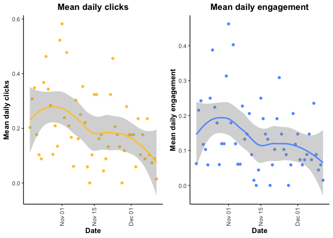
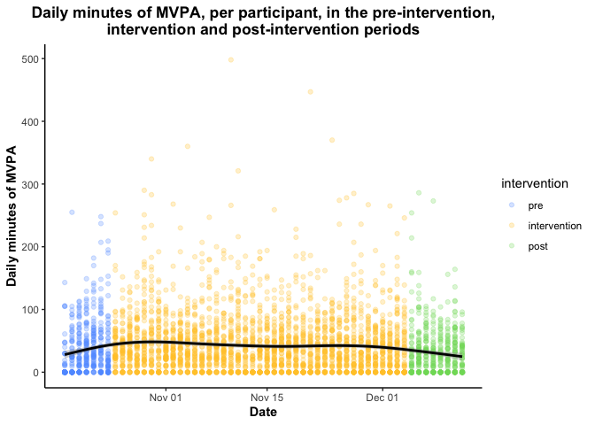
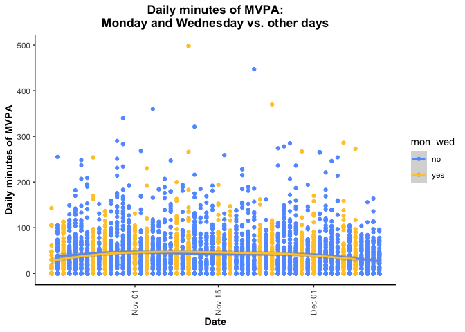
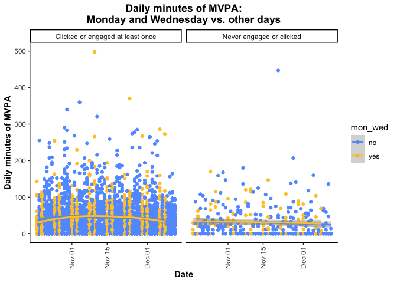
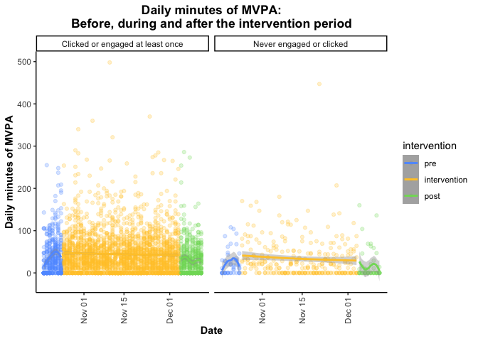

As per discussions last week, the plan is to: 
(1) Prepare visualizations using the FitBit day-level intensity data

# 1. Read in Data

## A. FitBit Data

### Read in and consolidate data

There are 18 csv files from each of four time periods. Read in all data from each of the four time periods (folder). 


```r
# sample data
  sample<-list.files("sample_data", pattern="*.csv", full.names=TRUE)
  sample_csv<-lapply(sample, read.csv)
  names(sample_csv)<-paste(gsub("sample_data/|.csv","",sample),".1",sep="")
  list2env(sample_csv,envir=.GlobalEnv)
  rm(sample,sample_csv)

# nov 08 - nov 21
  nov08<-list.files("fitbit_data/nov08-nov21", pattern="*.csv", full.names=TRUE)
  nov08_csv<-lapply(nov08, read.csv)
  names(nov08_csv)<-paste(gsub("fitbit_data/nov08-nov21/|.csv","",nov08),".2",sep="")
  list2env(nov08_csv,envir=.GlobalEnv)
  rm(nov08,nov08_csv)
  
# nov 22 - dec 05
  nov22<-list.files("fitbit_data/nov22-dec05", pattern="*.csv", full.names=TRUE)
  nov22_csv<-lapply(nov22, read.csv)
  names(nov22_csv)<-paste(gsub("fitbit_data/nov22-dec05/|.csv","",nov22),".3",sep="")
  list2env(nov22_csv,envir=.GlobalEnv)
  rm(nov22,nov22_csv)

# dec 06 - dec 12
  dec06<-list.files("fitbit_data/dec06-dec12", pattern="*.csv", full.names=TRUE)
  dec06_csv<-lapply(dec06, read.csv)
  names(dec06_csv)<-paste(gsub("fitbit_data/dec06-dec12/|.csv","",dec06),".4",sep="")
  list2env(dec06_csv,envir=.GlobalEnv)
  rm(dec06,dec06_csv)
```

Now consolidate data from four time periods. This will leave us with 18 unique dataframes. 


```r
# generate list of unique datasets (there are 18)
  files<-unique(gsub("\\.1|\\.2|\\.3|\\.4","",ls()))
    
# for each unique type of data, rbind data from the three periods together
  for(i in 1:length(files)) {
      
      pattern<-files[i]
      X<-mget(ls(pattern=pattern)) %>% bind_rows()
      distinct(X)
      assign(gsub("_merged","",pattern),X)
      rm(list = ls()[grepl(pattern, ls())])
      rm(X)
      i<-i+1
      
    }
    
# clean environment
  rm(i,pattern,files)
```

The 18 data types are as follows: 


```r
  ls()
```

```
##  [1] "30secondSleepStages"     "activitylogs"           
##  [3] "battery"                 "dailyCalories"          
##  [5] "dailyIntensities"        "dailySteps"             
##  [7] "heartrate_1min"          "heartRateZones"         
##  [9] "minuteCaloriesNarrow"    "minuteIntensitiesNarrow"
## [11] "minuteMETsNarrow"        "minuteSleep"            
## [13] "minuteStepsNarrow"       "sleepDay"               
## [15] "sleepLogInfo"            "sleepStageLogInfo"      
## [17] "sleepStagesDay"          "syncEvents"
```

## B. Read in demographics and ID


```r
  key <- foreign::read.spss("demo_key/Codes & Demographics.sav", to.data.frame=TRUE)
  key$PAC_Email<-tolower(key$PAC_Email)
  key<-key %>% rename(email=PAC_Email,
                      Id=Fitbit_ID)
  key$email<-gsub(" ","",key$email)
  str(key$email)
```

```
##  chr [1:68] "pacappstudy+a13@gmail.com" "pacappstudy+a04@gmail.com" ...
```

## C. Read in engagement data


```r
  engage<-read_xlsx("engagement_data/17.01.22.24hmg_daily_ps_appengagements.xlsx")
```

# 2. Explore FitBit data

## A. Intra-day data

Intraday datasets including minute-level data: 
  1. heart rate (heartrate_1min)
  2. calories (minuteCaloriesNarrow)
  3. intensity (minuteIntensitiesNarrow)
  4. METs (minuteMETsNarrow)
  5. steps (minuteStepsNarrow)
  6. sleep stage (minuteSleep)

Sleep stage information is also available measured at 30-second increments (30secondSleepStages). 

### Explore intraday data: 

#### i. Minute-level steps:  

Number of steps per minute

```r
  str(minuteStepsNarrow) # steps per minute
```

```
## 'data.frame':	5517524 obs. of  3 variables:
##  $ Id            : chr  "A01" "A01" "A01" "A01" ...
##  $ ActivityMinute: chr  "10/18/2021 12:00:00 AM" "10/18/2021 12:01:00 AM" "10/18/2021 12:02:00 AM" "10/18/2021 12:03:00 AM" ...
##  $ Steps         : int  0 0 0 0 0 0 0 0 0 0 ...
```

0 minutes have missing data for steps -- must be set to 0 during non-wear hours

```r
  length(minuteStepsNarrow[is.na(minuteStepsNarrow$Steps),]$Id)
```

```
## [1] 0
```

Plot of step frequency

```
##    Min. 1st Qu.  Median    Mean 3rd Qu.    Max. 
##   0.000   0.000   0.000   5.784   0.000 211.000
```


#### ii. Minute-level calories

Number of calories per minute. 

```r
  str(minuteCaloriesNarrow) # calories burned each minute
```

```
## 'data.frame':	5517524 obs. of  3 variables:
##  $ Id            : chr  "A01" "A01" "A01" "A01" ...
##  $ ActivityMinute: chr  "10/18/2021 12:00:00 AM" "10/18/2021 12:01:00 AM" "10/18/2021 12:02:00 AM" "10/18/2021 12:03:00 AM" ...
##  $ Calories      : num  1.03 1.03 1.03 1.03 1.03 ...
```

Very few records have 0 calories. Fitbit appears to apply a baseline number of calories per minute based on estimated basal metabolic rate. 

```r
  length(minuteCaloriesNarrow[minuteCaloriesNarrow$Calories==0,]$Id)
```

```
## [1] 4
```

Plot of calorie frequency

```
##    Min. 1st Qu.  Median    Mean 3rd Qu.    Max. 
##  0.0000  0.9598  1.0579  1.5170  1.2703 16.8428
```


#### iii. minute-level activity intensity

Minute-level intensity

```r
  str(minuteIntensitiesNarrow) # intensity of activity during each minute -- 0, 1, 2 and 3
```

```
## 'data.frame':	5517524 obs. of  3 variables:
##  $ Id            : chr  "A01" "A01" "A01" "A01" ...
##  $ ActivityMinute: chr  "10/18/2021 12:00:00 AM" "10/18/2021 12:01:00 AM" "10/18/2021 12:02:00 AM" "10/18/2021 12:03:00 AM" ...
##  $ Intensity     : int  0 0 0 0 0 0 0 0 0 0 ...
```

Plot of intensity frequency

```
##    Min. 1st Qu.  Median    Mean 3rd Qu.    Max. 
##  0.0000  0.0000  0.0000  0.2022  0.0000  3.0000
```

#### iv. minute-level METs

Minute-level METs

```r
  str(minuteMETsNarrow) # MET value measued each minute
```

```
## 'data.frame':	5517524 obs. of  3 variables:
##  $ Id            : chr  "A01" "A01" "A01" "A01" ...
##  $ ActivityMinute: chr  "10/18/2021 12:00:00 AM" "10/18/2021 12:01:00 AM" "10/18/2021 12:02:00 AM" "10/18/2021 12:03:00 AM" ...
##  $ METs          : int  10 10 10 10 10 10 10 10 10 10 ...
```

Plot of strange MET values

```
##    Min. 1st Qu.  Median    Mean 3rd Qu.    Max. 
##    0.00   10.00   10.00   15.11   12.00  137.00
```


#### v. minute-level heart rate (fewer observations than above)

Minute-level heart rate

```r
  str(heartrate_1min) # heart rate measured each minute -- fewer measurements than above
```

```
## 'data.frame':	4889757 obs. of  3 variables:
##  $ Id   : chr  "A01" "A01" "A01" "A01" ...
##  $ Time : chr  "10/18/2021 8:32:00 AM" "10/18/2021 8:33:00 AM" "10/18/2021 8:43:00 AM" "10/18/2021 8:44:00 AM" ...
##  $ Value: int  68 63 70 74 77 75 76 74 72 74 ...
```

Strange MET values

```
##    Min. 1st Qu.  Median    Mean 3rd Qu.    Max. 
##    0.00   10.00   10.00   15.11   12.00  137.00
```

### Merge minute-level activity data into one dataframe

#### merge minute-level calories, intensities, METs and steps


```r
  minute <- minuteCaloriesNarrow %>% full_join(minuteIntensitiesNarrow, by = c("ActivityMinute","Id")) %>%
                                     full_join(minuteMETsNarrow, by = c("ActivityMinute","Id")) %>%
                                     full_join(minuteStepsNarrow, by = c("ActivityMinute","Id")) 
  rm(minuteCaloriesNarrow,minuteIntensitiesNarrow,minuteMETsNarrow,minuteStepsNarrow)
```

#### merge minute-level heart rate data to other minute-level activity data


```r
  heartrate_1min$ActivityMinute<-heartrate_1min$Time
  heartrate_1min<-heartrate_1min %>% select(-Time)
  minute<-merge(minute,heartrate_1min,by=c("ActivityMinute","Id"),all.x=TRUE)
  rm(heartrate_1min)
```

#### generate dateTime and date variables with common naming convention 


```r
  minute$dateTime<-lubridate::mdy_hms(minute$ActivityMinute)
  minute$date<-as.Date(minute$dateTime)
  minute<-minute %>% select(-ActivityMinute)
```

#### assess time period of data


```r
  min(minute$date)
```

```
## [1] "2021-10-18"
```

```r
  max(minute$date)
```

```
## [1] "2021-12-12"
```

### Explore and clean intraday sleep data

Sleep observations can be measured on the half or full minute (one or the other within a given bout of sleep)

```r
  minuteSleep$test1<-ifelse(grepl(":30 ",minuteSleep$date),":30",":00")
  table(minuteSleep$test1)
```

```
## 
##    :00    :30 
## 974209 682160
```

However, all other minute-level data are measured on the full minute. 

```r
  minute$test1<-ifelse(grepl(":30 ",minute$dateTime),":30",":00")
  table(minute$test1)
```

```
## 
##     :00 
## 5517524
```

```r
  minute<-minute %>% select(-test1)
```

In order to merge with the other minute-level data, I will update the date of all observations to the full minute:

```r
# since sleep is either measured at :00 or :30 within a bout of sleep,
# we can update all records to ":00 " without introducing any duplicates
# this is necessary to merge sleep records with the other minute-level data (always measured on full minute)
  minuteSleep$date<-gsub(":30 ",":00 ",minuteSleep$date)
  minuteSleep$dateTime<-lubridate::mdy_hms(minuteSleep$date)
  minuteSleep$date<-as.Date(minuteSleep$dateTime)
  minuteSleep$test2<-ifelse(grepl(":30 ",minuteSleep$date),":30",":00")
  table(minuteSleep$test2)
```

```
## 
##     :00 
## 1656369
```

Check the date range of the sleep data

```r
  summary(minuteSleep$date)
```

```
##         Min.      1st Qu.       Median         Mean      3rd Qu.         Max. 
## "2021-10-18" "2021-11-03" "2021-11-16" "2021-11-16" "2021-11-30" "2021-12-13"
```

Filter to the same date range as the other minute-level data. 

```r
  minuteSleep<-minuteSleep[minuteSleep$date<"2021-12-13",]
```

Another issue: There are many duplicate sleep records (multiple rows corresponding to the same participant-minute):

```r
  test<-minuteSleep %>% select(Id,dateTime) %>% group_by(Id,dateTime) %>% mutate(length=length(Id))
  table(test$length) # this is unrelated to updating the date/time from :30 to :00 above
```

```
## 
##       1       2 
## 1462310  171478
```

```r
  # length(unique(test[test$length==2,]$Id)) 
    # almost every participant has duplicate records for sleep
```

Importantly, all but 6 observations (3 minutes for 1 participants) are exact duplicates (same Id, date AND value)

```r
  test3<-minuteSleep %>% select(Id,dateTime,value) %>% group_by(Id,dateTime) %>% 
                                                       mutate(length=length(Id)) %>%
                                                       mutate(unique=length(unique(value)))
# however, only 6 records (3 minutes for 1 participant) have more than one unique "value" within the same minute
# the rest of the duplicate rows are exact duplicates (same "value" (sleep stage) across both observations)
  table(test3[test3$length==2,]$unique) 
```

```
## 
##      1      2 
## 171472      6
```

```r
  rm(test,test3)
```

I will remove exact duplicates (across all columns in the data frame):

```r
# create de-duplicated version of the minuteSleep dataframe
# need to decide how to handle the 3 minutes with two unique "values"
  minuteSleep<-minuteSleep %>% select(-test1,-test2)
  minuteSleep<-distinct(minuteSleep) 
```

There are still over 800 duplicate records (same participant-minute):

```r
  test4<-minuteSleep %>% select(Id,dateTime,value) %>% group_by(Id,dateTime) %>% 
                                                       mutate(length=length(Id)) %>%
                                                       mutate(unique=length(unique(value)))
  table(test4$length)
```

```
## 
##       1       2 
## 1547616     866
```

It appears as though all 800+ duplicate rows are within the same participant -- the time and value are the same, but the logId differs between observations: 

```r
  minuteSleep<-distinct(minuteSleep, across(-"logId"),.keep_all = TRUE) 
  test4<-minuteSleep %>% select(Id,dateTime,value) %>% group_by(Id,dateTime) %>% 
                                                       mutate(length=length(Id)) %>%
                                                       mutate(unique=length(unique(value)))
  length(unique(test4[test4$length==2,]$Id))
```

```
## [1] 1
```

```r
  table(test4$length)
```

```
## 
##       1       2 
## 1548046       6
```

```r
  duplicates<-test4[test4$length==2,]
  rm(test4)
```

The remaining 6 duplicates represent 3 minutes from one participant where the value also differs between the two observations. I will recode value to NA and then de-duplicate again: 

```r
  minuteSleep$value<-ifelse(minuteSleep$Id %in% duplicates$Id & 
                            minuteSleep$dateTime %in% duplicates$dateTime,NA,minuteSleep$value)
  minuteSleep<-distinct(minuteSleep,across(-"logId"),.keep_all = TRUE) 
```


### Merge minute-level sleep and activity data


```r
  minute <- minute %>% full_join(minuteSleep, by = c("dateTime","Id","date"))
  rm(minuteSleep)
```

Rename columns in minute-level data (so it is clear which columns are minute- vs. day-level)

```r
  minute<-minute %>% rename(minuteCalories=Calories,
                            minuteHeartRate=Value,
                            minuteIntensity=Intensity,
                            minuteMETs=METs,
                            minuteSteps=Steps,
                            minuteSleepStage=value,
                            minuteSleepLogId=logId) %>%
                     relocate(dateTime,.after=Id) %>%
                     relocate(date,.after=dateTime) %>%
                     arrange(Id,dateTime)
  # minute$minuteAwake<-ifelse(is.na(minute$minuteSleepStage),1,0)
  # minute$minuteWearing<-ifelse(is.na(minute$minuteHeartRate),0,1)
```

#### reformat minute-level intensity 


```r
  minute$minuteIntensity1<-minute$minuteIntensity
  minute$minuteIntensity<-ifelse(minute$minuteIntensity==0,"minuteSedentary",
                               ifelse(minute$minuteIntensity==1,"minuteLightlyActive",
                                      ifelse(minute$minuteIntensity==2,"minuteFairlyActive",
                                             ifelse(minute$minuteIntensity==3,"minuteVeryActive",NA))))
  minute$minuteIntensity<-ifelse(is.na(minute$minuteHeartRate),"non-wear",minute$minuteIntensity)
  summary(as.factor(minute$minuteIntensity))
```

```
##  minuteFairlyActive minuteLightlyActive     minuteSedentary    minuteVeryActive 
##               71495              720470             4016690               81102 
##            non-wear 
##              627767
```

```r
  minute$minuteIntensityValue<-1
  minute<-pivot_wider(minute,names_from="minuteIntensity",values_from="minuteIntensityValue")
```

## B. Day-level data

### Explore day-level data

#### i. Day-level calories


```r
  str(dailyCalories)
```

```
## 'data.frame':	3838 obs. of  3 variables:
##  $ Id         : chr  "A01" "A01" "A01" "A01" ...
##  $ ActivityDay: chr  "10/18/2021" "10/19/2021" "10/20/2021" "10/21/2021" ...
##  $ Calories   : int  2214 2072 2376 2383 3072 2119 1853 1992 2112 2892 ...
```

#### ii. Day-level intensities


```r
  str(dailyIntensities)
```

```
## 'data.frame':	3838 obs. of  10 variables:
##  $ Id                      : chr  "A01" "A01" "A01" "A01" ...
##  $ ActivityDay             : chr  "10/18/2021" "10/19/2021" "10/20/2021" "10/21/2021" ...
##  $ SedentaryMinutes        : int  1214 722 510 727 498 845 716 799 720 688 ...
##  $ LightlyActiveMinutes    : int  120 91 144 213 281 97 99 128 128 180 ...
##  $ FairlyActiveMinutes     : int  82 19 69 34 59 27 11 3 21 44 ...
##  $ VeryActiveMinutes       : int  24 33 35 16 79 36 10 9 29 84 ...
##  $ SedentaryActiveDistance : num  0 0 0 0 0 0 0 0 0 0 ...
##  $ LightActiveDistance     : num  2.39 1.93 2.61 2.99 3.64 ...
##  $ ModeratelyActiveDistance: num  2.5 0.92 0.72 0.55 0.89 ...
##  $ VeryActiveDistance      : num  1.42 2.57 2.34 1.22 4.72 ...
```

#### iii. Day-level steps


```r
  str(dailySteps)
```

```
## 'data.frame':	3838 obs. of  3 variables:
##  $ Id         : chr  "A01" "A01" "A01" "A01" ...
##  $ ActivityDay: chr  "10/18/2021" "10/19/2021" "10/20/2021" "10/21/2021" ...
##  $ StepTotal  : int  8859 7607 7953 6722 12891 4539 3636 5424 5500 16156 ...
```

#### iv. Day-level sleep 


```r
  str(sleepDay)
```

```
## 'data.frame':	3386 obs. of  5 variables:
##  $ Id                : chr  "A01" "A01" "A01" "A01" ...
##  $ SleepDay          : chr  "10/19/2021 12:00:00 AM" "10/20/2021 12:00:00 AM" "10/21/2021 12:00:00 AM" "10/22/2021 12:00:00 AM" ...
##  $ TotalSleepRecords : int  1 2 1 1 1 1 1 1 1 1 ...
##  $ TotalMinutesAsleep: int  455 633 474 490 401 565 403 506 420 371 ...
##  $ TotalTimeInBed    : int  490 706 511 523 435 604 427 616 444 426 ...
```

#### v. Day-level sleep stages


```r
  str(sleepStagesDay) # same variables as above (Id, SleepDay, TotalSleepRecords, TotalMinutesAsleep, TotalTimeInBed) plus total minutes awake and spent in each sleep stage (light/deep/REM)
```

```
## 'data.frame':	3855 obs. of  9 variables:
##  $ Id                : chr  "A01" "A01" "A01" "A01" ...
##  $ SleepDay          : chr  "10/18/2021 12:00:00 AM" "10/19/2021 12:00:00 AM" "10/20/2021 12:00:00 AM" "10/21/2021 12:00:00 AM" ...
##  $ TotalSleepRecords : int  0 1 2 1 1 1 1 1 1 1 ...
##  $ TotalMinutesAsleep: int  0 418 633 474 490 374 528 403 506 374 ...
##  $ TotalTimeInBed    : int  0 490 706 511 523 435 604 427 616 444 ...
##  $ TotalTimeAwake    : int  0 72 0 0 0 61 76 0 0 70 ...
##  $ TotalMinutesLight : int  0 316 0 0 0 206 324 0 0 243 ...
##  $ TotalMinutesDeep  : int  0 55 0 0 0 82 89 0 0 32 ...
##  $ TotalMinutesREM   : int  0 47 0 0 0 86 115 0 0 99 ...
```

```r
  # will use sleepStagesDay instead of sleepDay because it contains all of the same and more information
  rm(sleepDay)
```

### Merge day-level activity data


```r
  daily<-dailyCalories %>% full_join(dailyIntensities, by = c("ActivityDay","Id")) %>%
                           full_join(dailySteps, by = c("ActivityDay","Id")) 
  rm(dailyCalories,dailyIntensities,dailySteps)
```

#### generate date variable (named to align with date column in minute-level datasets)


```r
  str(daily$ActivityDay)
```

```
##  chr [1:3838] "10/18/2021" "10/19/2021" "10/20/2021" "10/21/2021" ...
```

```r
  daily$date<-as.Date(daily$ActivityDay,"%m/%d/%Y")
  lubridate::tz(daily$date)
```

```
## [1] "UTC"
```

```r
  min(daily$date)
```

```
## [1] "2021-10-18"
```

```r
  max(daily$date)
```

```
## [1] "2021-12-12"
```

### Merge day-level activity data and day-level sleep data 

#### generate date in the day-level sleep data 


```r
  sleepStagesDay$date<-as.Date(lubridate::mdy_hms(sleepStagesDay$SleepDay))
  min(sleepStagesDay$date)
```

```
## [1] "2021-10-18"
```

```r
  max(sleepStagesDay$date)
```

```
## [1] "2021-12-12"
```

#### merge day-level activity data and day-level sleep data


```r
  daily<-daily %>% full_join(sleepStagesDay, by = c("date","Id"))
  daily<-daily %>% select(-ActivityDay,-SleepDay)
  rm(sleepStagesDay)
```

#### rename columns in day-level data (so it is clear which columns are minute- vs. day-level)


```r
  daily<-daily %>% rename(TotalCalories=Calories) %>%
                   relocate(date,.after=Id) 
  names(daily)
```

```
##  [1] "Id"                       "date"                    
##  [3] "TotalCalories"            "SedentaryMinutes"        
##  [5] "LightlyActiveMinutes"     "FairlyActiveMinutes"     
##  [7] "VeryActiveMinutes"        "SedentaryActiveDistance" 
##  [9] "LightActiveDistance"      "ModeratelyActiveDistance"
## [11] "VeryActiveDistance"       "StepTotal"               
## [13] "TotalSleepRecords"        "TotalMinutesAsleep"      
## [15] "TotalTimeInBed"           "TotalTimeAwake"          
## [17] "TotalMinutesLight"        "TotalMinutesDeep"        
## [19] "TotalMinutesREM"
```

#### create intervention flag in day-level data


```r
  daily$intervention<-ifelse(daily$date < "2021-10-25","pre",
                      ifelse(daily$date >= "2021-12-05","post","intervention"))
  daily$intervention<-factor(daily$intervention,levels=c("pre","intervention","post"))
  table(daily$intervention)
```

```
## 
##          pre intervention         post 
##          474         2829          552
```


### merge minute- and day-level dataframes


```r
  data<-merge(daily,minute,by=c("Id","date"))
```

## add battery (and syncEvents) data

### explore data

#### clean columns in battery data


```r
  battery$dateTime<-as.character(lubridate::mdy_hms(battery$DateTime))
  substr(battery$dateTime,18,19)<-"00"
  battery$dateTime<-as.POSIXct(battery$dateTime,tz="UTC")
  lubridate::tz(battery$dateTime)
```

```
## [1] "UTC"
```

```r
  battery$lastSync<-lubridate::mdy_hms(battery$LastSync)
  battery<-battery %>% select(Id,dateTime,lastSync,DeviceName,BatteryLevel)
```

#### sometimes there are multiple sync's per minute, but they always have the same battery level


```r
# sometimes there are multiple syncs within the same minute
  test<-battery %>% group_by(Id,dateTime) %>% mutate(length=length(Id),
                                                     unique=length(unique(Id)))
  table(test$unique)
```

```
## 
##      1 
## 195912
```

```r
  rm(test)
```


#### take list of distinct battery measurements (one per minute maximum)


```r
  battery<-distinct(battery,across(-"lastSync"))
```


#### explore syncEvents - contains no additional info above and beyond battery data


```r
  names(syncEvents)
```

```
## [1] "Id"          "DateTime"    "SyncDateUTC" "Provider"    "DeviceName"
```

```r
# will use battery data instead (has the same and more information as syncEvents)
  rm(syncEvents)
```

### merge battery data with activity and sleep data


```r
  data<-merge(data,battery,by=c("Id","dateTime"),all=TRUE)
  rm(battery)
```

### C. Explore remaining dataframes

### sleepLogInfo


```r
# contains other information re: sleep, including the time they went to sleep, how efficient the sleep was, minutes to fall asleep, time in bed, awakeCount, AwakeDuration, RestlessCount, Restless Duration
# may not be necessary for this study? will omit for now and revisit
  str(sleepLogInfo)
```

```
## 'data.frame':	3966 obs. of  14 variables:
##  $ Id                 : chr  "A01" "A01" "A01" "A01" ...
##  $ LogId              : num  3.42e+10 3.42e+10 3.42e+10 3.42e+10 3.42e+10 ...
##  $ StartTime          : chr  "10/18/2021 11:22:00 PM" "10/19/2021 10:35:00 PM" "10/20/2021 2:43:30 PM" "10/20/2021 10:59:00 PM" ...
##  $ Duration           : int  29400000 37620000 4740000 30660000 31380000 26100000 36240000 25620000 36960000 26640000 ...
##  $ Efficiency         : int  93 99 90 95 95 92 94 97 99 95 ...
##  $ IsMainSleep        : chr  "True" "True" "False" "True" ...
##  $ MinutesAfterWakeup : int  0 0 0 0 0 0 0 4 0 4 ...
##  $ MinutesAsleep      : int  455 562 71 474 490 401 565 403 506 420 ...
##  $ MinutesToFallAsleep: int  0 58 0 14 6 0 0 6 104 0 ...
##  $ TimeInBed          : int  490 627 79 511 523 435 604 427 616 444 ...
##  $ AwakeCount         : int  0 1 0 1 0 3 3 1 4 2 ...
##  $ AwakeDuration      : int  0 6 0 3 0 4 4 3 4 2 ...
##  $ RestlessCount      : int  13 11 2 15 18 17 17 8 18 10 ...
##  $ RestlessDuration   : int  35 37 8 30 29 30 35 17 71 22 ...
```

```r
  rm(sleepLogInfo)
```

### sleepStageLogInfo


```r
# more information relating to each individual sleep bout of sleep, including the time spent in each intensity
# however, primary dataframe (data) already contains much of the high-level summary statistics re: sleep
  str(sleepStageLogInfo)
```

```
## 'data.frame':	3609 obs. of  29 variables:
##  $ Id                     : chr  "A01" "A01" "A01" "A01" ...
##  $ LogId                  : num  3.42e+10 3.42e+10 3.42e+10 3.42e+10 3.42e+10 ...
##  $ StartTime              : chr  "10/18/2021 11:22:00 PM" "10/19/2021 10:35:00 PM" "10/20/2021 2:43:30 PM" "10/20/2021 10:59:00 PM" ...
##  $ Duration               : int  29400000 37620000 4740000 30660000 31380000 26100000 36240000 25620000 36960000 26640000 ...
##  $ Efficiency             : int  93 99 90 95 95 92 94 97 99 95 ...
##  $ IsMainSleep            : chr  "True" "True" "False" "True" ...
##  $ SleepDataType          : chr  "stages" "classic" "classic" "classic" ...
##  $ MinutesAfterWakeUp     : int  0 0 0 0 0 0 0 4 0 4 ...
##  $ MinutesAsleep          : int  418 562 71 474 490 374 528 403 506 374 ...
##  $ MinutesToFallAsleep    : int  0 58 0 14 6 0 0 6 104 0 ...
##  $ TimeInBed              : int  490 627 79 511 523 435 604 427 616 444 ...
##  $ ClassicAsleepCount     : int  NA 0 0 0 0 NA NA 0 0 NA ...
##  $ ClassicAsleepDuration  : int  NA 562 71 474 490 NA NA 403 506 NA ...
##  $ ClassicAwakeCount      : int  NA 1 0 1 0 NA NA 1 4 NA ...
##  $ ClassicAwakeDuration   : int  NA 6 0 3 0 NA NA 3 4 NA ...
##  $ ClassicRestlessCount   : int  NA 11 2 15 18 NA NA 8 18 NA ...
##  $ ClassicRestlessDuration: int  NA 37 8 30 29 NA NA 17 71 NA ...
##  $ StagesWakeCount        : int  41 NA NA NA NA 29 40 NA NA 31 ...
##  $ StagesWakeDuration     : int  72 NA NA NA NA 61 76 NA NA 70 ...
##  $ StagesWakeThirtyDayAvg : int  0 NA NA NA NA 72 67 NA NA 70 ...
##  $ StagesLightCount       : int  42 NA NA NA NA 23 38 NA NA 28 ...
##  $ StagesLightDuration    : int  316 NA NA NA NA 206 324 NA NA 243 ...
##  $ StagesLightThirtyDayAvg: int  0 NA NA NA NA 316 261 NA NA 282 ...
##  $ StagesDeepCount        : int  3 NA NA NA NA 3 3 NA NA 3 ...
##  $ StagesDeepDuration     : int  55 NA NA NA NA 82 89 NA NA 32 ...
##  $ StagesDeepThirtyDayAvg : int  0 NA NA NA NA 55 69 NA NA 75 ...
##  $ StagesREMCount         : int  6 NA NA NA NA 12 12 NA NA 11 ...
##  $ StagesREMDuration      : int  47 NA NA NA NA 86 115 NA NA 99 ...
##  $ StagesREMThirtyDayAvg  : int  0 NA NA NA NA 47 67 NA NA 83 ...
```

```r
  rm(sleepStageLogInfo)
```

### 30 second sleep stages


```r
# already have minute-level sleep stages (incorporated into the dataframe)
  str(`30secondSleepStages`)
```

```
## 'data.frame':	2721966 obs. of  6 variables:
##  $ Id        : chr  "A01" "A01" "A01" "A01" ...
##  $ LogId     : num  3.42e+10 3.42e+10 3.42e+10 3.42e+10 3.42e+10 ...
##  $ Time      : chr  "10/18/2021 11:22:00 PM" "10/18/2021 11:22:30 PM" "10/18/2021 11:23:00 PM" "10/18/2021 11:23:30 PM" ...
##  $ Level     : chr  "wake" "wake" "wake" "wake" ...
##  $ ShortWakes: chr  "" "" "" "" ...
##  $ SleepStage: chr  "wake" "wake" "wake" "wake" ...
```

```r
  rm(`30secondSleepStages`)
```

### heartRateZones


```r
# long dataset with day-level heart rate zone information 
# four rows per person, one per each zone (out of range, fat burn, cardio, peak)
# structured this way to have a min and max column defining the heart rate range corresponding to the label (range will differ between participants)
  str(heartRateZones)
```

```
## 'data.frame':	15044 obs. of  7 variables:
##  $ Id         : chr  "A01" "A01" "A01" "A01" ...
##  $ ActivityDay: chr  "10/18/2021" "10/18/2021" "10/18/2021" "10/18/2021" ...
##  $ ZoneName   : chr  "Out of Range" "Fat Burn" "Cardio" "Peak" ...
##  $ Min        : int  30 119 146 181 30 115 144 180 30 115 ...
##  $ Max        : int  119 146 181 220 115 144 180 220 115 144 ...
##  $ Calories   : int  2017 194 4 0 1873 199 0 0 1949 304 ...
##  $ Minutes    : int  1400 38 1 0 1409 30 0 0 1354 52 ...
```

#### re-structure heartRateZones before merging


```r
# create a "range column" for each (can always parse into min/max columns if necessary?)
  heartRateZones$range<-paste(heartRateZones$Min,"-",heartRateZones$Max,sep="")

# pivot wider
  HRrange<-heartRateZones %>% select(Id,ActivityDay,ZoneName,range)
  HRrange<-pivot_wider(data=HRrange,id_cols=c("Id","ActivityDay"),names_from="ZoneName",values_from="range")
  HRrange<-HRrange %>% rename(range_outOfRange=`Out of Range`,
                              range_fatBurn=`Fat Burn`,
                              range_cardio=`Cardio`,
                              range_peak=`Peak`)
  
# generate minutes in each HR zone
  HRzoneMinutes<-heartRateZones %>% select(Id,ActivityDay,ZoneName,Minutes)
  HRzoneMinutes<-pivot_wider(data=HRzoneMinutes,id_cols=c("Id","ActivityDay"),names_from="ZoneName",values_from="Minutes")
  HRzoneMinutes<-HRzoneMinutes %>% rename(total_outOfRange=`Out of Range`,
                                          total_fatBurn=`Fat Burn`,
                                          total_cardio=`Cardio`,
                                          total_peak=`Peak`)
  
# merge back together
  HRzones<-HRrange %>% full_join(HRzoneMinutes,by=c("Id","ActivityDay"))
  
# remove dataframes I don't need
  rm(HRzoneMinutes,heartRateZones,HRrange)
```

#### generate date column in day-level heartrate zone data


```r
  HRzones$date<-as.Date(HRzones$ActivityDay,"%m/%d/%Y")
  HRzones<-HRzones %>% select(-ActivityDay)
```

#### merge with data


```r
  data<-merge(data,HRzones,by=c("Id","date"))
  rm(HRzones)
```

### activitylogs


```r
# similar to sleepLogInfo and sleepStageLogInfo, but for workouts
# one row per workout
  str(activitylogs)
```

```
## 'data.frame':	2358 obs. of  20 variables:
##  $ Id                        : chr  "A01" "A01" "A01" "A01" ...
##  $ Date                      : chr  "10/18/2021" "10/19/2021" "10/20/2021" "10/20/2021" ...
##  $ StartTime                 : chr  "18:58:00" "11:44:45" "9:31:28" "10:00:00" ...
##  $ Duration                  : int  3660000 973000 1230000 2820000 1332000 3738000 1383000 2356000 1076000 1076000 ...
##  $ Activity                  : chr  "Rowing Machine" "Walk" "Walk" "Rowing Machine" ...
##  $ ActivityType              : int  90003 90013 90013 90003 90013 90013 90009 90013 90013 90013 ...
##  $ LogType                   : chr  "manual" "auto_detected" "auto_detected" "manual" ...
##  $ Steps                     : int  1779 1495 1499 395 1727 4536 3253 3098 1229 1581 ...
##  $ Distance                  : num  1.61 0 0 1.61 0 ...
##  $ ElevationGain             : num  0 0 0 0 0 0 0 0 0 0 ...
##  $ Calories                  : int  221 99 136 170 120 341 244 261 109 120 ...
##  $ SedentaryMinutes          : int  0 0 1 0 2 3 0 0 1 0 ...
##  $ LightlyActiveMinutes      : int  0 0 1 0 7 16 0 1 8 8 ...
##  $ FairlyActiveMinutes       : int  61 6 3 47 4 9 1 10 1 1 ...
##  $ VeryActiveMinutes         : int  0 10 15 0 9 34 22 29 7 9 ...
##  $ AverageHeartRate          : int  116 114 126 155 107 111 159 119 119 119 ...
##  $ OutOfRangeHeartRateMinutes: int  42 9 3 7 16 39 0 10 5 4 ...
##  $ FatBurnHeartRateMinutes   : int  18 7 16 8 6 23 5 29 12 13 ...
##  $ CardioHeartRateMinutes    : int  1 0 1 31 0 0 13 0 0 0 ...
##  $ PeakHeartRateMinutes      : int  0 0 0 1 0 0 5 0 0 0 ...
```

#### can merge workout data at the start time?


```r
  activitylogs$dateTime<-paste(activitylogs$Date,activitylogs$StartTime,sep=" ")
  substr(activitylogs$dateTime,18,19)<-"00"
  activitylogs$dateTime<-lubridate::mdy_hms(activitylogs$dateTime)
```

#### select and rename columns 


```r
  activitylogs$date<-as.Date(activitylogs$dateTime)
  activitylogs<-activitylogs %>% select(-Date,-StartTime,-ActivityType) %>%
                                 rename(activity_duration=Duration,
                                        activity=Activity,
                                        activity_logType=LogType,
                                        activity_steps=Steps,
                                        activity_distance=Distance,
                                        activity_elevationGain=ElevationGain,
                                        activity_calories=Calories,
                                        activity_sedentaryMins=SedentaryMinutes,
                                        activity_lightlyActiveMins=LightlyActiveMinutes,
                                        activity_fairlyActiveMins=FairlyActiveMinutes,
                                        activity_veryActiveMins=VeryActiveMinutes,
                                        activity_avgHeartRate=AverageHeartRate,
                                        activity_outOfRangeMins=OutOfRangeHeartRateMinutes,
                                        activity_fatBurnMins=FatBurnHeartRateMinutes,
                                        activity_cardioMins=CardioHeartRateMinutes,
                                        activity_peakMins=PeakHeartRateMinutes) %>%
                                  relocate(date,.before=activity_duration) %>%
                                  relocate(dateTime,.after=date)
```


### generate count of workouts per day, unique types of workouts per day, total duration of workouts

```r
  names(activitylogs)
```

```
##  [1] "Id"                         "date"                      
##  [3] "dateTime"                   "activity_duration"         
##  [5] "activity"                   "activity_logType"          
##  [7] "activity_steps"             "activity_distance"         
##  [9] "activity_elevationGain"     "activity_calories"         
## [11] "activity_sedentaryMins"     "activity_lightlyActiveMins"
## [13] "activity_fairlyActiveMins"  "activity_veryActiveMins"   
## [15] "activity_avgHeartRate"      "activity_outOfRangeMins"   
## [17] "activity_fatBurnMins"       "activity_cardioMins"       
## [19] "activity_peakMins"
```

```r
  activitylogs$activity_duration<-activitylogs$activity_sedentaryMins+
                                  activitylogs$activity_lightlyActiveMins+
                                  activitylogs$activity_fairlyActiveMins+
                                  activitylogs$activity_veryActiveMins
  activitylogs<-activitylogs %>% group_by(Id,date) %>% mutate(day_activity_count=length(Id),
                                                              day_activity_duration=sum(activity_duration),
                                                              day_activity_unique=length(unique(activity))) %>%
                                                       relocate(day_activity_count,.after=dateTime) %>%
                                                       relocate(day_activity_duration,.after=day_activity_count) %>%
                                                       relocate(day_activity_unique,.after=day_activity_duration) 
```


#### merge with data


```r
  names(activitylogs)
```

```
##  [1] "Id"                         "date"                      
##  [3] "dateTime"                   "day_activity_count"        
##  [5] "day_activity_duration"      "day_activity_unique"       
##  [7] "activity_duration"          "activity"                  
##  [9] "activity_logType"           "activity_steps"            
## [11] "activity_distance"          "activity_elevationGain"    
## [13] "activity_calories"          "activity_sedentaryMins"    
## [15] "activity_lightlyActiveMins" "activity_fairlyActiveMins" 
## [17] "activity_veryActiveMins"    "activity_avgHeartRate"     
## [19] "activity_outOfRangeMins"    "activity_fatBurnMins"      
## [21] "activity_cardioMins"        "activity_peakMins"
```

```r
  data<-merge(data,activitylogs[,!(colnames(activitylogs) %in% c("date"))],by=c("Id","dateTime"),all.x=TRUE)
  rm(activitylogs)
```

## D. Compare minute-level and day-level data

Aggregate at the level of the day

```r
  names(data)
```

```
##  [1] "Id"                         "dateTime"                  
##  [3] "date"                       "TotalCalories"             
##  [5] "SedentaryMinutes"           "LightlyActiveMinutes"      
##  [7] "FairlyActiveMinutes"        "VeryActiveMinutes"         
##  [9] "SedentaryActiveDistance"    "LightActiveDistance"       
## [11] "ModeratelyActiveDistance"   "VeryActiveDistance"        
## [13] "StepTotal"                  "TotalSleepRecords"         
## [15] "TotalMinutesAsleep"         "TotalTimeInBed"            
## [17] "TotalTimeAwake"             "TotalMinutesLight"         
## [19] "TotalMinutesDeep"           "TotalMinutesREM"           
## [21] "intervention"               "minuteCalories"            
## [23] "minuteMETs"                 "minuteSteps"               
## [25] "minuteHeartRate"            "minuteSleepStage"          
## [27] "minuteSleepLogId"           "minuteIntensity1"          
## [29] "non-wear"                   "minuteSedentary"           
## [31] "minuteLightlyActive"        "minuteFairlyActive"        
## [33] "minuteVeryActive"           "DeviceName"                
## [35] "BatteryLevel"               "range_outOfRange"          
## [37] "range_fatBurn"              "range_cardio"              
## [39] "range_peak"                 "total_outOfRange"          
## [41] "total_fatBurn"              "total_cardio"              
## [43] "total_peak"                 "day_activity_count"        
## [45] "day_activity_duration"      "day_activity_unique"       
## [47] "activity_duration"          "activity"                  
## [49] "activity_logType"           "activity_steps"            
## [51] "activity_distance"          "activity_elevationGain"    
## [53] "activity_calories"          "activity_sedentaryMins"    
## [55] "activity_lightlyActiveMins" "activity_fairlyActiveMins" 
## [57] "activity_veryActiveMins"    "activity_avgHeartRate"     
## [59] "activity_outOfRangeMins"    "activity_fatBurnMins"      
## [61] "activity_cardioMins"        "activity_peakMins"
```

```r
  assess<-data %>% group_by(Id,date) %>% summarise(Id=identity(Id),
                                                   date=identity(date),
                                                   TotalCalories=identity(TotalCalories),
                                                   minuteCalories=as.numeric(format(trunc(sum(minuteCalories),0),nsmall=0)),
                                                   nonWearMinutes=sum(`non-wear`,na.rm=TRUE),
                                                   SedentaryMinutes=identity(SedentaryMinutes),
                                                   minuteSedentary=sum(minuteSedentary,na.rm=TRUE),
                                                   LightlyActiveMinutes=identity(LightlyActiveMinutes),
                                                   minuteLightlyActive=sum(minuteLightlyActive,na.rm=TRUE),
                                                   FairlyActiveMinutes=identity(FairlyActiveMinutes),
                                                   minuteFairlyActive=sum(minuteFairlyActive,na.rm=TRUE),
                                                   VeryActiveMinutes=identity(VeryActiveMinutes),
                                                   minuteVeryActive=sum(minuteVeryActive,na.rm=TRUE),
                                                   TotalSleps=identity(StepTotal),
                                                   minuteSteps=sum(minuteSteps),
                                                   TotalTimeInBed=identity(TotalTimeInBed))
```

```
## `summarise()` has grouped output by 'Id', 'date'. You can override using the `.groups` argument.
```

How many minutes of data are accounted for accross the various day-level intensity categories?
Calculate as the sum of SedentaryMinutes, LightlyActiveMinutes, FairlyActiveMinutes, VeryActivitMinutes, TotalTimeInBed, nonWearMinutes

```r
  assess$sum_minutes<-assess$SedentaryMinutes+
                      assess$LightlyActiveMinutes+
                      assess$FairlyActiveMinutes+
                      assess$VeryActiveMinutes+
                      assess$TotalTimeInBed+assess$nonWearMinutes
  assess<-distinct(assess)
  summary(assess$sum_minutes)
```

```
##    Min. 1st Qu.  Median    Mean 3rd Qu.    Max. 
##     656    1440    1449    1548    1487    2961
```

Create a dataframe that calculates the difference between totals from the day-level data vs. totals aggregated up from the minute-level data

```r
# compare
  compare<-assess %>% mutate(diffCalories=TotalCalories-minuteCalories,
                             diffSed=SedentaryMinutes-minuteSedentary,
                             diffLight=LightlyActiveMinutes-minuteLightlyActive,
                             diffFairly=FairlyActiveMinutes-minuteFairlyActive,
                             diffVery=VeryActiveMinutes-minuteVeryActive,
                             diffSteps=TotalSleps-minuteSteps)
```

Difference in calories: 

```r
  compare<-distinct(compare)
  summary(compare$diffCalories) 
```

```
##     Min.  1st Qu.   Median     Mean  3rd Qu.     Max. 
##  -37.000    0.000    0.000    2.956    0.000 1009.000
```

```r
      # agree for ~2300 participant-days; 
      # disagrees for just over 100 participant-days, most by a relatively small amount, 12 by more than 100 calories 
```

Difference in minutes of light activity: 

```r
  # diffSed: issues with day-level measure of sedentary time -- appears to take another category into account?
  summary(compare$diffLight) # disagrees for 4 people-days, by no more than 12 minutes
```

```
##    Min. 1st Qu.  Median    Mean 3rd Qu.    Max. 
##   0.000   0.000   0.000   1.614   0.000 337.000
```

Difference in minutes of fairly active: 

```r
  # diffSed: issues with day-level measure of sedentary time -- appears to take another category into account?
  summary(compare$diffFairly) # disagrees for 3 people-days, by no more than 7 minutes
```

```
##    Min. 1st Qu.  Median    Mean 3rd Qu.    Max. 
## -7.0000  0.0000  0.0000  0.1136  0.0000 61.0000
```

Difference in minutes of very active: 

```r
  summary(compare$diffVery) # disagrees for 2 people-days, by no more than 5 minutes
```

```
##    Min. 1st Qu.  Median    Mean 3rd Qu.    Max. 
##   -5.00    0.00    0.00    0.17    0.00   73.00
```

Difference in steps: 

```r
  summary(compare$diffSteps) # disagrees for ~150 people-days, 12 people/days differ by more than 100 steps (9 by >1000 steps)
```

```
##     Min.  1st Qu.   Median     Mean  3rd Qu.     Max. 
##     0.00     0.00     0.00    21.57     0.00 18314.00
```


```r
  rm(assess,compare,data)
```


# 3. Add Demographic and Daily Engagement Data

## Merge Demographic and Engagement Data using email

Check for IDs that are in engagement and not key

```r
# check for IDs that are in engagement and not key
  unique(engage[!(engage$email %in% key$email),]$email)
```

```
## [1] "pacappstudy+08@gmail.com" "pacappstudy+03@gmail.com"
## [3] "pacappstudy+28@gmail.com"
```

Check for IDs that are in key and not engagement

```r
# check for IDs that are in the key but not the engagement data
  unique(key[!(key$email %in% engage$email),]$email)
```

```
## [1] "pacappstudy+a28@gmail.com" "pacappstudy+a08@gmail.com"
## [3] "pacappstudy+a03@gmail.com"
```

Note: There are three participants missing the letter location identifier in their engagement data email address (missing an A specifically). The email address in the key dataframe contains the A, so the records did not merge. All three participants look to be from Queens, and should have an A in their email. 

I will manually correct these email addresses and then merge the data again

```r
  engage$email<-ifelse(engage$email=="pacappstudy+08@gmail.com","pacappstudy+a08@gmail.com",
                       ifelse(engage$email=="pacappstudy+03@gmail.com","pacappstudy+a03@gmail.com",
                              ifelse(engage$email=="pacappstudy+28@gmail.com","pacappstudy+a28@gmail.com",engage$email)))
```

Try merging again with corrected email addresses

```r
  engage<-merge(engage,key,by=c("email"))
  rm(key)
```

Note that all records from the engagement dataset have been retained after this correction. 

Reformat date so it aligns with the daily fitbit data (as.Date vs. as.POSIXct)

```r
  engage$date<-as.Date(engage$date)
```

Trim whitespace from Id columns in engage data

```r
  engage$Id<-gsub(" ","",engage$Id)
```

There are some participants who have a row indicating "no_engagement" (during the study) but one or more records indicating that they had engaged with a specific article on a specific date: 

```r
  any_engage<-engage[,colnames(engage) %in% c("Id","any_engagement")]
  any_engage<-distinct(any_engage)
  any_engage<-any_engage %>% group_by(Id) %>% mutate(n_rows=length(Id))
  length(unique(engage[engage$Id %in% any_engage[any_engage$n_rows==2,]$Id,]$Id))
```

```
## [1] 6
```

Need to check with Geri to see how this variable was calculated. For now, I will generate a new version (ever_engage) that = YES if there is at least one row where date and title are not missing, NO otherwise

```r
  engage<-engage %>% group_by(Id) %>% mutate(ever_engage=max(click))
  table(engage$any_engagement,engage$ever_engage)
```

```
##                              
##                                 0   1
##   any_engagement_during_study   0 832
##   no_engagement                 7   6
```

```r
  any_engage<-engage[,colnames(engage) %in% c("Id","ever_engage")]
  any_engage<-distinct(any_engage)
```

Remove rows where ever_engage = 1 but any_engagement = no_engagement

```r
  engage<-engage[!(engage$any_engagement=="no_engagement" & engage$ever_engage==1),]
```

## Merge daily fitbit data with engagement data

Split time-varying and non-time-varying factors

```r
  names(engage)
```

```
##  [1] "email"                       "id"                         
##  [3] "any_engagement"              "date"                       
##  [5] "title"                       "intervention_content"       
##  [7] "featured_content"            "pubdate"                    
##  [9] "weekofpublish"               "type"                       
## [11] "click"                       "engage"                     
## [13] "University"                  "Questionnaire_ID_1"         
## [15] "Questionnaire_ID_2"          "Id"                         
## [17] "Age"                         "Year_HS_Graduation"         
## [19] "Gender"                      "Ethnicity"                  
## [21] "Undergrad_Program"           "Current_Living_Situation"   
## [23] "PACapp_Use"                  "Tracking_Movement_Behaviour"
## [25] "ever_engage"
```

```r
  engage_participant<-engage %>% select(email,Id,ever_engage,Age,Year_HS_Graduation,Gender,Ethnicity,University,Undergrad_Program,
                                        Current_Living_Situation,PACapp_Use,Tracking_Movement_Behaviour,
                                        Questionnaire_ID_1,Questionnaire_ID_2)
  engage_time_varying<-engage %>%
                       select(Id,date,title,intervention_content,featured_content,pubdate,weekofpublish,type,click,engage)
```

Merge daily data and variables that are not time/date-dependent

```r
  daily<-distinct(merge(daily[daily$Id!="Study Coordinator QU",],
                        engage_participant,by=c("Id")))
```

Merge time-varying engagement variables

```r
  daily<-distinct(merge(daily,
                        engage_time_varying,by=c("Id","date"),all.x=TRUE))
```

## Exploratory: Compare FitBit intensity categorization with alternate approaches. 

### Merge age from enagement data with minute-level heart rate data to calcualte various intensity metrics
 
Merge minute-level HR with ages

```r
  minHR<-merge(minute[minute$Id!="Study Coordinator QU",
                               colnames(minute) %in%
                               c("Id","dateTime","date","minuteHeartRate","minuteIntensity1","minuteSteps")],
               engage_participant[,colnames(engage_participant) %in% c("Id","Age")],by=c("Id"))
  minHR<-distinct(minHR)
```

### Generate alternative intensity categories using demographics

#### minuteIntensity1: fitbit categories

This is a four-level variable. I am assuming that 0 = sedentary, 1 = lightly active, 2 = fairly active, 3 = very active. I am also assuming that fairly active is approximately moderate intensity, very active is approximately vigorous intensity. 

```r
  minHR$minuteIntensity1<-ifelse(minHR$minuteIntensity %in% c("2","3"),"MVPA","non-MVPA")
  table(minHR$minuteIntensity1)
```

```
## 
##     MVPA non-MVPA 
##   152875  5284009
```

#### minuteIntensity2: 100 steps/minute

based on research from Catrine Tudor-Locke, 100 steps/minute and 130 steps/minute can be used as thresholds for moderate and vigorous physical activity (https://ijbnpa.biomedcentral.com/articles/10.1186/s12966-019-0769-6) 

```r
  minHR$minuteIntensity2<-ifelse(minHR$minuteSteps>100,"MVPA","non-MVPA")
  table(minHR$minuteIntensity2) # fewer MVPA minutes using this vs. the fitbit categories
```

```
## 
##     MVPA non-MVPA 
##   112412  5324472
```

#### minuteIntensity3: Karvonen formula

Karvonen formula estimates maximum heart rate by subtracting age from 220. Since all participants are 19-20, I'll assume 200 as the max heart rate for all participants. This can be updated once demographic data is available for all participants. Moderate intensity activity is 40-60% of max heart rate, vigorous is >60% max heart rate (https://bcmj.org/articles/science-exercise-prescription-martti-karvonen-and-his-contributions)

```r
# flag a minute as MVPA if minuteHeartRate 80 or greater (40% of 200)
# heart rate reserve = max - resting (how to determine resting heart rate?) (mean/median of values less than 80 as resting heart rate)
# resting + (max-resting)*0.4
# 60 + (140)*0.4 = 116
  estRHR<-minHR[!is.na(minHR$minuteHeartRate) & minHR$minuteHeartRate<80,]
  estRHR<-estRHR %>% select(Id,minuteHeartRate)
  estRHR<-estRHR %>% group_by(Id) %>% mutate(meanRHR=format(round(mean(minuteHeartRate),0),nsmall=0),
                                             medianRHR=median(minuteHeartRate)) %>% 
                                      select(Id,meanRHR,medianRHR)
  estRHR<-distinct(estRHR)
  minHR<-merge(minHR,estRHR,by="Id")
  minHR$thresholdHR<-(minHR$medianRHR+(((220-minHR$Age)-minHR$medianRHR)*0.4))
  minHR$minuteIntensity3<-ifelse(minHR$minuteHeartRate >= minHR$thresholdHR,"MVPA","non-MVPA")
  table(minHR$minuteIntensity3) # fewer using this method
```

```
## 
##     MVPA non-MVPA 
##    75115  4752498
```

#### comparison of various intensity categorizations


```r
# fitbit vs. 100 steps/min
  test<-table(minHR$minuteIntensity1,minHR$minuteIntensity2)
  chisq.test(test)
```

```
## 
## 	Pearson's Chi-squared test with Yates' continuity correction
## 
## data:  test
## X-squared = 1703911, df = 1, p-value < 2.2e-16
```

There is not a lot of agreement here... more minutes categorized as 2/3 intensity were flagged as non-MVPA than MVPA. 

```r
# fitbit vs. hr one steps/min
  test2<-table(minHR$minuteIntensity1,minHR$minuteIntensity3)
  chisq.test(test2)
```

```
## 
## 	Pearson's Chi-squared test with Yates' continuity correction
## 
## data:  test2
## X-squared = 1179292, df = 1, p-value < 2.2e-16
```


# 4. Analysis

To do: 
(1) Plot daily MVPA, faceted by week - DONE
(2) Plot the distribution of engagement across person-days - DONE
(3) Create table of average weekly PA
(4) What is the overall effect of the intervention day (regardless of interaction/engagement/clicks) and how does that change over the course of the pre/during/post -- avg. effect of intervention (intention to treat) -- linear regression - intervention variable (monday/wednesday) -- interaction between pre/during/post and monday/wednesday
Effect of engagement on MVPA -- On average, when you enagge vs. don't enagge with the content, what happens with their activity (days when you engaged vs. days you didn't)
  Any engagement vs. never engaged -- time series with smooth to work -- lm or smooth etc. 
  Engagement by day -- these people engaged on this day vs. this 
  Clicks by day 
(5) ever engaged vs. never engaged, by engaged (within the week/day) and by clicked (within the week/day) 
(6) model building - if we were going to model this, what would the model look like? from epi/naturral experiment perspective 
intervention content vs. non-intervention content (look at clicks and engagement as is, revisit this after speaking with Jenn etc.)

Recode ever_engage for figures

```r
  daily$ever_engage<-ifelse(daily$ever_engage==1,"Clicked or engaged at least once","Never engaged or clicked")
```


Add week start date and day of week for plotting and analysis

```r
  daily$weekNum<-format(daily$date,"%W")
  daily<-daily %>% group_by(weekNum) %>% mutate(weekStart=min(date))
  daily$weekday<-factor(weekdays(daily$date),
                        levels=c("Monday","Tuesday","Wednesday","Thursday","Friday","Saturday","Sunday"))
  daily$mon_wed<-ifelse(daily$weekday %in% c("Monday","Wednesday"),"yes","no")
```

Calculate daily minutes of MVPA 

```r
  daily$totalMVPA<-daily$FairlyActiveMinutes+daily$VeryActiveMinutes
```

Generate count of engagements per day

```r
  daily<-daily %>% group_by(Id,date) %>% mutate(countEngage=sum(engage),
                                                countClick=sum(click))
  daily$countClick<-ifelse(is.na(daily$countClick),0,daily$countClick)
  daily$countEngage<-ifelse(is.na(daily$countEngage),0,daily$countEngage)
```

Calculate average daily clicks and engagements per participant, and per participant and period (pre, intervention, post)

```r
  daily<-daily %>% group_by(Id) %>% mutate(meanDailyClick=mean(countClick),
                                           meanDailyEngage=mean(countEngage)) %>%
                   group_by(Id,intervention) %>% mutate(meanDailyClickPeriod=mean(countClick),
                                                        meanDailyEngagePeriod=mean(countEngage))
```

Create person-level dataset for plots. Currently, the "daily" dataframe has one row per person-day-article, so if someone engages with two different articles, they have two rows in the dataframe. I want a maximum of one row per person per day for data exploration. 

```r
  dailyForPlots<-daily[!is.na(daily$totalMVPA),] %>% select(-title,-intervention_content,-featured_content,-pubdate,-weekofpublish,
                                                            -type,-click,-engage)
  dailyForPlots<-distinct(dailyForPlots)
```

## Engagement and clicks:

### Total clicks and engagement per day (summed across all participants)

#### Total engagements per day, by date
Total clicks and engagements, when summed across participants, appear somewhat cyclical, though the value and the amplitude both appear to diminish over time.

```
## `geom_smooth()` using method = 'gam' and formula 'y ~ s(x, bs = "cs")'
## `geom_smooth()` using method = 'gam' and formula 'y ~ s(x, bs = "cs")'
```

<!-- -->
<!-- #### Mean total engagements and clicks per weekday and intervention period -->
<!-- Mean total clicks and engagement, calculated as the sum of clicks/engagement for a given weekday in each of the pre-intervention, intervention and post-intervention periods for all participants, divided by the number of dates reflected in the calculation. This is to make the three periods comparable, even though the pre- and post- periods are only ~7 days each.  -->

### Clicks and engagement per participant-day

#### Distribution of clicks and engagement per participant and day
The vast majority of participant-days had 0 clicks and 0 engagement. 
<!-- -->

#### Number of clicks and engagement per participant and day over time
It is hard to make out any interesting patterns because there are so many participant-days with 0 engagement and/or clicks (as observed above)
<!-- -->

#### Mean daily clicks and engagement over time
It is easier to see trends in daily clicks and engagement over time using mean clicks and engagement per day (calculated as the sum of all clicks and engagements on a given date divided by the number of participants that contributed data on that date, respectively). Please note, we cannot use median, as the median clicks and median engagement is 0 everyday. 

```
## [1] TRUE
```

```
## [1] TRUE
```

```
## `geom_smooth()` using method = 'loess' and formula 'y ~ x'
## `geom_smooth()` using method = 'loess' and formula 'y ~ x'
```

<!-- -->

<!-- #### Clicks and engagement over time, by intervention period -- Excluding for now -->


#### Clicks and engagement by weekday in the pre, intervention and post intervention period
I am interested in assessing if daily clicks and/or engagement (at the participant level) varies by day of the week. It looks like clicks and engagement are higher during the work week, particularly during the intervention period, but it is difficult to tell because there are also more Mondays, Tuesday, etc. during this period (since it is much longer). 
<!-- -->

#### Mean clicks and engagement, by weekday and period
Mean clicks and engagement is calculated by taking the mean daily click and/or engagement count across all participants, separately for each weekday in each of the pre-intervention, intervention and post-intervention periods. It appears that the mean clicks and mean engagement by day of the week differ between the pre-intervention, intervention and post-intervention periods. 
<!-- -->

## MVPA

#### Distribution/frequency of MVPA - with and without including 0s
First, lets assess the distribution of MVPA across participant-days. Similar to the engagement metrics, minutes of MVPA is 0 on the majority of participant days. It is easier to see the distribution if you exclude participant-days with 0 minutes if MVPA (right). 

```
##    Min. 1st Qu.  Median    Mean 3rd Qu.    Max. 
##    0.00    0.00   29.00   40.42   58.00  498.00
```

<!-- -->

### Plot of minutes of MVPA per day over time -- overall and comparing engagers and non-engagers
Next, lets assess how daily MVPA varies over time. There is no obvious trend over time, though there is a slight bow to the loess line that appears to correspond (roughly) to the intervention period. 

```
## `geom_smooth()` using method = 'gam' and formula 'y ~ s(x, bs = "cs")'
```

<!-- -->

Interestingly, this "bowing" of the loess curve appears to be driven by participants that engaged with the app content (at least once)

```
## `geom_smooth()` using method = 'gam' and formula 'y ~ s(x, bs = "cs")'
```

<!-- -->

#### Minutes of MVPA per day and participant - Queen's vs. UBC
Overall, MVPA is slightly higher at Queens; MVPA is lower at UBC and dips slightly during the intervention period. 

```
## `geom_smooth()` using method = 'gam' and formula 'y ~ s(x, bs = "cs")'
```

<!-- -->

The relationship between MVPA and campus also differs when you stratify by engagers and non-engagers. Among engagers, participant's at Queen's were more active, and there appears to be a slightly increase in MVPA during the intervention period (as seen above), while engagers at UBC exhibited a dip in daily MVPA during the middle of the intervention period (left panel). Converely, non-engagers at UBC were more active than non-engagers at Queen's (right), though daily MVPA remained largely stable at both campuses over time. 

```
## `geom_smooth()` using method = 'gam' and formula 'y ~ s(x, bs = "cs")'
```

<!-- -->

#### Minutes of MVPA per day - Monday and Wednesday vs. other days of the week - overall and for engagers vs. non-engagers
Intervention content was released on Mondays and Wednesdays. The following plot would suggest no major difference in daily MVPA on Monday/Wednesday vs. other days of the week. 

```
## `geom_smooth()` using method = 'gam' and formula 'y ~ s(x, bs = "cs")'
```

```
## Warning: Removed 17 rows containing non-finite values (stat_smooth).
```

```
## Warning: Removed 17 rows containing missing values (geom_point).
```

<!-- -->

It doesn't look like Mondays/Wednesdays have higher MVPA for either group (again, we see the non-engagers MVPA level remained more stable over time compared to engagers)

```
## `geom_smooth()` using method = 'gam' and formula 'y ~ s(x, bs = "cs")'
```

```
## Warning: Removed 17 rows containing non-finite values (stat_smooth).
```

```
## Warning: Removed 17 rows containing missing values (geom_point).
```

<!-- -->
#### Trend: Minutes of MVPA per day in the pre-intervention, intervention and post-intervention period
It appears that daily MVPA "ramped-up" during the pre-intervention period and was sustained throughout the intervention period. 

```
## `geom_smooth()` using method = 'loess' and formula 'y ~ x'
```

```
## `geom_smooth()` using method = 'gam' and formula 'y ~ s(x, bs = "cs")'
```

```
## `geom_smooth()` using method = 'loess' and formula 'y ~ x'
```

<!-- -->

We see a similar trend among the non-engagers; however, they appear to have ramped up to a slightly lower level of daily MVPA. This may suggest that at least part of the intervention effect is the fitbit itself, since even non-engagers saw slightly increases. 

```
## `geom_smooth()` using method = 'loess' and formula 'y ~ x'
```

```
## `geom_smooth()` using method = 'gam' and formula 'y ~ s(x, bs = "cs")'
```

```
## `geom_smooth()` using method = 'loess' and formula 'y ~ x'
```

<!-- -->

#### Daily minutes of MVPA, faceted by week number
Another way to visualize changes over time
<!-- -->

#### Mean daily MVPA, by date
Mean daily MVPA per day. Trend looks as described previously; daily MVPA ramps up during the pre-intervention period and remains largely stable throughput the intervention period (decreases slightly)
<!-- -->

Similar trends are observed among engagers and non-engagers; however, mean MVPA for non-engagers are more impacted by outlying values, since there were so few non-engagers (n=7). 

```
## `geom_smooth()` using method = 'loess' and formula 'y ~ x'
```

<!-- -->

#### Median daily MVPA 

Repeat the above using median instead of mean, acknowledging that there are some extreme outlier (~500 minutes of MVPA per day). Using median, we see more of the downward trend over time. There does seem to be evidence that daily MVPA exhibits a cyclical trend as well. 
<!-- -->

Daily MVPA looks noticeably lower for non-engagers vs. engagers when you use median instead of mean, but both groups do ramp up during pre-intervention period and decline slightly throughput the intervention period

```
## `geom_smooth()` using method = 'loess' and formula 'y ~ x'
```

<!-- -->

#### Mean daily MVPA, by weekday and intervention period
Trends in the pre- and post- periods must be interpreted with caution, as there is only 1 (or 2) dates contributing to the estimates for each weekday in these two periods. As such, both are ~ the trend over time (with the exception of Sunday in the post-period, which is based on two days of data)
<!-- -->

There is a slightly different trend in mean daily MVPA among engagers and non-engagers (during the intervention period in particular). Plot is not working when I knit the file so I will exclude for now.


## Models

### Exploratory: Linear regression

#### (a) only independent variable is intervention period

Compared to the pre-intervention period, daily MVPA was significantly higher in the intervention period and significantly lower in the post-intervention period

```r
  linearInt<-lm(totalMVPA~intervention,data=dailyForPlots)
  summary(linearInt)
```

```
## 
## Call:
## lm(formula = totalMVPA ~ intervention, data = dailyForPlots)
## 
## Residuals:
##    Min     1Q Median     3Q    Max 
## -43.34 -31.34 -11.34  17.76 454.66 
## 
## Coefficients:
##                          Estimate Std. Error t value Pr(>|t|)    
## (Intercept)                36.176      2.111  17.136  < 2e-16 ***
## interventionintervention    7.161      2.282   3.138  0.00171 ** 
## interventionpost           -6.935      2.878  -2.410  0.01601 *  
## ---
## Signif. codes:  0 '***' 0.001 '**' 0.01 '*' 0.05 '.' 0.1 ' ' 1
## 
## Residual standard error: 45.62 on 3779 degrees of freedom
## Multiple R-squared:  0.01255,	Adjusted R-squared:  0.01203 
## F-statistic: 24.02 on 2 and 3779 DF,  p-value: 4.312e-11
```

#### (b) only independent variable is a binary indicator for Mon/Wed

MVPA was not significantly different on Monday and Wednesday compared to other days of the week (without accounting for any other variables, including intervention period and/or repeated measures within participants)

```r
  linearMW<-lm(totalMVPA~mon_wed,data=dailyForPlots)
  summary(linearMW)
```

```
## 
## Call:
## lm(formula = totalMVPA ~ mon_wed, data = dailyForPlots)
## 
## Residuals:
##    Min     1Q Median     3Q    Max 
## -40.43 -40.41 -11.43  17.59 457.59 
## 
## Coefficients:
##             Estimate Std. Error t value Pr(>|t|)    
## (Intercept) 40.42936    0.88275  45.800   <2e-16 ***
## mon_wedyes  -0.01563    1.65343  -0.009    0.992    
## ---
## Signif. codes:  0 '***' 0.001 '**' 0.01 '*' 0.05 '.' 0.1 ' ' 1
## 
## Residual standard error: 45.9 on 3780 degrees of freedom
## Multiple R-squared:  2.365e-08,	Adjusted R-squared:  -0.0002645 
## F-statistic: 8.941e-05 on 1 and 3780 DF,  p-value: 0.9925
```

#### (c) only independent variable is whether the participant ever engaged (clicked or engaged) with app content

Participants who never enagaged with app content recorded an average of 13 minutes less MVPA per day (statistically significant) compared to those who engaged at least once (note: only a small number of participants (n=7) never engaged)

```r
  linearEverEngage<-lm(totalMVPA~ever_engage,data=dailyForPlots)
  summary(linearEverEngage)
```

```
## 
## Call:
## lm(formula = totalMVPA ~ ever_engage, data = dailyForPlots)
## 
## Residuals:
##    Min     1Q Median     3Q    Max 
## -41.60 -31.60 -10.87  17.40 456.40 
## 
## Coefficients:
##                                     Estimate Std. Error t value Pr(>|t|)    
## (Intercept)                          41.5969     0.7844  53.027  < 2e-16 ***
## ever_engageNever engaged or clicked -11.7266     2.4813  -4.726 2.37e-06 ***
## ---
## Signif. codes:  0 '***' 0.001 '**' 0.01 '*' 0.05 '.' 0.1 ' ' 1
## 
## Residual standard error: 45.77 on 3780 degrees of freedom
## Multiple R-squared:  0.005874,	Adjusted R-squared:  0.005611 
## F-statistic: 22.33 on 1 and 3780 DF,  p-value: 2.374e-06
```

#### (d) only independent variable is countClicks

Every one click was associated with a 2 minute increase in MVPA on that date (statistically signiciant)

```r
  linearCountClick<-lm(totalMVPA~countClick,data=dailyForPlots)
  summary(linearCountClick)
```

```
## 
## Call:
## lm(formula = totalMVPA ~ countClick, data = dailyForPlots)
## 
## Residuals:
##    Min     1Q Median     3Q    Max 
## -68.11 -40.00 -11.00  18.00 453.88 
## 
## Coefficients:
##             Estimate Std. Error t value Pr(>|t|)    
## (Intercept)  40.0037     0.7665  52.192   <2e-16 ***
## countClick    2.0580     0.8629   2.385   0.0171 *  
## ---
## Signif. codes:  0 '***' 0.001 '**' 0.01 '*' 0.05 '.' 0.1 ' ' 1
## 
## Residual standard error: 45.87 on 3780 degrees of freedom
## Multiple R-squared:  0.001503,	Adjusted R-squared:  0.001238 
## F-statistic: 5.688 on 1 and 3780 DF,  p-value: 0.01713
```

#### (e) only independent variable is countEngage

Every one engagement was associated with a <1.5 minute increase in MVPA on that date; however, the relationship was not statistically significant

```r
  linearCountEngage<-lm(totalMVPA~countEngage,data=dailyForPlots)
  summary(linearCountEngage)
```

```
## 
## Call:
## lm(formula = totalMVPA ~ countEngage, data = dailyForPlots)
## 
## Residuals:
##    Min     1Q Median     3Q    Max 
## -51.92 -40.24 -11.24  17.76 457.76 
## 
## Coefficients:
##             Estimate Std. Error t value Pr(>|t|)    
## (Intercept)  40.2445     0.7634  52.716   <2e-16 ***
## countEngage   1.2970     1.1565   1.121    0.262    
## ---
## Signif. codes:  0 '***' 0.001 '**' 0.01 '*' 0.05 '.' 0.1 ' ' 1
## 
## Residual standard error: 45.9 on 3780 degrees of freedom
## Multiple R-squared:  0.0003326,	Adjusted R-squared:  6.813e-05 
## F-statistic: 1.258 on 1 and 3780 DF,  p-value: 0.2622
```

#### (f) intervention + countClicks

Every one click was associated with a 2 minute increase in MVPA on that date (statistically signiciant)

```r
  linearClicksInt<-lm(totalMVPA~countClick+intervention,data=dailyForPlots)
  summary(linearClicksInt)
```

```
## 
## Call:
## lm(formula = totalMVPA ~ countClick + intervention, data = dailyForPlots)
## 
## Residuals:
##    Min     1Q Median     3Q    Max 
## -66.74 -31.93 -11.93  18.07 451.40 
## 
## Coefficients:
##                          Estimate Std. Error t value Pr(>|t|)    
## (Intercept)               35.7597     2.1190  16.876  < 2e-16 ***
## countClick                 1.8320     0.8587   2.134  0.03294 *  
## interventionintervention   7.1750     2.2809   3.146  0.00167 ** 
## interventionpost          -6.7210     2.8783  -2.335  0.01959 *  
## ---
## Signif. codes:  0 '***' 0.001 '**' 0.01 '*' 0.05 '.' 0.1 ' ' 1
## 
## Residual standard error: 45.6 on 3778 degrees of freedom
## Multiple R-squared:  0.01374,	Adjusted R-squared:  0.01296 
## F-statistic: 17.54 on 3 and 3778 DF,  p-value: 2.614e-11
```

### zero-inflated poisson/hurdle models?? 

