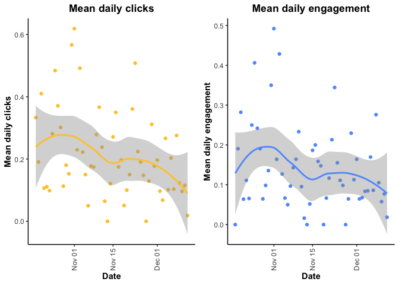
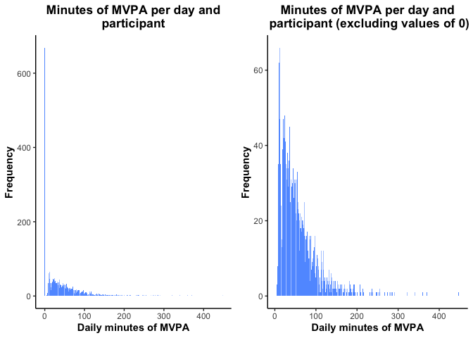
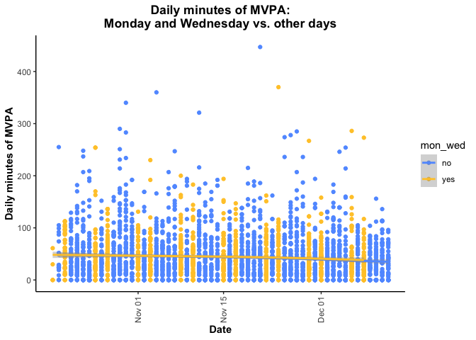
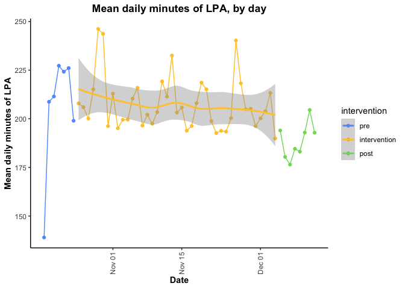
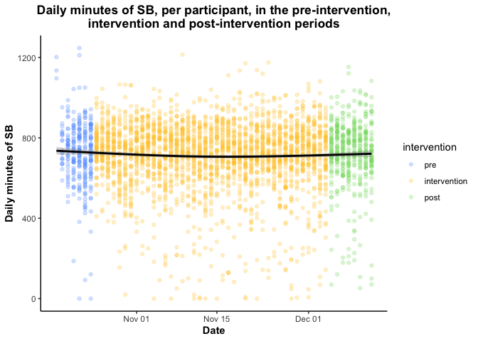
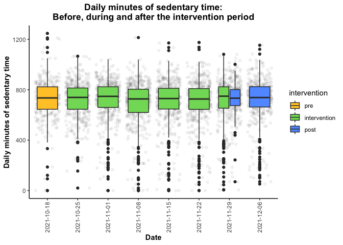
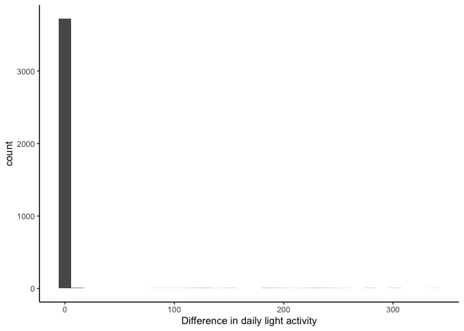
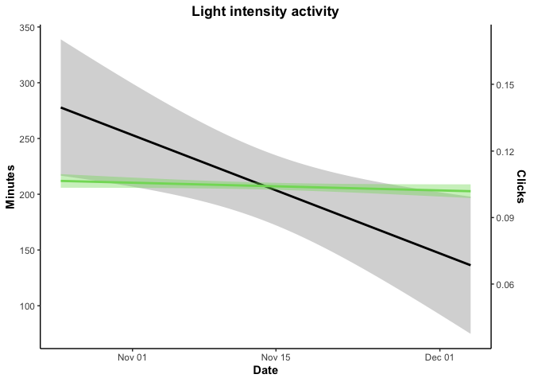
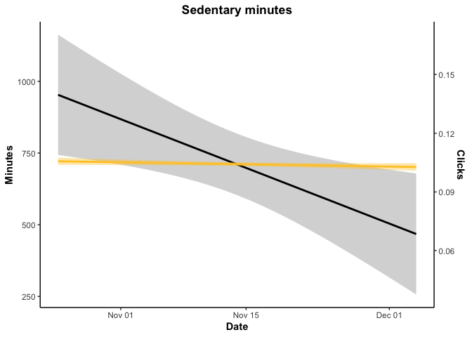
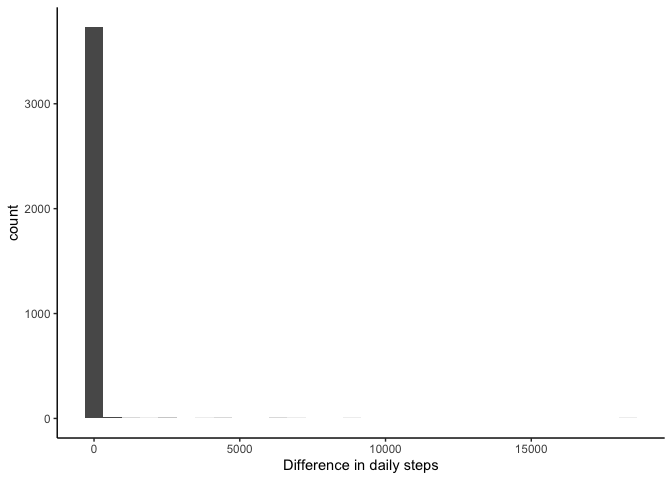

# Fitbit analysis

This script contains preliminary figures and data analysis for Fitbit data.


```r
daily <- read.csv("daily-TOP-CSEP.csv")
str(daily$date)
```

```
##  chr [1:3603] "2021-10-19" "2021-10-20" "2021-10-21" "2021-10-22" ...
```

Make sure that the intervention variable and the weekday variables are formatted as factors where the intervention periods and weekdays are ordered correctly (pre, intervention, post; monday, tuesday, etc.)


```r
  daily$weekday<-factor(daily$weekday,
                        levels=c("Monday","Tuesday","Wednesday","Thursday","Friday","Saturday","Sunday"))
  daily$intervention<-factor(daily$intervention,levels=c("pre","intervention","post"))
  daily$date<-as.Date(daily$date)
  str(daily$weekday)
```

```
##  Factor w/ 7 levels "Monday","Tuesday",..: 2 3 4 5 6 7 1 2 3 4 ...
```

```r
  str(daily$intervention)
```

```
##  Factor w/ 3 levels "pre","intervention",..: 1 1 1 1 1 1 2 2 2 2 ...
```

Create person-day-level for plots. Currently, the "daily" dataframe has one row per person-day-article, so if someone engages with two different articles, they have two rows in the dataframe. I want a maximum of one row per person per day for data exploration. 

```r
  dailyForPlots<-daily[!is.na(daily$totalMVPA),] %>% select(-title,-intervention_content,-featured_content,
                                                            -pubdate,-weekofpublish,
                                                            -type,-click,-engage,-clickInt,-engageInt)
  dailyForPlots<-distinct(dailyForPlots)
# tentative: remove particiapnt-days with less than 10 hours of wear time (so 14 hours or more of non-wear time)
  # 14 * 60 = 840 (840 minutes or more of non-wear time) 
```

Remove days where time in bed = 0 

```r
  dailyForPlots<-dailyForPlots[dailyForPlots$TotalTimeInBed!=0,]
```

Remove days with < 10 hours of wear time (14+ hours of non-wear time)

```r
  dailyForPlots<-dailyForPlots[dailyForPlots$nonWearMinutes < 840,]
```

Explore total minutes of data contributed per particiant day. Should be ~1440 minutes

```r
  dailyForPlots$test<-dailyForPlots$totalMVPA+dailyForPlots$LightlyActiveMinutes+dailyForPlots$SedentaryMinutes+
                      dailyForPlots$TotalMinutesAsleep
  dailyForPlots$test2<-dailyForPlots$totalMVPA+dailyForPlots$LightlyActiveMinutes+dailyForPlots$SedentaryMinutes+
                       dailyForPlots$TotalTimeInBed
  totalMinutesAsleep<-ggplot(dailyForPlots,aes(x=test)) + 
                        geom_bar(fill="#619CFF") + 
                        theme_classic() +
                        labs(x="Total minutes of data\n(MVPA + light + sedentary + time asleep)",
                             y="Frequency",
                             title="Minutes of data per day and\n participant") +
                        theme(axis.title.x = element_text(face="bold"),
                              axis.title.y = element_text(face="bold"),
                              plot.title = element_text(face="bold",
                                                        hjust=0.5))
  totalMinutesInBed<-ggplot(dailyForPlots,aes(x=test2)) + 
                        geom_bar(fill="#619CFF") + 
                        theme_classic() +
                        labs(x="Total minutes of data\n(MVPA + light + sedentary + time in bed)",
                             y="Frequency",
                             title="Minutes of data per day and\n participant") +
                        theme(axis.title.x = element_text(face="bold"),
                              axis.title.y = element_text(face="bold"),
                              plot.title = element_text(face="bold",
                                                        hjust=0.5))
  grid.arrange(totalMinutesAsleep,totalMinutesInBed,ncol=2)
```

<!-- -->


# Exploratory Analysis

## Engagement and clicks:

### Total clicks and engagement per day (summed across all participants)

#### Total engagements per day, by date
Total clicks and engagements, when summed across participants, appear somewhat cyclical, though the value and the amplitude both appear to diminish over time.

```
## `geom_smooth()` using method = 'gam' and formula 'y ~ s(x, bs = "cs")'
## `geom_smooth()` using method = 'gam' and formula 'y ~ s(x, bs = "cs")'
```

<!-- -->
### Clicks and engagement per participant-day

#### Distribution of clicks and engagement per participant and day
The vast majority of participant-days had 0 clicks and 0 engagement. 
<!-- -->

#### Distribution of clicks and engagement per participant (across the entire study period)
Can participants be grouped based on how often they engaged over the study period?
<!-- -->


#### Number of clicks and engagement per participant and day over time
It is hard to make out any interesting patterns because there are so many participant-days with 0 engagement and/or clicks (as observed above)
<!-- -->

#### Mean daily clicks and engagement over time
It is easier to see trends in daily clicks and engagement over time using mean clicks and engagement per day (calculated by taking the mean of both countClick (count of clicks per person per day) and countEngage (count of engagement per person per day) across all participants for each day in the study period. Please note, we cannot use median, as the median clicks and median engagement is 0 everyday. 

```
## [1] TRUE
```

```
## [1] TRUE
```

```
## `geom_smooth()` using method = 'loess' and formula 'y ~ x'
## `geom_smooth()` using method = 'loess' and formula 'y ~ x'
```

<!-- -->

<!-- #### Clicks and engagement over time, by intervention period -- Excluding for now -->


#### Clicks and engagement by weekday in the pre, intervention and post intervention period
I am interested in assessing if daily clicks and/or engagement (at the participant level) varies by day of the week. It looks like clicks and engagement are higher during the work week, particularly during the intervention period, but it is difficult to tell because there are also more Mondays, Tuesday, etc. during this period (since it is much longer). 
<!-- -->

#### Mean clicks and engagement, by weekday and period
Mean clicks and engagement is calculated by taking the mean daily click and/or engagement count across all participants, separately for each weekday, in each of the pre-intervention, intervention and post-intervention periods. It appears that the mean clicks and mean engagement by day of the week differ between the pre-intervention, intervention and post-intervention periods, but trends look similar for both clicks and engagements. 
<!-- -->
## Total time use


## MVPA

#### Distribution/frequency of MVPA - with and without including 0s
First, lets assess the distribution of MVPA across participant-days. Similar to the engagement metrics, minutes of MVPA is 0 on the majority of participant days. It is easier to see the distribution if you exclude participant-days with 0 minutes if MVPA (right). 

```
##    Min. 1st Qu.  Median    Mean 3rd Qu.    Max. 
##    0.00   10.00   32.00   43.13   62.00  447.00
```

<!-- -->

### Plot of minutes of MVPA per day over time -- overall and comparing engagers and non-engagers
Next, lets assess how daily MVPA varies over time. There is no obvious trend over time, though there is a slight bow to the loess line that appears to correspond (roughly) to the intervention period. 

```
## `geom_smooth()` using method = 'gam' and formula 'y ~ s(x, bs = "cs")'
```

<!-- -->
When you fit a loess curve to each period, daily MVPA appears to "ramp-up" during the pre-intervention period and remain ~stable throughout the intervention period. 

```
## `geom_smooth()` using method = 'loess' and formula 'y ~ x'
```

```
## `geom_smooth()` using method = 'gam' and formula 'y ~ s(x, bs = "cs")'
```

```
## `geom_smooth()` using method = 'loess' and formula 'y ~ x'
```

<!-- -->

Interestingly, this "bowing" of the loess curve appears to be driven by participants that engaged with the app content (at least once); a light downward trend is observed among non-engagers (not pictured)


#### Boxplot of MVPA per day and participant, by week
<!-- -->

<!-- #### Minutes of MVPA per day and participant - Queen's vs. UBC -->
<!-- Overall, MVPA is slightly higher at Queens; MVPA is lower at UBC and dips slightly during the intervention period.  -->

```
## `geom_smooth()` using method = 'gam' and formula 'y ~ s(x, bs = "cs")'
```

<!-- -->

<!-- The relationship between MVPA and campus also differs when you stratify by engagers and non-engagers. Among engagers, participant's at Queen's were more active, and there appears to be a slightly increase in MVPA during the intervention period (as seen above), while engagers at UBC exhibited a dip in daily MVPA during the middle of the intervention period (left panel). Converely, non-engagers at UBC were more active than non-engagers at Queen's (right), though daily MVPA remained largely stable at both campuses over time. (not pictured) -->


<!-- #### Minutes of MVPA per day - Monday and Wednesday vs. other days of the week - overall and for engagers vs. non-engagers -->
<!-- Intervention content was released on Mondays and Wednesdays. The following plot would suggest no major difference in daily MVPA on Monday/Wednesday vs. other days of the week.  -->

```
## `geom_smooth()` using method = 'gam' and formula 'y ~ s(x, bs = "cs")'
```

<!-- -->

<!-- It doesn't look like Mondays/Wednesdays have higher MVPA for either group (again, we see the non-engagers MVPA level remained more stable over time compared to engagers) (not pictured) -->


<!-- #### Mean and median daily MVPA, by date -->
<!-- Mean daily MVPA per day. Trend looks as described previously; daily MVPA ramps up during the pre-intervention period and remains largely stable throughput the intervention period (decreases slightly) -->

```
## `geom_smooth()` using method = 'loess' and formula 'y ~ x'
```

<!-- -->

<!-- Similar trends are observed among engagers and non-engagers; however, mean MVPA for non-engagers are more impacted by outlying values, since there were so few non-engagers (n=7).  -->


<!-- Repeat the above using median instead of mean, acknowledging that there are some extreme outlier (~500 minutes of MVPA per day). Using median, we see more of the downward trend over time. There does seem to be evidence that daily MVPA exhibits a cyclical trend as well.  -->

<!-- Median MVPA per day. Similar trend, through the downward trajectory appears more noticable -->

```
## `geom_smooth()` using method = 'loess' and formula 'y ~ x'
```

<!-- -->

<!-- Daily median MVPA looks to ramp up to the same median daily MVPA by the end of the pre-intervention period, and start the intervention period at approximately the same level of daily MVPA. However, the non-engagers exhibit a more dramatic decrease throughput the intervention period, and end at a lower median MVPA at the end of the intervention period/into the post-period.  -->


<!-- #### Mean daily MVPA, by weekday and intervention period
Trends in the pre- and post- periods must be interpreted with caution, as there is only 1 (or 2) dates contributing to the estimates for each weekday in these two periods. As such, both are ~ the trend over time (with the exception of Sunday in the post-period, which is based on two days of data) -->


<!-- There is a slightly different trend in mean daily MVPA among engagers and non-engagers (during the intervention period in particular) (not pictured) -->


## LPA

#### Distribution/frequency of LPA - with and without including 0s
First, lets assess the distribution of LPA across participant-days. Similar to the engagement metrics, minutes of LPA is 0 on the majority of participant days. It is easier to see the distribution if you exclude participant-days with 0 minutes if LPA (right). 

```
##    Min. 1st Qu.  Median    Mean 3rd Qu.    Max. 
##     4.0   147.8   197.0   205.5   254.0   547.0
```

<!-- -->

### Plot of minutes of LPA per day over time -- overall and comparing engagers and non-engagers
Next, lets assess how daily LPA varies over time. There is no obvious trend over time, though there is a slight bow to the loess line that appears to correspond (roughly) to the intervention period. 

```
## `geom_smooth()` using method = 'gam' and formula 'y ~ s(x, bs = "cs")'
```

<!-- -->

Similar to MVPA, LPA ramped up during the pre-intervention period and was sustained throughout the intervention period. 

```
## `geom_smooth()` using method = 'loess' and formula 'y ~ x'
```

```
## `geom_smooth()` using method = 'gam' and formula 'y ~ s(x, bs = "cs")'
```

```
## `geom_smooth()` using method = 'loess' and formula 'y ~ x'
```

<!-- -->

#### Boxplot of LPA per day and participant, by week
<!-- -->

<!-- #### Minutes of LPA per day and participant - Queen's vs. UBC -->
<!-- Overall, LPA is slightly higher at Queens; LPA is lower at UBC and dips slightly during the intervention period.  -->

```
## `geom_smooth()` using method = 'gam' and formula 'y ~ s(x, bs = "cs")'
```

<!-- -->


<!-- #### Minutes of LPA per day - Monday and Wednesday vs. other days of the week - overall and for engagers vs. non-engagers -->
<!-- Intervention content was released on Mondays and Wednesdays. The following plot would suggest no major difference in daily LPA on Monday/Wednesday vs. other days of the week.  -->

```
## `geom_smooth()` using method = 'gam' and formula 'y ~ s(x, bs = "cs")'
```

<!-- -->

<!-- #### Mean and median daily LPA, by date -->
<!-- Mean daily LPA per day. Trend looks as described previously; daily LPA ramps up during the pre-intervention period and remains largely stable throughput the intervention period (decreases slightly) -->

```
## `geom_smooth()` using method = 'loess' and formula 'y ~ x'
```

<!-- -->

<!-- Repeat the above using median instead of mean, acknowledging that there are some extreme outlier (~500 minutes of LPA per day). Using median, we see more of the downward trend over time. There does seem to be evidence that daily LPA exhibits a cyclical trend as well.  -->

<!-- Median LPA per day. Similar trend, through the downward trajectory appears more noticable -->

```
## `geom_smooth()` using method = 'loess' and formula 'y ~ x'
```

<!-- -->


## Sedentary Behaviour

#### Distribution/frequency of SB - with and without including 0s
First, lets assess the distribution of SB across participant-days. Similar to the engagement metrics, minutes of SB is 0 on the majority of participant days. It is easier to see the distribution if you exclude participant-days with 0 minutes if SB (right). 

```
##    Min. 1st Qu.  Median    Mean 3rd Qu.    Max. 
##     0.0   648.0   735.5   714.2   817.2  1247.0
```

<!-- -->

### Plot of minutes of SB per day over time -- overall and comparing engagers and non-engagers
Next, lets assess how daily SB varies over time. There is no obvious trend over time, though there is a slight bow to the loess line that appears to correspond (roughly) to the intervention period. 

```
## `geom_smooth()` using method = 'gam' and formula 'y ~ s(x, bs = "cs")'
```

<!-- -->

Similar to MVPA, SB ramped up during the pre-intervention period and was sustained throughout the intervention period. 

```
## `geom_smooth()` using method = 'loess' and formula 'y ~ x'
```

```
## `geom_smooth()` using method = 'gam' and formula 'y ~ s(x, bs = "cs")'
```

```
## `geom_smooth()` using method = 'loess' and formula 'y ~ x'
```

<!-- -->

#### Boxplot of SB per day and participant, by week

```
## Warning: Ignoring unknown parameters: outliers
```

<!-- -->

<!-- #### Minutes of SB per day and participant - Queen's vs. UBC -->
<!-- Overall, SB is slightly higher at Queens; SB is lower at UBC and dips slightly during the intervention period.  -->

```
## `geom_smooth()` using method = 'gam' and formula 'y ~ s(x, bs = "cs")'
```

<!-- -->


<!-- #### Minutes of SB per day - Monday and Wednesday vs. other days of the week - overall and for engagers vs. non-engagers -->
<!-- Intervention content was released on Mondays and Wednesdays. The following plot would suggest no major difference in daily SB on Monday/Wednesday vs. other days of the week.  -->

```
## `geom_smooth()` using method = 'gam' and formula 'y ~ s(x, bs = "cs")'
```

<!-- -->

<!-- #### Mean and median daily SB, by date -->
<!-- Mean daily SB per day. Trend looks as described previously; daily SB ramps up during the pre-intervention period and remains largely stable throughput the intervention period (decreases slightly) -->

```
## `geom_smooth()` using method = 'loess' and formula 'y ~ x'
```

<!-- -->

<!-- Repeat the above using median instead of mean, acknowledging that there are some extreme outlier (~500 minutes of SB per day). Using median, we see more of the downward trend over time. There does seem to be evidence that daily SB exhibits a cyclical trend as well.  -->

<!-- Median SB per day. Similar trend, through the downward trajectory appears more noticable -->

```
## `geom_smooth()` using method = 'loess' and formula 'y ~ x'
```

<!-- -->


## Sleep

#### Distribution/frequency of Sleep - with and without including 0s
First, lets assess the distribution of Sleep across participant-days. Similar to the engagement metrics, minutes of Sleep is 0 on the majority of participant days. It is easier to see the distribution if you exclude participant-days with 0 minutes if Sleep (right). 

```
##    Min. 1st Qu.  Median    Mean 3rd Qu.    Max. 
##    83.0   395.0   455.0   456.3   517.2   880.0
```

<!-- -->

### Plot of minutes of Sleep per day over time -- overall and comparing engagers and non-engagers
Next, lets assess how daily Sleep varies over time. There is no obvious trend over time, though there is a slight bow to the loess line that appears to correspond (roughly) to the intervention period. 

```
## `geom_smooth()` using method = 'gam' and formula 'y ~ s(x, bs = "cs")'
```

<!-- -->

Similar to MVPA, Sleep ramped up during the pre-intervention period and was sustained throughout the intervention period. 

```
## `geom_smooth()` using method = 'loess' and formula 'y ~ x'
```

```
## `geom_smooth()` using method = 'gam' and formula 'y ~ s(x, bs = "cs")'
```

```
## `geom_smooth()` using method = 'loess' and formula 'y ~ x'
```

<!-- -->
#### Boxplot of SB per day and participant, by week
<!-- -->

<!-- #### Minutes of Sleep per day and participant - Queen's vs. UBC -->
<!-- Overall, Sleep is slightly higher at Queens; Sleep is lower at UBC and dips slightly during the intervention period.  -->

```
## `geom_smooth()` using method = 'gam' and formula 'y ~ s(x, bs = "cs")'
```

<!-- -->


<!-- #### Minutes of Sleep per day - Monday and Wednesday vs. other days of the week - overall and for engagers vs. non-engagers -->
<!-- Intervention content was released on Mondays and Wednesdays. The following plot would suggest no major difference in daily Sleep on Monday/Wednesday vs. other days of the week.  -->

```
## `geom_smooth()` using method = 'gam' and formula 'y ~ s(x, bs = "cs")'
```

<!-- -->

<!-- #### Mean and median daily Sleep, by date -->
<!-- Mean daily Sleep per day. Trend looks as described previously; daily Sleep ramps up during the pre-intervention period and remains largely stable throughput the intervention period (decreases slightly) -->

```
## `geom_smooth()` using method = 'loess' and formula 'y ~ x'
```

<!-- -->

<!-- Repeat the above using median instead of mean, acknowledging that there are some extreme outlier (~500 minutes of Sleep per day). Using median, we see more of the downward trend over time. There does seem to be evidence that daily Sleep exhibits a cyclical trend as well.  -->

<!-- Median Sleep per day. Similar trend, through the downward trajectory appears more noticable -->

```
## `geom_smooth()` using method = 'loess' and formula 'y ~ x'
```

<!-- -->

## High-level: All movement behaviours over time 

Plot of all movement behaviours over time

```
## Before During  After 
##   1192  10020   1796
```

```
## `geom_smooth()` using method = 'gam' and formula 'y ~ s(x, bs = "cs")'
```

<!-- -->

<!-- #### Boxplot of all movement behaviours per day and participant, by intervention period -->

<!-- -->

<!-- #### Boxplot of all movement behaviours per day and participant, by week -->
<!-- -->


<!-- #### Relationship between engagement and movement behaviours -->

<!-- Scatter plot: behaviour vs. all clicks -->

```
## `geom_smooth()` using method = 'gam' and formula 'y ~ s(x, bs = "cs")'
```

<!-- -->

<!-- Scatter plot: behaviour vs. all engagement -->

```
## `geom_smooth()` using method = 'gam' and formula 'y ~ s(x, bs = "cs")'
```

<!-- -->

<!-- Scatter plot: behaviour vs. intervention clicks -->
<!-- -->

<!-- Scatter plot: behaviour vs. intervention engagement -->
<!-- -->

# Plots

## Line Graph - with engagement and clicks overlayed

### Any clicks across all three periods

Re-scale clicks and engagement for plots of each of the four movement behaviours

```r
# MVPA
  mean(dailyForPlots$totalMVPA) # 447
```

```
## [1] 43.13223
```

```r
  dailyForPlots$clickMVPA<-dailyForPlots$dayCountClickAny*(mean(dailyForPlots$totalMVPA)/mean(dailyForPlots$dayCountClickAny))
  dailyForPlots$engageMVPA<-dailyForPlots$dayCountEngageAny*(mean(dailyForPlots$totalMVPA)/mean(dailyForPlots$dayCountEngageAny))

# Lightly Active Minutes
  dailyForPlots$clickLPA<-dailyForPlots$dayCountClickAny*
                          (mean(dailyForPlots$LightlyActiveMinutes)/mean(dailyForPlots$dayCountClickAny))
  dailyForPlots$engageLPA<-dailyForPlots$dayCountEngageAny*
                           (mean(dailyForPlots$LightlyActiveMinutes)/mean(dailyForPlots$dayCountEngageAny))
  
# Sedentary Behavior
  dailyForPlots$clickSB<-dailyForPlots$dayCountClickAny*
                          (mean(dailyForPlots$SedentaryMinutes)/mean(dailyForPlots$dayCountClickAny))
  dailyForPlots$engageSB<-dailyForPlots$dayCountEngageAny*
                          (mean(dailyForPlots$SedentaryMinutes)/mean(dailyForPlots$dayCountEngageAny))
  
# Sleep 
  dailyForPlots$clickSleep<-dailyForPlots$dayCountClickAny*
                            (mean(dailyForPlots$TotalTimeInBed)/mean(dailyForPlots$dayCountClickAny))
  dailyForPlots$engageSleep<-dailyForPlots$dayCountEngageAny*
                            (mean(dailyForPlots$TotalTimeInBed)/mean(dailyForPlots$dayCountEngageAny))
```

Create a time variable (where Oct 18 = 1, Oct 19 = 2, etc.)

```r
dates<-dailyForPlots %>% select(date,intervention) %>% distinct() %>% arrange(date) %>% mutate(nDate=row_number())
```

MVPA

```r
# Regression model - clicks

# Regression model - MVPA

  
# Figure
  lineIntMVPA<-ggplot(dailyForPlots,aes(x=date,y=totalMVPA))+
              # clicks
                geom_smooth(data=dailyForPlots[dailyForPlots$intervention=="pre",],
                            method="lm",formula="y~x",aes(x=date,y=clickMVPA),color="black") +
                geom_smooth(data=dailyForPlots[dailyForPlots$intervention=="intervention",],
                            method="lm",formula="y~x",aes(x=date,y=clickMVPA),color="black") +
                geom_smooth(data=dailyForPlots[dailyForPlots$intervention=="post",],
                            method="lm",formula="y~x",aes(x=date,y=clickMVPA),color="black") +
              # MVPA
                geom_smooth(data=dailyForPlots[dailyForPlots$intervention=="pre",],
                            method="lm",formula="y~x",color="#619CFF",fill="#619CFF") +
                geom_smooth(data=dailyForPlots[dailyForPlots$intervention=="intervention",],
                            method="lm",formula="y~x",color="#619CFF",fill="#619CFF") +
                geom_smooth(data=dailyForPlots[dailyForPlots$intervention=="post",],
                            method="lm",formula="y~x",color="#619CFF",fill="#619CFF") +
               theme_classic()+
               labs(x="Date",
                    y="Minutes",
                    title="MVPA") +
               theme(axis.title.x = element_text(face="bold"),
                     axis.title.y = element_text(face="bold"),
                     plot.title = element_text(face="bold",
                                               hjust=0.5))+
  scale_y_continuous(
    sec.axis = sec_axis(trans=~./(mean(dailyForPlots$totalMVPA)/mean(dailyForPlots$dayCountClickInt)), name = "Clicks"))
  lineIntMVPA
```

<!-- -->

```r
  lineMVPA<-ggplot(dailyForPlots,aes(x=date,y=totalMVPA))+
               #geom_jitter(color="#619CFF",alpha=0.15) + 
               #geom_jitter(data=dailyForPlots,aes(x=date,y=clickMVPA),color="black",alpha=0.15) +
               geom_smooth(data=dailyForPlots,aes(x=date,y=clickMVPA),color="black") +
               geom_smooth(color="#619CFF",fill="#619CFF") +
            # lines for clicks
               #geom_smooth(data=dailyForPlots,method="lm",formula="y~x",aes(x=date,y=clickMVPA),color="black") +
            # lines for MVPA
               #geom_smooth(method="lm",formula="y~x",color="#619CFF",fill="#619CFF") +
               theme_classic()+
               labs(x="Date",
                    y="Minutes",
                    title="MVPA") +
               theme(axis.title.x = element_text(face="bold"),
                     axis.title.y = element_text(face="bold"),
                     plot.title = element_text(face="bold",
                                               hjust=0.5))+
  scale_y_continuous(
    sec.axis = sec_axis(trans=~./(mean(dailyForPlots$totalMVPA)/mean(dailyForPlots$dayCountClickAny)), name = "Clicks"))
  lineMVPA
```

```
## `geom_smooth()` using method = 'gam' and formula 'y ~ s(x, bs = "cs")'
## `geom_smooth()` using method = 'gam' and formula 'y ~ s(x, bs = "cs")'
```

<!-- -->

Lightly active minutes

```r
# Figure
  lineLPA<-ggplot(dailyForPlots,aes(x=date,y=LightlyActiveMinutes))+
               #geom_jitter(color="#81DA66",alpha=0.25) + 
               #geom_jitter(data=dailyForPlots,aes(x=date,y=clickLPA),color="black",alpha=0.25) +
               geom_smooth(data=dailyForPlots,aes(x=date,y=clickLPA),color="black") +
               geom_smooth(color="#81DA66",fill="#81DA66") +
               theme_classic()+
               labs(x="Date",
                    y="Minutes",
                    title="Light intensity activity") +
               theme(axis.title.x = element_text(face="bold"),
                     axis.title.y = element_text(face="bold"),
                     plot.title = element_text(face="bold",
                                               hjust=0.5))+
  scale_y_continuous(
    sec.axis = sec_axis(trans=~./(mean(dailyForPlots$LightlyActiveMinutes)/mean(dailyForPlots$dayCountClickAny)), 
                        name = "Clicks"))
  lineLPA
```

```
## `geom_smooth()` using method = 'gam' and formula 'y ~ s(x, bs = "cs")'
## `geom_smooth()` using method = 'gam' and formula 'y ~ s(x, bs = "cs")'
```

<!-- -->

Sedentary minutes

```r
# Regression model - clicks

# Regression model - Sedentary minutes

# Figure
  lineSB<-ggplot(dailyForPlots,aes(x=date,y=SedentaryMinutes))+
               #geom_jitter(color="#FFC833",alpha=0.25) + 
               #geom_jitter(data=dailyForPlots,aes(x=date,y=clickSB),color="black",alpha=0.25) +
               geom_smooth(data=dailyForPlots,aes(x=date,y=clickSB),color="black") +
               geom_smooth(color="#FFC833",fill="#FFC833") +
               theme_classic()+
               labs(x="Date",
                    y="Minutes",
                    title="Sedentary time") +
               theme(axis.title.x = element_text(face="bold"),
                     axis.title.y = element_text(face="bold"),
                     plot.title = element_text(face="bold",
                                               hjust=0.5))+
  scale_y_continuous(
    sec.axis = sec_axis(trans=~./(mean(dailyForPlots$SedentaryMinutes)/mean(dailyForPlots$dayCountClickAny)), 
                        name = "Clicks"))
  lineSB
```

```
## `geom_smooth()` using method = 'gam' and formula 'y ~ s(x, bs = "cs")'
## `geom_smooth()` using method = 'gam' and formula 'y ~ s(x, bs = "cs")'
```

<!-- -->

Sleep minutes

```r
# Regression model - clicks

# Regression model - Sleep

# Figure
  lineSleep<-ggplot(dailyForPlots,aes(x=date,y=TotalTimeInBed))+
               #geom_jitter(color="#FF8333",alpha=0.25) + 
               #geom_jitter(data=dailyForPlots,aes(x=date,y=clickSleep),color="black",alpha=0.25) +
               geom_smooth(data=dailyForPlots,aes(x=date,y=clickSleep),color="black") +
               geom_smooth(color="#FF8333",fill="#FF8333") +
               theme_classic()+
               labs(x="Date",
                    y="Minutes",
                    title="Time in bed") +
               theme(axis.title.x = element_text(face="bold"),
                     axis.title.y = element_text(face="bold"),
                     plot.title = element_text(face="bold",
                                               hjust=0.5))+
  scale_y_continuous(
    sec.axis = sec_axis(trans=~./(mean(dailyForPlots$TotalTimeInBed)/mean(dailyForPlots$dayCountClickAny)), 
                        name = "Clicks"))
  lineSleep
```

```
## `geom_smooth()` using method = 'gam' and formula 'y ~ s(x, bs = "cs")'
## `geom_smooth()` using method = 'gam' and formula 'y ~ s(x, bs = "cs")'
```

<!-- -->

Panel figure

```r
 linesSave<-grid.arrange(lineMVPA,lineLPA,lineSB,lineSleep,ncol=2)
```

```
## `geom_smooth()` using method = 'gam' and formula 'y ~ s(x, bs = "cs")'
## `geom_smooth()` using method = 'gam' and formula 'y ~ s(x, bs = "cs")'
## `geom_smooth()` using method = 'gam' and formula 'y ~ s(x, bs = "cs")'
## `geom_smooth()` using method = 'gam' and formula 'y ~ s(x, bs = "cs")'
## `geom_smooth()` using method = 'gam' and formula 'y ~ s(x, bs = "cs")'
## `geom_smooth()` using method = 'gam' and formula 'y ~ s(x, bs = "cs")'
## `geom_smooth()` using method = 'gam' and formula 'y ~ s(x, bs = "cs")'
## `geom_smooth()` using method = 'gam' and formula 'y ~ s(x, bs = "cs")'
```

<!-- -->

```r
 linesSave
```

```
## TableGrob (2 x 2) "arrange": 4 grobs
##   z     cells    name           grob
## 1 1 (1-1,1-1) arrange gtable[layout]
## 2 2 (1-1,2-2) arrange gtable[layout]
## 3 3 (2-2,1-1) arrange gtable[layout]
## 4 4 (2-2,2-2) arrange gtable[layout]
```

### Intervention clicks during intervention period

Generate click and engagement variables that are rescaled such that the mean = mean of the respective behaviour for plotting

```r
  dailyInt<-dailyForPlots[dailyForPlots$intervention=="intervention",]

# MVPA
  mean(dailyInt$totalMVPA)
```

```
## [1] 44.58323
```

```r
  dailyInt$clickIntMVPA<-dailyInt$dayCountClickInt*
                               (mean(dailyInt$totalMVPA)/mean(dailyInt$dayCountClickInt))
  dailyInt$engageIntMVPA<-dailyInt$dayCountEngageAny*
                               (mean(dailyInt$totalMVPA)/mean(dailyInt$dayCountEngageAny))

# Lightly Active Minutes
  dailyInt$clickIntLPA<-dailyInt$dayCountClickInt*
                          (mean(dailyInt$LightlyActiveMinutes)/mean(dailyInt$dayCountClickInt))
  dailyInt$engageIntLPA<-dailyInt$dayCountEngageAny*
                           (mean(dailyInt$LightlyActiveMinutes)/mean(dailyInt$dayCountEngageAny))
  
# Sedentary Behavior
  dailyInt$clickIntSB<-dailyInt$dayCountClickInt*
                          (mean(dailyInt$SedentaryMinutes)/mean(dailyInt$dayCountClickInt))
  dailyInt$engageIntSB<-dailyInt$dayCountEngageAny*
                          (mean(dailyInt$SedentaryMinutes)/mean(dailyInt$dayCountEngageAny))
  
# Sleep 
  dailyInt$clickIntSleep<-dailyInt$dayCountClickInt*
                            (mean(dailyInt$TotalTimeInBed)/mean(dailyInt$dayCountClickInt))
  dailyInt$engageIntSleep<-dailyInt$dayCountEngageAny*
                            (mean(dailyInt$TotalTimeInBed)/mean(dailyInt$dayCountEngageAny))
```

Create a time variable (where Oct 18 = 1, Oct 19 = 2, etc.)

```r
datesInt<-dailyInt %>% select(date,intervention) %>% distinct() %>% arrange(date) %>% mutate(nDate=row_number())
dailyInt<-merge(dailyInt,datesInt,by=c("date"))
```

MVPA

```r
# Regression model - clicks
  clicksIntMVPA<-lm(clickIntMVPA~nDate+I(nDate^2),data=dailyInt)
  dailyInt$predClicksMVPA<-predict(clicksIntMVPA,dailyInt)

# Regression model - MVPA
  intMVPA<-lm(totalMVPA~poly(nDate,degree=2,raw=TRUE),data=dailyInt)
  dailyInt$predMVPA<-predict(intMVPA,dailyInt)

# Figure
  lineIntMVPA<-ggplot(dailyInt,aes(x=date,y=totalMVPA))+
               #geom_jitter(color="#619CFF",alpha=0.15) + 
               #geom_jitter(data=dailyForPlots,aes(x=date,y=clickMVPA),color="black",alpha=0.15) +
               #geom_smooth(data=dailyInt,aes(x=date,y=clickIntMVPA),color="black") +
               geom_smooth(data=dailyInt,method="lm",formula="y~x",aes(x=date,y=clickIntMVPA),color="black") +
               #geom_line(data=dailyInt,aes(x=date,y=predClicksMVPA),color="black") +
               #geom_smooth(color="#619CFF",fill="#619CFF") +
               geom_smooth(method="lm",formula="y~x",color="#619CFF",fill="#619CFF") +
               theme_classic()+
               labs(x="Date",
                    y="Minutes",
                    title="MVPA") +
               theme(axis.title.x = element_text(face="bold"),
                     axis.title.y = element_text(face="bold"),
                     plot.title = element_text(face="bold",
                                               hjust=0.5))+
  scale_y_continuous(
    sec.axis = sec_axis(trans=~./(mean(dailyInt$totalMVPA)/mean(dailyInt$dayCountClickInt)), name = "Clicks"))
  lineIntMVPA
```

<!-- -->

Lightly active minutes

```r
# Regression model - clicks
  clicksIntLPA<-lm(clickIntLPA~nDate+I(nDate^2),data=dailyInt)
  dailyInt$predClicksLPA<-predict(clicksIntLPA,dailyInt)

# Regression model - LPA
  intLPA<-lm(LightlyActiveMinutes~poly(nDate,degree=2,raw=TRUE),data=dailyInt)
  dailyInt$predLPA<-predict(intLPA,dailyInt)

# Figure
  lineIntLPA<-ggplot(dailyInt,aes(x=date,y=LightlyActiveMinutes))+
               #geom_jitter(color="#619CFF",alpha=0.15) + 
               #geom_jitter(data=dailyForPlots,aes(x=date,y=clickLPA),color="black",alpha=0.15) +
               #geom_smooth(data=dailyInt,aes(x=date,y=clickIntLPA),color="black") +
               geom_smooth(data=dailyInt,method="lm",formula="y~x",aes(x=date,y=clickIntLPA),color="black") +
               #geom_line(data=dailyInt,aes(x=date,y=predClicksLPA),color="black") +
               #geom_smooth(color="#619CFF",fill="#619CFF") +
               geom_smooth(method="lm",formula="y~x",color="#81DA66",fill="#81DA66") +
               theme_classic()+
               labs(x="Date",
                    y="Minutes",
                    title="Light intensity activity") +
               theme(axis.title.x = element_text(face="bold"),
                     axis.title.y = element_text(face="bold"),
                     plot.title = element_text(face="bold",
                                               hjust=0.5))+
  scale_y_continuous(
    sec.axis = sec_axis(trans=~./(mean(dailyInt$LightlyActiveMinutes)/mean(dailyInt$dayCountClickInt)), name = "Clicks"))
  lineIntLPA
```

<!-- -->

Sedentary minutes

```r
# Regression model - clicks
  clicksIntSB<-lm(clickIntSB~nDate+I(nDate^2),data=dailyInt)
  dailyInt$predClicksSB<-predict(clicksIntSB,dailyInt)

# Regression model - Sedentary
  intSB<-lm(SedentaryMinutes~poly(nDate,degree=2,raw=TRUE),data=dailyInt)
  dailyInt$predSB<-predict(intSB,dailyInt)

# Figure
  lineIntSB<-ggplot(dailyInt,aes(x=date,y=SedentaryMinutes))+
               #geom_jitter(color="#619CFF",alpha=0.15) + 
               #geom_jitter(data=dailyForPlots,aes(x=date,y=clickSB),color="black",alpha=0.15) +
               #geom_smooth(data=dailyInt,aes(x=date,y=clickIntSB),color="black") +
               geom_smooth(data=dailyInt,method="lm",formula="y~x",aes(x=date,y=clickIntSB),color="black") +
               #geom_line(data=dailyInt,aes(x=date,y=predClicksSB),color="black") +
               #geom_smooth(color="#619CFF",fill="#619CFF") +
               geom_smooth(method="lm",formula="y~x",color="#FFC833",fill="#FFC833") +
               theme_classic()+
               labs(x="Date",
                    y="Minutes",
                    title="Sedentary minutes") +
               theme(axis.title.x = element_text(face="bold"),
                     axis.title.y = element_text(face="bold"),
                     plot.title = element_text(face="bold",
                                               hjust=0.5))+
  scale_y_continuous(
    sec.axis = sec_axis(trans=~./(mean(dailyInt$SedentaryMinutes)/mean(dailyInt$dayCountClickInt)), name = "Clicks"))
  lineIntSB
```

<!-- -->

Sleep minutes

```r
# Regression model - clicks
  clicksIntSleep<-lm(clickIntSleep~nDate+I(nDate^2),data=dailyInt)
  dailyInt$predClicksSleep<-predict(clicksIntSleep,dailyInt)

# Regression model - Sedentary
  intSleep<-lm(TotalTimeInBed~poly(nDate,degree=2,raw=TRUE),data=dailyInt)
  dailyInt$predSleep<-predict(intSleep,dailyInt)

# Figure
  lineIntSleep<-ggplot(dailyInt,aes(x=date,y=TotalTimeInBed))+
               #geom_jitter(color="#619CFF",alpha=0.15) + 
               #geom_jitter(data=dailyForPlots,aes(x=date,y=clickSleep),color="black",alpha=0.15) +
               #geom_smooth(data=dailyInt,aes(x=date,y=clickIntSleep),color="black") +
               geom_smooth(data=dailyInt,method="lm",formula="y~x",aes(x=date,y=clickIntSleep),color="black") +
               #geom_line(data=dailyInt,aes(x=date,y=predClicksSleep),color="black") +
               #geom_smooth(color="#619CFF",fill="#619CFF") +
               geom_smooth(method="lm",formula="y~x",color="#FF8333",fill="#FF8333") +
               theme_classic()+
               labs(x="Date",
                    y="Minutes",
                    title="Time in bed") +
               theme(axis.title.x = element_text(face="bold"),
                     axis.title.y = element_text(face="bold"),
                     plot.title = element_text(face="bold",
                                               hjust=0.5))+
  scale_y_continuous(
    sec.axis = sec_axis(trans=~./(mean(dailyInt$TotalTimeInBed)/mean(dailyInt$dayCountClickInt)), name = "Clicks"))
  lineIntSleep
```

<!-- -->


```r
# Regression model - clicks

# Regression model - Sleep 

# Figure
  lineIntSleep<-ggplot(dailyInt,aes(x=date,y=TotalTimeInBed))+
               #geom_jitter(color="#FF8333",alpha=0.25) + 
               #geom_jitter(data=dailyForPlots,aes(x=date,y=clickSleep),color="black",alpha=0.25) +
               geom_smooth(data=dailyInt,aes(x=date,y=clickIntSleep),color="black") +
               geom_smooth(color="#FF8333",fill="#FF8333") +
               theme_classic()+
               labs(x="Date",
                    y="Minutes",
                    title="Time in bed") +
               theme(axis.title.x = element_text(face="bold"),
                     axis.title.y = element_text(face="bold"),
                     plot.title = element_text(face="bold",
                                               hjust=0.5))+
  scale_y_continuous(
    sec.axis = sec_axis(trans=~./(mean(dailyInt$TotalTimeInBed)/mean(dailyInt$dayCountClickInt)), 
                        name = "Clicks"))
```

Panel figure

```r
 lineIntSave<-grid.arrange(lineIntMVPA,lineIntLPA,lineIntSB,lineIntSleep,ncol=2)
```

```
## `geom_smooth()` using method = 'gam' and formula 'y ~ s(x, bs = "cs")'
## `geom_smooth()` using method = 'gam' and formula 'y ~ s(x, bs = "cs")'
```

<!-- -->

```r
 lineIntSave
```

```
## TableGrob (2 x 2) "arrange": 4 grobs
##   z     cells    name           grob
## 1 1 (1-1,1-1) arrange gtable[layout]
## 2 2 (1-1,2-2) arrange gtable[layout]
## 3 3 (2-2,1-1) arrange gtable[layout]
## 4 4 (2-2,2-2) arrange gtable[layout]
```


## Box plot - per period - one panel per behaviour

```r
  boxplotMVPAperiod<-ggplot(dailyLong[dailyLong$behaviour=="MVPA",],
                            aes(x=date,y=minutes,fill=period),group=weekStart)+
                             geom_boxplot() +
                             scale_fill_manual(values=c("#FFC833","#81DA66","#619CFF"))+
                             theme_classic() +
                            labs(x="Date",
                                 y="Minutes MVPA",
                                 fill="Intervention Period",
                                 title="MVPA")+
                            theme(axis.text.x = element_text(angle=90,vjust = 0.5, hjust=1),
                                  axis.title.x = element_text(face="bold"),
                                  axis.title.y = element_text(face="bold"),
                                  plot.title = element_text(face="bold",hjust=0.5),
                                  legend.title = element_text(face="bold"),
                                  strip.text = element_text(face="bold")) 
  boxplotMVPAperiod
```

<!-- -->


## Box plot - per week - one panel per behaviour

# Models

### Exploratory: Linear regression

#### (a) only independent variable is intervention period

Compared to the pre-intervention period, daily MVPA was significantly higher in the intervention period and significantly lower in the post-intervention period

```r
dailyForPlots <- dailyForPlots %>% 
  mutate(intervention=factor(intervention)) %>% 
  mutate(intervention=fct_relevel(intervention,c("pre","intervention","post"))) %>%
 arrange(intervention)

  linearInt<-lm(totalMVPA~intervention,data=dailyForPlots)
  tab_model(linearInt)
```

<table style="border-collapse:collapse; border:none;">
<tr>
<th style="border-top: double; text-align:center; font-style:normal; font-weight:bold; padding:0.2cm;  text-align:left; ">&nbsp;</th>
<th colspan="3" style="border-top: double; text-align:center; font-style:normal; font-weight:bold; padding:0.2cm; ">totalMVPA</th>
</tr>
<tr>
<td style=" text-align:center; border-bottom:1px solid; font-style:italic; font-weight:normal;  text-align:left; ">Predictors</td>
<td style=" text-align:center; border-bottom:1px solid; font-style:italic; font-weight:normal;  ">Estimates</td>
<td style=" text-align:center; border-bottom:1px solid; font-style:italic; font-weight:normal;  ">CI</td>
<td style=" text-align:center; border-bottom:1px solid; font-style:italic; font-weight:normal;  ">p</td>
</tr>
<tr>
<td style=" padding:0.2cm; text-align:left; vertical-align:top; text-align:left; ">(Intercept)</td>
<td style=" padding:0.2cm; text-align:left; vertical-align:top; text-align:center;  ">45.69</td>
<td style=" padding:0.2cm; text-align:left; vertical-align:top; text-align:center;  ">40.57&nbsp;&ndash;&nbsp;50.82</td>
<td style=" padding:0.2cm; text-align:left; vertical-align:top; text-align:center;  "><strong>&lt;0.001</strong></td>
</tr>
<tr>
<td style=" padding:0.2cm; text-align:left; vertical-align:top; text-align:left; ">intervention<br>[intervention]</td>
<td style=" padding:0.2cm; text-align:left; vertical-align:top; text-align:center;  ">&#45;1.11</td>
<td style=" padding:0.2cm; text-align:left; vertical-align:top; text-align:center;  ">&#45;6.53&nbsp;&ndash;&nbsp;4.31</td>
<td style=" padding:0.2cm; text-align:left; vertical-align:top; text-align:center;  ">0.688</td>
</tr>
<tr>
<td style=" padding:0.2cm; text-align:left; vertical-align:top; text-align:left; ">intervention [post]</td>
<td style=" padding:0.2cm; text-align:left; vertical-align:top; text-align:center;  ">&#45;12.36</td>
<td style=" padding:0.2cm; text-align:left; vertical-align:top; text-align:center;  ">&#45;18.97&nbsp;&ndash;&nbsp;-5.75</td>
<td style=" padding:0.2cm; text-align:left; vertical-align:top; text-align:center;  "><strong>&lt;0.001</strong></td>
</tr>
<tr>
<td style=" padding:0.2cm; text-align:left; vertical-align:top; text-align:left; padding-top:0.1cm; padding-bottom:0.1cm; border-top:1px solid;">Observations</td>
<td style=" padding:0.2cm; text-align:left; vertical-align:top; padding-top:0.1cm; padding-bottom:0.1cm; text-align:left; border-top:1px solid;" colspan="3">3252</td>
</tr>
<tr>
<td style=" padding:0.2cm; text-align:left; vertical-align:top; text-align:left; padding-top:0.1cm; padding-bottom:0.1cm;">R<sup>2</sup> / R<sup>2</sup> adjusted</td>
<td style=" padding:0.2cm; text-align:left; vertical-align:top; padding-top:0.1cm; padding-bottom:0.1cm; text-align:left;" colspan="3">0.008 / 0.007</td>
</tr>

</table>

#### (b) only independent variable is a binary indicator for Mon/Wed

MVPA was not significantly different on Monday and Wednesday compared to other days of the week (without accounting for any other variables, including intervention period and/or repeated measures within participants)

```r
  linearMW<-lm(totalMVPA~mon_wed,data=dailyForPlots)
  summary(linearMW)
```

```
## 
## Call:
## lm(formula = totalMVPA ~ mon_wed, data = dailyForPlots)
## 
## Residuals:
##    Min     1Q Median     3Q    Max 
## -44.21 -32.72 -10.72  18.28 404.28 
## 
## Coefficients:
##             Estimate Std. Error t value Pr(>|t|)    
## (Intercept)  42.7192     0.9328  45.798   <2e-16 ***
## mon_wedyes    1.4957     1.7751   0.843    0.399    
## ---
## Signif. codes:  0 '***' 0.001 '**' 0.01 '*' 0.05 '.' 0.1 ' ' 1
## 
## Residual standard error: 45.26 on 3250 degrees of freedom
## Multiple R-squared:  0.0002184,	Adjusted R-squared:  -8.92e-05 
## F-statistic:  0.71 on 1 and 3250 DF,  p-value: 0.3995
```

#### (c) only independent variable is whether the participant ever engaged (clicked or engaged) with app content

Participants who never enagaged with app content recorded an average of 13 minutes less MVPA per day (statistically significant) compared to those who engaged at least once (note: only a small number of participants (n=7) never engaged)

```r
  linearEverEngage<-lm(totalMVPA~ever_engage,data=dailyForPlots)
  tab_model(linearEverEngage)
```

<table style="border-collapse:collapse; border:none;">
<tr>
<th style="border-top: double; text-align:center; font-style:normal; font-weight:bold; padding:0.2cm;  text-align:left; ">&nbsp;</th>
<th colspan="3" style="border-top: double; text-align:center; font-style:normal; font-weight:bold; padding:0.2cm; ">totalMVPA</th>
</tr>
<tr>
<td style=" text-align:center; border-bottom:1px solid; font-style:italic; font-weight:normal;  text-align:left; ">Predictors</td>
<td style=" text-align:center; border-bottom:1px solid; font-style:italic; font-weight:normal;  ">Estimates</td>
<td style=" text-align:center; border-bottom:1px solid; font-style:italic; font-weight:normal;  ">CI</td>
<td style=" text-align:center; border-bottom:1px solid; font-style:italic; font-weight:normal;  ">p</td>
</tr>
<tr>
<td style=" padding:0.2cm; text-align:left; vertical-align:top; text-align:left; ">(Intercept)</td>
<td style=" padding:0.2cm; text-align:left; vertical-align:top; text-align:center;  ">43.73</td>
<td style=" padding:0.2cm; text-align:left; vertical-align:top; text-align:center;  ">42.10&nbsp;&ndash;&nbsp;45.36</td>
<td style=" padding:0.2cm; text-align:left; vertical-align:top; text-align:center;  "><strong>&lt;0.001</strong></td>
</tr>
<tr>
<td style=" padding:0.2cm; text-align:left; vertical-align:top; text-align:left; ">ever engage [Never<br>engaged or clicked]</td>
<td style=" padding:0.2cm; text-align:left; vertical-align:top; text-align:center;  ">&#45;6.61</td>
<td style=" padding:0.2cm; text-align:left; vertical-align:top; text-align:center;  ">&#45;12.04&nbsp;&ndash;&nbsp;-1.18</td>
<td style=" padding:0.2cm; text-align:left; vertical-align:top; text-align:center;  "><strong>0.017</strong></td>
</tr>
<tr>
<td style=" padding:0.2cm; text-align:left; vertical-align:top; text-align:left; padding-top:0.1cm; padding-bottom:0.1cm; border-top:1px solid;">Observations</td>
<td style=" padding:0.2cm; text-align:left; vertical-align:top; padding-top:0.1cm; padding-bottom:0.1cm; text-align:left; border-top:1px solid;" colspan="3">3252</td>
</tr>
<tr>
<td style=" padding:0.2cm; text-align:left; vertical-align:top; text-align:left; padding-top:0.1cm; padding-bottom:0.1cm;">R<sup>2</sup> / R<sup>2</sup> adjusted</td>
<td style=" padding:0.2cm; text-align:left; vertical-align:top; padding-top:0.1cm; padding-bottom:0.1cm; text-align:left;" colspan="3">0.002 / 0.001</td>
</tr>

</table>

#### (d) only independent variable is dayCountClickAnys

Every one click was associated with a 2 minute increase in MVPA on that date (statistically signiciant)

```r
  linearCountClick<-lm(totalMVPA~dayCountClickAny,data=dailyForPlots)
  tab_model(linearCountClick)
```

<table style="border-collapse:collapse; border:none;">
<tr>
<th style="border-top: double; text-align:center; font-style:normal; font-weight:bold; padding:0.2cm;  text-align:left; ">&nbsp;</th>
<th colspan="3" style="border-top: double; text-align:center; font-style:normal; font-weight:bold; padding:0.2cm; ">totalMVPA</th>
</tr>
<tr>
<td style=" text-align:center; border-bottom:1px solid; font-style:italic; font-weight:normal;  text-align:left; ">Predictors</td>
<td style=" text-align:center; border-bottom:1px solid; font-style:italic; font-weight:normal;  ">Estimates</td>
<td style=" text-align:center; border-bottom:1px solid; font-style:italic; font-weight:normal;  ">CI</td>
<td style=" text-align:center; border-bottom:1px solid; font-style:italic; font-weight:normal;  ">p</td>
</tr>
<tr>
<td style=" padding:0.2cm; text-align:left; vertical-align:top; text-align:left; ">(Intercept)</td>
<td style=" padding:0.2cm; text-align:left; vertical-align:top; text-align:center;  ">42.90</td>
<td style=" padding:0.2cm; text-align:left; vertical-align:top; text-align:center;  ">41.30&nbsp;&ndash;&nbsp;44.50</td>
<td style=" padding:0.2cm; text-align:left; vertical-align:top; text-align:center;  "><strong>&lt;0.001</strong></td>
</tr>
<tr>
<td style=" padding:0.2cm; text-align:left; vertical-align:top; text-align:left; ">dayCountClickAny</td>
<td style=" padding:0.2cm; text-align:left; vertical-align:top; text-align:center;  ">1.09</td>
<td style=" padding:0.2cm; text-align:left; vertical-align:top; text-align:center;  ">&#45;0.66&nbsp;&ndash;&nbsp;2.85</td>
<td style=" padding:0.2cm; text-align:left; vertical-align:top; text-align:center;  ">0.223</td>
</tr>
<tr>
<td style=" padding:0.2cm; text-align:left; vertical-align:top; text-align:left; padding-top:0.1cm; padding-bottom:0.1cm; border-top:1px solid;">Observations</td>
<td style=" padding:0.2cm; text-align:left; vertical-align:top; padding-top:0.1cm; padding-bottom:0.1cm; text-align:left; border-top:1px solid;" colspan="3">3252</td>
</tr>
<tr>
<td style=" padding:0.2cm; text-align:left; vertical-align:top; text-align:left; padding-top:0.1cm; padding-bottom:0.1cm;">R<sup>2</sup> / R<sup>2</sup> adjusted</td>
<td style=" padding:0.2cm; text-align:left; vertical-align:top; padding-top:0.1cm; padding-bottom:0.1cm; text-align:left;" colspan="3">0.000 / 0.000</td>
</tr>

</table>

#### (e) only independent variable is countEngage

Every one engagement was associated with a <1.5 minute increase in MVPA on that date; however, the relationship was not statistically significant

```r
  linearCountEngage<-lm(totalMVPA~dayCountEngageAny,data=dailyForPlots)
  tab_model(linearCountEngage)
```

<table style="border-collapse:collapse; border:none;">
<tr>
<th style="border-top: double; text-align:center; font-style:normal; font-weight:bold; padding:0.2cm;  text-align:left; ">&nbsp;</th>
<th colspan="3" style="border-top: double; text-align:center; font-style:normal; font-weight:bold; padding:0.2cm; ">totalMVPA</th>
</tr>
<tr>
<td style=" text-align:center; border-bottom:1px solid; font-style:italic; font-weight:normal;  text-align:left; ">Predictors</td>
<td style=" text-align:center; border-bottom:1px solid; font-style:italic; font-weight:normal;  ">Estimates</td>
<td style=" text-align:center; border-bottom:1px solid; font-style:italic; font-weight:normal;  ">CI</td>
<td style=" text-align:center; border-bottom:1px solid; font-style:italic; font-weight:normal;  ">p</td>
</tr>
<tr>
<td style=" padding:0.2cm; text-align:left; vertical-align:top; text-align:left; ">(Intercept)</td>
<td style=" padding:0.2cm; text-align:left; vertical-align:top; text-align:center;  ">43.01</td>
<td style=" padding:0.2cm; text-align:left; vertical-align:top; text-align:center;  ">41.42&nbsp;&ndash;&nbsp;44.60</td>
<td style=" padding:0.2cm; text-align:left; vertical-align:top; text-align:center;  "><strong>&lt;0.001</strong></td>
</tr>
<tr>
<td style=" padding:0.2cm; text-align:left; vertical-align:top; text-align:left; ">dayCountEngageAny</td>
<td style=" padding:0.2cm; text-align:left; vertical-align:top; text-align:center;  ">0.83</td>
<td style=" padding:0.2cm; text-align:left; vertical-align:top; text-align:center;  ">&#45;1.53&nbsp;&ndash;&nbsp;3.19</td>
<td style=" padding:0.2cm; text-align:left; vertical-align:top; text-align:center;  ">0.490</td>
</tr>
<tr>
<td style=" padding:0.2cm; text-align:left; vertical-align:top; text-align:left; padding-top:0.1cm; padding-bottom:0.1cm; border-top:1px solid;">Observations</td>
<td style=" padding:0.2cm; text-align:left; vertical-align:top; padding-top:0.1cm; padding-bottom:0.1cm; text-align:left; border-top:1px solid;" colspan="3">3252</td>
</tr>
<tr>
<td style=" padding:0.2cm; text-align:left; vertical-align:top; text-align:left; padding-top:0.1cm; padding-bottom:0.1cm;">R<sup>2</sup> / R<sup>2</sup> adjusted</td>
<td style=" padding:0.2cm; text-align:left; vertical-align:top; padding-top:0.1cm; padding-bottom:0.1cm; text-align:left;" colspan="3">0.000 / -0.000</td>
</tr>

</table>

#### (f) intervention, countClicks, engagers, and univeristy

Every one click was associated with a 1.7 minute increase in MVPA on that date (statistically signiciant). There is also a significant intervention effect of 6.4 more daily minutes of MVPA on average over the intervention period compared to the pre intervention period. There is a interaction between the intervention and university. Both universities increased activity but compared to Queens UBC had less activity overall, but the intervention had a bigger effect. Last, people who never engaged had significantly less activity. 

We can't do the interaction between ever_engage and intervention while including clicks in the model because those variables are collinear. Need to think about stratifying the model by engagers probably. 


```r
  linearClicksInt<-lm(totalMVPA ~ dayCountClickAny + intervention + ever_engage + intervention*University, data=dailyForPlots)
  tab_model(linearClicksInt)
```

<table style="border-collapse:collapse; border:none;">
<tr>
<th style="border-top: double; text-align:center; font-style:normal; font-weight:bold; padding:0.2cm;  text-align:left; ">&nbsp;</th>
<th colspan="3" style="border-top: double; text-align:center; font-style:normal; font-weight:bold; padding:0.2cm; ">totalMVPA</th>
</tr>
<tr>
<td style=" text-align:center; border-bottom:1px solid; font-style:italic; font-weight:normal;  text-align:left; ">Predictors</td>
<td style=" text-align:center; border-bottom:1px solid; font-style:italic; font-weight:normal;  ">Estimates</td>
<td style=" text-align:center; border-bottom:1px solid; font-style:italic; font-weight:normal;  ">CI</td>
<td style=" text-align:center; border-bottom:1px solid; font-style:italic; font-weight:normal;  ">p</td>
</tr>
<tr>
<td style=" padding:0.2cm; text-align:left; vertical-align:top; text-align:left; ">(Intercept)</td>
<td style=" padding:0.2cm; text-align:left; vertical-align:top; text-align:center;  ">53.87</td>
<td style=" padding:0.2cm; text-align:left; vertical-align:top; text-align:center;  ">46.79&nbsp;&ndash;&nbsp;60.96</td>
<td style=" padding:0.2cm; text-align:left; vertical-align:top; text-align:center;  "><strong>&lt;0.001</strong></td>
</tr>
<tr>
<td style=" padding:0.2cm; text-align:left; vertical-align:top; text-align:left; ">dayCountClickAny</td>
<td style=" padding:0.2cm; text-align:left; vertical-align:top; text-align:center;  ">0.44</td>
<td style=" padding:0.2cm; text-align:left; vertical-align:top; text-align:center;  ">&#45;1.30&nbsp;&ndash;&nbsp;2.19</td>
<td style=" padding:0.2cm; text-align:left; vertical-align:top; text-align:center;  ">0.617</td>
</tr>
<tr>
<td style=" padding:0.2cm; text-align:left; vertical-align:top; text-align:left; ">intervention<br>[intervention]</td>
<td style=" padding:0.2cm; text-align:left; vertical-align:top; text-align:center;  ">&#45;2.74</td>
<td style=" padding:0.2cm; text-align:left; vertical-align:top; text-align:center;  ">&#45;10.21&nbsp;&ndash;&nbsp;4.72</td>
<td style=" padding:0.2cm; text-align:left; vertical-align:top; text-align:center;  ">0.471</td>
</tr>
<tr>
<td style=" padding:0.2cm; text-align:left; vertical-align:top; text-align:left; ">intervention [post]</td>
<td style=" padding:0.2cm; text-align:left; vertical-align:top; text-align:center;  ">&#45;16.31</td>
<td style=" padding:0.2cm; text-align:left; vertical-align:top; text-align:center;  ">&#45;25.52&nbsp;&ndash;&nbsp;-7.09</td>
<td style=" padding:0.2cm; text-align:left; vertical-align:top; text-align:center;  "><strong>0.001</strong></td>
</tr>
<tr>
<td style=" padding:0.2cm; text-align:left; vertical-align:top; text-align:left; ">ever engage [Never<br>engaged or clicked]</td>
<td style=" padding:0.2cm; text-align:left; vertical-align:top; text-align:center;  ">&#45;8.60</td>
<td style=" padding:0.2cm; text-align:left; vertical-align:top; text-align:center;  ">&#45;14.01&nbsp;&ndash;&nbsp;-3.19</td>
<td style=" padding:0.2cm; text-align:left; vertical-align:top; text-align:center;  "><strong>0.002</strong></td>
</tr>
<tr>
<td style=" padding:0.2cm; text-align:left; vertical-align:top; text-align:left; ">University [UBC]</td>
<td style=" padding:0.2cm; text-align:left; vertical-align:top; text-align:center;  ">&#45;15.36</td>
<td style=" padding:0.2cm; text-align:left; vertical-align:top; text-align:center;  ">&#45;25.53&nbsp;&ndash;&nbsp;-5.19</td>
<td style=" padding:0.2cm; text-align:left; vertical-align:top; text-align:center;  "><strong>0.003</strong></td>
</tr>
<tr>
<td style=" padding:0.2cm; text-align:left; vertical-align:top; text-align:left; ">intervention<br>[intervention] *<br>University [UBC]</td>
<td style=" padding:0.2cm; text-align:left; vertical-align:top; text-align:center;  ">3.62</td>
<td style=" padding:0.2cm; text-align:left; vertical-align:top; text-align:center;  ">&#45;7.13&nbsp;&ndash;&nbsp;14.37</td>
<td style=" padding:0.2cm; text-align:left; vertical-align:top; text-align:center;  ">0.509</td>
</tr>
<tr>
<td style=" padding:0.2cm; text-align:left; vertical-align:top; text-align:left; ">intervention [post] *<br>University [UBC]</td>
<td style=" padding:0.2cm; text-align:left; vertical-align:top; text-align:center;  ">8.21</td>
<td style=" padding:0.2cm; text-align:left; vertical-align:top; text-align:center;  ">&#45;4.91&nbsp;&ndash;&nbsp;21.32</td>
<td style=" padding:0.2cm; text-align:left; vertical-align:top; text-align:center;  ">0.220</td>
</tr>
<tr>
<td style=" padding:0.2cm; text-align:left; vertical-align:top; text-align:left; padding-top:0.1cm; padding-bottom:0.1cm; border-top:1px solid;">Observations</td>
<td style=" padding:0.2cm; text-align:left; vertical-align:top; padding-top:0.1cm; padding-bottom:0.1cm; text-align:left; border-top:1px solid;" colspan="3">3252</td>
</tr>
<tr>
<td style=" padding:0.2cm; text-align:left; vertical-align:top; text-align:left; padding-top:0.1cm; padding-bottom:0.1cm;">R<sup>2</sup> / R<sup>2</sup> adjusted</td>
<td style=" padding:0.2cm; text-align:left; vertical-align:top; padding-top:0.1cm; padding-bottom:0.1cm; text-align:left;" colspan="3">0.026 / 0.024</td>
</tr>

</table>
