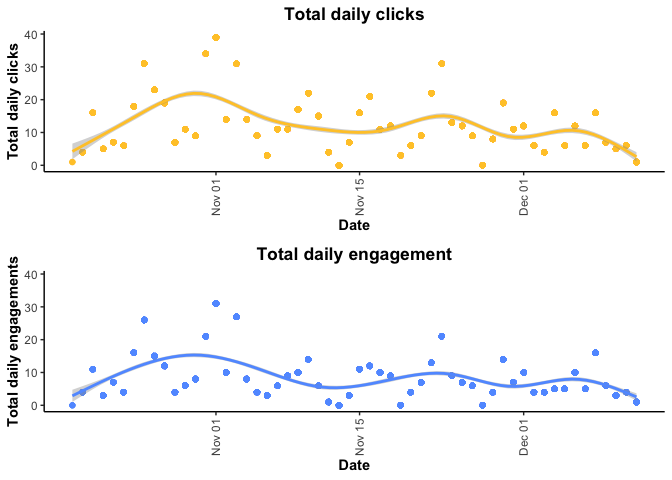
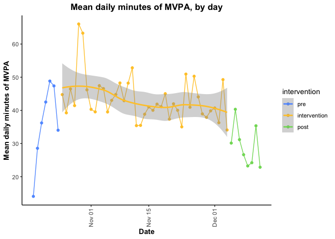
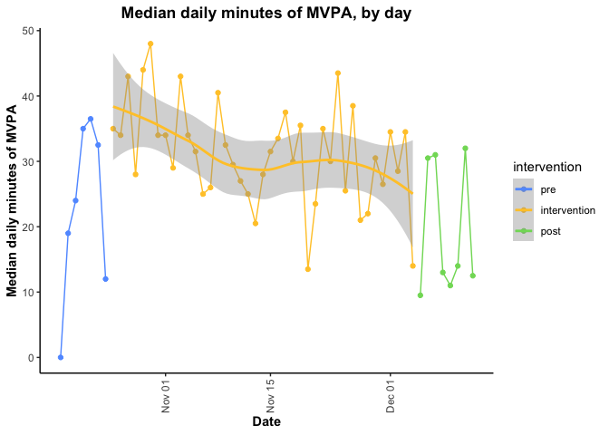

# Fitbit analysis

This script contains preliminary figures and data analysis for Fitbit data.


```r
daily <- read_csv("daily-TOP-CSEP.csv")
```

```
## Rows: 4168 Columns: 56
```

```
## ── Column specification ────────────────────────────────────────────────────────
## Delimiter: ","
## chr  (20): Id, intervention, email, ever_engage, Gender, Ethnicity, Universi...
## dbl  (33): TotalCalories, SedentaryMinutes, LightlyActiveMinutes, FairlyActi...
## date  (3): date, pubdate, weekStart
```

```
## 
## ℹ Use `spec()` to retrieve the full column specification for this data.
## ℹ Specify the column types or set `show_col_types = FALSE` to quiet this message.
```

Create person-day-level and person-level datasets for plots. Currently, the "daily" dataframe has one row per person-day-article, so if someone engages with two different articles, they have two rows in the dataframe. I want a maximum of one row per person per day for data exploration. 

```r
  dailyForPlots<-daily[!is.na(daily$totalMVPA),] %>% select(-title,-intervention_content,-featured_content,-pubdate,-weekofpublish,
                                                            -type,-click,-engage)
  dailyForPlots<-distinct(dailyForPlots)
  person<-daily %>% ungroup() %>% select(Id,ever_engage,meanDailyClick,meanDailyEngage,meanDailyMVPA,medianDailyMVPA) %>% distinct
  personPeriod<-daily %>% ungroup() %>% select(Id,ever_engage,intervention,meanDailyClickPeriod,meanDailyEngagePeriod,meanDailyMVPAPeriod,medianDailyMVPAPeriod) %>% distinct
```

## Engagement and clicks:

### Total clicks and engagement per day (summed across all participants)

#### Total engagements per day, by date
Total clicks and engagements, when summed across participants, appear somewhat cyclical, though the value and the amplitude both appear to diminish over time.

```
## `geom_smooth()` using method = 'gam' and formula 'y ~ s(x, bs = "cs")'
## `geom_smooth()` using method = 'gam' and formula 'y ~ s(x, bs = "cs")'
```

<!-- -->
<!-- #### Mean total engagements and clicks per weekday and intervention period -->
<!-- Mean total clicks and engagement, calculated as the sum of clicks/engagement for a given weekday in each of the pre-intervention, intervention and post-intervention periods for all participants, divided by the number of dates reflected in the calculation. This is to make the three periods comparable, even though the pre- and post- periods are only ~7 days each.  -->

### Clicks and engagement per participant-day

#### Distribution of clicks and engagement per participant and day
The vast majority of participant-days had 0 clicks and 0 engagement. 
<!-- -->
#### Number of clicks and engagement per participant and day over time
It is hard to make out any interesting patterns because there are so many participant-days with 0 engagement and/or clicks (as observed above)
<!-- -->

#### Mean daily clicks and engagement over time
It is easier to see trends in daily clicks and engagement over time using mean clicks and engagement per day (calculated by taking the mean of both countClick (count of clicks per person per day) and countEngage (count of engagement per person per day) across all participants for each day in the study period. Please note, we cannot use median, as the median clicks and median engagement is 0 everyday. 

```
## [1] TRUE
```

```
## [1] TRUE
```

```
## `geom_smooth()` using method = 'loess' and formula 'y ~ x'
## `geom_smooth()` using method = 'loess' and formula 'y ~ x'
```

<!-- -->

<!-- #### Clicks and engagement over time, by intervention period -- Excluding for now -->


#### Clicks and engagement by weekday in the pre, intervention and post intervention period
I am interested in assessing if daily clicks and/or engagement (at the participant level) varies by day of the week. It looks like clicks and engagement are higher during the work week, particularly during the intervention period, but it is difficult to tell because there are also more Mondays, Tuesday, etc. during this period (since it is much longer). 
<!-- -->

#### Mean clicks and engagement, by weekday and period
Mean clicks and engagement is calculated by taking the mean daily click and/or engagement count across all participants, separately for each weekday, in each of the pre-intervention, intervention and post-intervention periods. It appears that the mean clicks and mean engagement by day of the week differ between the pre-intervention, intervention and post-intervention periods, but trends look similar for both clicks and engagements. 
<!-- -->

## MVPA

#### Distribution/frequency of MVPA - with and without including 0s
First, lets assess the distribution of MVPA across participant-days. Similar to the engagement metrics, minutes of MVPA is 0 on the majority of participant days. It is easier to see the distribution if you exclude participant-days with 0 minutes if MVPA (right). 

```
##    Min. 1st Qu.  Median    Mean 3rd Qu.    Max. 
##    0.00    0.00   29.00   40.42   58.00  498.00
```

<!-- -->

### Plot of minutes of MVPA per day over time -- overall and comparing engagers and non-engagers
Next, lets assess how daily MVPA varies over time. There is no obvious trend over time, though there is a slight bow to the loess line that appears to correspond (roughly) to the intervention period. 

```
## `geom_smooth()` using method = 'gam' and formula 'y ~ s(x, bs = "cs")'
```

<!-- -->

Interestingly, this "bowing" of the loess curve appears to be driven by participants that engaged with the app content (at least once); a light downward trend is observed among non-engagers

```
## `geom_smooth()` using method = 'gam' and formula 'y ~ s(x, bs = "cs")'
```

<!-- -->

#### Minutes of MVPA per day and participant - Queen's vs. UBC
Overall, MVPA is slightly higher at Queens; MVPA is lower at UBC and dips slightly during the intervention period. 

```
## `geom_smooth()` using method = 'gam' and formula 'y ~ s(x, bs = "cs")'
```

<!-- -->

The relationship between MVPA and campus also differs when you stratify by engagers and non-engagers. Among engagers, participant's at Queen's were more active, and there appears to be a slightly increase in MVPA during the intervention period (as seen above), while engagers at UBC exhibited a dip in daily MVPA during the middle of the intervention period (left panel). Converely, non-engagers at UBC were more active than non-engagers at Queen's (right), though daily MVPA remained largely stable at both campuses over time. 

```
## `geom_smooth()` using method = 'gam' and formula 'y ~ s(x, bs = "cs")'
```

<!-- -->

#### Minutes of MVPA per day - Monday and Wednesday vs. other days of the week - overall and for engagers vs. non-engagers
Intervention content was released on Mondays and Wednesdays. The following plot would suggest no major difference in daily MVPA on Monday/Wednesday vs. other days of the week. 

```
## `geom_smooth()` using method = 'gam' and formula 'y ~ s(x, bs = "cs")'
```

<!-- -->

It doesn't look like Mondays/Wednesdays have higher MVPA for either group (again, we see the non-engagers MVPA level remained more stable over time compared to engagers)

```
## `geom_smooth()` using method = 'gam' and formula 'y ~ s(x, bs = "cs")'
```

<!-- -->

#### Trend: Minutes of MVPA per day in the pre-intervention, intervention and post-intervention period
It appears that daily MVPA "ramped-up" during the pre-intervention period and was sustained throughout the intervention period. 

```
## `geom_smooth()` using method = 'loess' and formula 'y ~ x'
```

```
## `geom_smooth()` using method = 'gam' and formula 'y ~ s(x, bs = "cs")'
```

```
## `geom_smooth()` using method = 'loess' and formula 'y ~ x'
```

<!-- -->

We see a similar trend among the non-engagers; however, they appear to have ramped up to a slightly lower level of daily MVPA. This may suggest that at least part of the intervention effect is the fitbit itself, since even non-engagers saw increases in MVPA (albeit lower), and these increases were observed before the start of the intervention period. 

```
## `geom_smooth()` using method = 'loess' and formula 'y ~ x'
```

```
## `geom_smooth()` using method = 'gam' and formula 'y ~ s(x, bs = "cs")'
```

```
## `geom_smooth()` using method = 'loess' and formula 'y ~ x'
```

<!-- -->

#### Daily minutes of MVPA, faceted by week number
Another way to visualize changes over time
<!-- -->

#### Mean and median daily MVPA, by date
Mean daily MVPA per day. Trend looks as described previously; daily MVPA ramps up during the pre-intervention period and remains largely stable throughput the intervention period (decreases slightly)

```
## `geom_smooth()` using method = 'loess' and formula 'y ~ x'
```

<!-- -->

Similar trends are observed among engagers and non-engagers; however, mean MVPA for non-engagers are more impacted by outlying values, since there were so few non-engagers (n=7). 

```
## `geom_smooth()` using method = 'loess' and formula 'y ~ x'
```

<!-- -->

Repeat the above using median instead of mean, acknowledging that there are some extreme outlier (~500 minutes of MVPA per day). Using median, we see more of the downward trend over time. There does seem to be evidence that daily MVPA exhibits a cyclical trend as well. 

Median MVPA per day. Similar trend, through the downward trajectory appears more noticable

```
## `geom_smooth()` using method = 'loess' and formula 'y ~ x'
```

<!-- -->

Daily median MVPA looks to ramp up to the same median daily MVPA by the end of the pre-intervention period, and start the intervention period at approximately the same level of daily MVPA. However, the non-engagers exhibit a more dramatic decrease throughput the intervention period, and end at a lower median MVPA at the end of the intervention period/into the post-period. 

```
## `geom_smooth()` using method = 'loess' and formula 'y ~ x'
```

<!-- -->

#### Mean daily MVPA, by weekday and intervention period
Trends in the pre- and post- periods must be interpreted with caution, as there is only 1 (or 2) dates contributing to the estimates for each weekday in these two periods. As such, both are ~ the trend over time (with the exception of Sunday in the post-period, which is based on two days of data)
<!-- -->

There is a slightly different trend in mean daily MVPA among engagers and non-engagers (during the intervention period in particular). Plot is not working when I knit the file so I will exclude for now.
<!-- -->

## Models

### Exploratory: Linear regression

#### (a) only independent variable is intervention period

Compared to the pre-intervention period, daily MVPA was significantly higher in the intervention period and significantly lower in the post-intervention period

```r
dailyForPlots <- dailyForPlots %>% 
  mutate(intervention=factor(intervention)) %>% 
  mutate(intervention=fct_relevel(intervention,c("pre","intervention","post"))) %>%
 arrange(intervention)

  linearInt<-lm(totalMVPA~intervention,data=dailyForPlots)
  tab_model(linearInt)
```

<table style="border-collapse:collapse; border:none;">
<tr>
<th style="border-top: double; text-align:center; font-style:normal; font-weight:bold; padding:0.2cm;  text-align:left; ">&nbsp;</th>
<th colspan="3" style="border-top: double; text-align:center; font-style:normal; font-weight:bold; padding:0.2cm; ">total MVPA</th>
</tr>
<tr>
<td style=" text-align:center; border-bottom:1px solid; font-style:italic; font-weight:normal;  text-align:left; ">Predictors</td>
<td style=" text-align:center; border-bottom:1px solid; font-style:italic; font-weight:normal;  ">Estimates</td>
<td style=" text-align:center; border-bottom:1px solid; font-style:italic; font-weight:normal;  ">CI</td>
<td style=" text-align:center; border-bottom:1px solid; font-style:italic; font-weight:normal;  ">p</td>
</tr>
<tr>
<td style=" padding:0.2cm; text-align:left; vertical-align:top; text-align:left; ">(Intercept)</td>
<td style=" padding:0.2cm; text-align:left; vertical-align:top; text-align:center;  ">36.18</td>
<td style=" padding:0.2cm; text-align:left; vertical-align:top; text-align:center;  ">32.04&nbsp;&ndash;&nbsp;40.31</td>
<td style=" padding:0.2cm; text-align:left; vertical-align:top; text-align:center;  "><strong>&lt;0.001</strong></td>
</tr>
<tr>
<td style=" padding:0.2cm; text-align:left; vertical-align:top; text-align:left; ">intervention<br>[intervention]</td>
<td style=" padding:0.2cm; text-align:left; vertical-align:top; text-align:center;  ">7.16</td>
<td style=" padding:0.2cm; text-align:left; vertical-align:top; text-align:center;  ">2.69&nbsp;&ndash;&nbsp;11.64</td>
<td style=" padding:0.2cm; text-align:left; vertical-align:top; text-align:center;  "><strong>0.002</strong></td>
</tr>
<tr>
<td style=" padding:0.2cm; text-align:left; vertical-align:top; text-align:left; ">intervention [post]</td>
<td style=" padding:0.2cm; text-align:left; vertical-align:top; text-align:center;  ">&#45;6.93</td>
<td style=" padding:0.2cm; text-align:left; vertical-align:top; text-align:center;  ">&#45;12.58&nbsp;&ndash;&nbsp;-1.29</td>
<td style=" padding:0.2cm; text-align:left; vertical-align:top; text-align:center;  "><strong>0.016</strong></td>
</tr>
<tr>
<td style=" padding:0.2cm; text-align:left; vertical-align:top; text-align:left; padding-top:0.1cm; padding-bottom:0.1cm; border-top:1px solid;">Observations</td>
<td style=" padding:0.2cm; text-align:left; vertical-align:top; padding-top:0.1cm; padding-bottom:0.1cm; text-align:left; border-top:1px solid;" colspan="3">3782</td>
</tr>
<tr>
<td style=" padding:0.2cm; text-align:left; vertical-align:top; text-align:left; padding-top:0.1cm; padding-bottom:0.1cm;">R<sup>2</sup> / R<sup>2</sup> adjusted</td>
<td style=" padding:0.2cm; text-align:left; vertical-align:top; padding-top:0.1cm; padding-bottom:0.1cm; text-align:left;" colspan="3">0.013 / 0.012</td>
</tr>

</table>

#### (b) only independent variable is a binary indicator for Mon/Wed

MVPA was not significantly different on Monday and Wednesday compared to other days of the week (without accounting for any other variables, including intervention period and/or repeated measures within participants)

```r
  linearMW<-lm(totalMVPA~mon_wed,data=dailyForPlots)
  summary(linearMW)
```

```
## 
## Call:
## lm(formula = totalMVPA ~ mon_wed, data = dailyForPlots)
## 
## Residuals:
##    Min     1Q Median     3Q    Max 
## -40.43 -40.41 -11.43  17.59 457.59 
## 
## Coefficients:
##             Estimate Std. Error t value Pr(>|t|)    
## (Intercept) 40.42936    0.88275  45.800   <2e-16 ***
## mon_wedyes  -0.01563    1.65343  -0.009    0.992    
## ---
## Signif. codes:  0 '***' 0.001 '**' 0.01 '*' 0.05 '.' 0.1 ' ' 1
## 
## Residual standard error: 45.9 on 3780 degrees of freedom
## Multiple R-squared:  2.365e-08,	Adjusted R-squared:  -0.0002645 
## F-statistic: 8.941e-05 on 1 and 3780 DF,  p-value: 0.9925
```

#### (c) only independent variable is whether the participant ever engaged (clicked or engaged) with app content

Participants who never enagaged with app content recorded an average of 13 minutes less MVPA per day (statistically significant) compared to those who engaged at least once (note: only a small number of participants (n=7) never engaged)

```r
  linearEverEngage<-lm(totalMVPA~ever_engage,data=dailyForPlots)
  tab_model(linearEverEngage)
```

<table style="border-collapse:collapse; border:none;">
<tr>
<th style="border-top: double; text-align:center; font-style:normal; font-weight:bold; padding:0.2cm;  text-align:left; ">&nbsp;</th>
<th colspan="3" style="border-top: double; text-align:center; font-style:normal; font-weight:bold; padding:0.2cm; ">total MVPA</th>
</tr>
<tr>
<td style=" text-align:center; border-bottom:1px solid; font-style:italic; font-weight:normal;  text-align:left; ">Predictors</td>
<td style=" text-align:center; border-bottom:1px solid; font-style:italic; font-weight:normal;  ">Estimates</td>
<td style=" text-align:center; border-bottom:1px solid; font-style:italic; font-weight:normal;  ">CI</td>
<td style=" text-align:center; border-bottom:1px solid; font-style:italic; font-weight:normal;  ">p</td>
</tr>
<tr>
<td style=" padding:0.2cm; text-align:left; vertical-align:top; text-align:left; ">(Intercept)</td>
<td style=" padding:0.2cm; text-align:left; vertical-align:top; text-align:center;  ">41.60</td>
<td style=" padding:0.2cm; text-align:left; vertical-align:top; text-align:center;  ">40.06&nbsp;&ndash;&nbsp;43.13</td>
<td style=" padding:0.2cm; text-align:left; vertical-align:top; text-align:center;  "><strong>&lt;0.001</strong></td>
</tr>
<tr>
<td style=" padding:0.2cm; text-align:left; vertical-align:top; text-align:left; ">ever engage [Never<br>engaged or clicked]</td>
<td style=" padding:0.2cm; text-align:left; vertical-align:top; text-align:center;  ">&#45;11.73</td>
<td style=" padding:0.2cm; text-align:left; vertical-align:top; text-align:center;  ">&#45;16.59&nbsp;&ndash;&nbsp;-6.86</td>
<td style=" padding:0.2cm; text-align:left; vertical-align:top; text-align:center;  "><strong>&lt;0.001</strong></td>
</tr>
<tr>
<td style=" padding:0.2cm; text-align:left; vertical-align:top; text-align:left; padding-top:0.1cm; padding-bottom:0.1cm; border-top:1px solid;">Observations</td>
<td style=" padding:0.2cm; text-align:left; vertical-align:top; padding-top:0.1cm; padding-bottom:0.1cm; text-align:left; border-top:1px solid;" colspan="3">3782</td>
</tr>
<tr>
<td style=" padding:0.2cm; text-align:left; vertical-align:top; text-align:left; padding-top:0.1cm; padding-bottom:0.1cm;">R<sup>2</sup> / R<sup>2</sup> adjusted</td>
<td style=" padding:0.2cm; text-align:left; vertical-align:top; padding-top:0.1cm; padding-bottom:0.1cm; text-align:left;" colspan="3">0.006 / 0.006</td>
</tr>

</table>

#### (d) only independent variable is countClicks

Every one click was associated with a 2 minute increase in MVPA on that date (statistically signiciant)

```r
  linearCountClick<-lm(totalMVPA~countClick,data=dailyForPlots)
  tab_model(linearCountClick)
```

<table style="border-collapse:collapse; border:none;">
<tr>
<th style="border-top: double; text-align:center; font-style:normal; font-weight:bold; padding:0.2cm;  text-align:left; ">&nbsp;</th>
<th colspan="3" style="border-top: double; text-align:center; font-style:normal; font-weight:bold; padding:0.2cm; ">total MVPA</th>
</tr>
<tr>
<td style=" text-align:center; border-bottom:1px solid; font-style:italic; font-weight:normal;  text-align:left; ">Predictors</td>
<td style=" text-align:center; border-bottom:1px solid; font-style:italic; font-weight:normal;  ">Estimates</td>
<td style=" text-align:center; border-bottom:1px solid; font-style:italic; font-weight:normal;  ">CI</td>
<td style=" text-align:center; border-bottom:1px solid; font-style:italic; font-weight:normal;  ">p</td>
</tr>
<tr>
<td style=" padding:0.2cm; text-align:left; vertical-align:top; text-align:left; ">(Intercept)</td>
<td style=" padding:0.2cm; text-align:left; vertical-align:top; text-align:center;  ">40.00</td>
<td style=" padding:0.2cm; text-align:left; vertical-align:top; text-align:center;  ">38.50&nbsp;&ndash;&nbsp;41.51</td>
<td style=" padding:0.2cm; text-align:left; vertical-align:top; text-align:center;  "><strong>&lt;0.001</strong></td>
</tr>
<tr>
<td style=" padding:0.2cm; text-align:left; vertical-align:top; text-align:left; ">countClick</td>
<td style=" padding:0.2cm; text-align:left; vertical-align:top; text-align:center;  ">2.06</td>
<td style=" padding:0.2cm; text-align:left; vertical-align:top; text-align:center;  ">0.37&nbsp;&ndash;&nbsp;3.75</td>
<td style=" padding:0.2cm; text-align:left; vertical-align:top; text-align:center;  "><strong>0.017</strong></td>
</tr>
<tr>
<td style=" padding:0.2cm; text-align:left; vertical-align:top; text-align:left; padding-top:0.1cm; padding-bottom:0.1cm; border-top:1px solid;">Observations</td>
<td style=" padding:0.2cm; text-align:left; vertical-align:top; padding-top:0.1cm; padding-bottom:0.1cm; text-align:left; border-top:1px solid;" colspan="3">3782</td>
</tr>
<tr>
<td style=" padding:0.2cm; text-align:left; vertical-align:top; text-align:left; padding-top:0.1cm; padding-bottom:0.1cm;">R<sup>2</sup> / R<sup>2</sup> adjusted</td>
<td style=" padding:0.2cm; text-align:left; vertical-align:top; padding-top:0.1cm; padding-bottom:0.1cm; text-align:left;" colspan="3">0.002 / 0.001</td>
</tr>

</table>

#### (e) only independent variable is countEngage

Every one engagement was associated with a <1.5 minute increase in MVPA on that date; however, the relationship was not statistically significant

```r
  linearCountEngage<-lm(totalMVPA~countEngage,data=dailyForPlots)
  tab_model(linearCountEngage)
```

<table style="border-collapse:collapse; border:none;">
<tr>
<th style="border-top: double; text-align:center; font-style:normal; font-weight:bold; padding:0.2cm;  text-align:left; ">&nbsp;</th>
<th colspan="3" style="border-top: double; text-align:center; font-style:normal; font-weight:bold; padding:0.2cm; ">total MVPA</th>
</tr>
<tr>
<td style=" text-align:center; border-bottom:1px solid; font-style:italic; font-weight:normal;  text-align:left; ">Predictors</td>
<td style=" text-align:center; border-bottom:1px solid; font-style:italic; font-weight:normal;  ">Estimates</td>
<td style=" text-align:center; border-bottom:1px solid; font-style:italic; font-weight:normal;  ">CI</td>
<td style=" text-align:center; border-bottom:1px solid; font-style:italic; font-weight:normal;  ">p</td>
</tr>
<tr>
<td style=" padding:0.2cm; text-align:left; vertical-align:top; text-align:left; ">(Intercept)</td>
<td style=" padding:0.2cm; text-align:left; vertical-align:top; text-align:center;  ">40.24</td>
<td style=" padding:0.2cm; text-align:left; vertical-align:top; text-align:center;  ">38.75&nbsp;&ndash;&nbsp;41.74</td>
<td style=" padding:0.2cm; text-align:left; vertical-align:top; text-align:center;  "><strong>&lt;0.001</strong></td>
</tr>
<tr>
<td style=" padding:0.2cm; text-align:left; vertical-align:top; text-align:left; ">countEngage</td>
<td style=" padding:0.2cm; text-align:left; vertical-align:top; text-align:center;  ">1.30</td>
<td style=" padding:0.2cm; text-align:left; vertical-align:top; text-align:center;  ">&#45;0.97&nbsp;&ndash;&nbsp;3.56</td>
<td style=" padding:0.2cm; text-align:left; vertical-align:top; text-align:center;  ">0.262</td>
</tr>
<tr>
<td style=" padding:0.2cm; text-align:left; vertical-align:top; text-align:left; padding-top:0.1cm; padding-bottom:0.1cm; border-top:1px solid;">Observations</td>
<td style=" padding:0.2cm; text-align:left; vertical-align:top; padding-top:0.1cm; padding-bottom:0.1cm; text-align:left; border-top:1px solid;" colspan="3">3782</td>
</tr>
<tr>
<td style=" padding:0.2cm; text-align:left; vertical-align:top; text-align:left; padding-top:0.1cm; padding-bottom:0.1cm;">R<sup>2</sup> / R<sup>2</sup> adjusted</td>
<td style=" padding:0.2cm; text-align:left; vertical-align:top; padding-top:0.1cm; padding-bottom:0.1cm; text-align:left;" colspan="3">0.000 / 0.000</td>
</tr>

</table>

#### (f) intervention, countClicks, engagers, and univeristy

Every one click was associated with a 1.7 minute increase in MVPA on that date (statistically signiciant). There is also a significant intervention effect of 6.4 more daily minutes of MVPA on average over the intervention period compared to the pre intervention period. There is a interaction between the intervention and university. Both universities increased activity but compared to Queens UBC had less activity overall, but the intervention had a bigger effect. Last, people who never engaged had significantly less activity. 

We can't do the interaction between ever_engage and intervention while including clicks in the model because those variables are collinear. Need to think about stratifying the model by engagers probably. 


```r
  linearClicksInt<-lm(totalMVPA ~ countClick + intervention + countClick + ever_engage + intervention*University, data=dailyForPlots)
  tab_model(linearClicksInt)
```

<table style="border-collapse:collapse; border:none;">
<tr>
<th style="border-top: double; text-align:center; font-style:normal; font-weight:bold; padding:0.2cm;  text-align:left; ">&nbsp;</th>
<th colspan="3" style="border-top: double; text-align:center; font-style:normal; font-weight:bold; padding:0.2cm; ">total MVPA</th>
</tr>
<tr>
<td style=" text-align:center; border-bottom:1px solid; font-style:italic; font-weight:normal;  text-align:left; ">Predictors</td>
<td style=" text-align:center; border-bottom:1px solid; font-style:italic; font-weight:normal;  ">Estimates</td>
<td style=" text-align:center; border-bottom:1px solid; font-style:italic; font-weight:normal;  ">CI</td>
<td style=" text-align:center; border-bottom:1px solid; font-style:italic; font-weight:normal;  ">p</td>
</tr>
<tr>
<td style=" padding:0.2cm; text-align:left; vertical-align:top; text-align:left; ">(Intercept)</td>
<td style=" padding:0.2cm; text-align:left; vertical-align:top; text-align:center;  ">43.02</td>
<td style=" padding:0.2cm; text-align:left; vertical-align:top; text-align:center;  ">37.24&nbsp;&ndash;&nbsp;48.80</td>
<td style=" padding:0.2cm; text-align:left; vertical-align:top; text-align:center;  "><strong>&lt;0.001</strong></td>
</tr>
<tr>
<td style=" padding:0.2cm; text-align:left; vertical-align:top; text-align:left; ">countClick</td>
<td style=" padding:0.2cm; text-align:left; vertical-align:top; text-align:center;  ">1.32</td>
<td style=" padding:0.2cm; text-align:left; vertical-align:top; text-align:center;  ">&#45;0.36&nbsp;&ndash;&nbsp;3.00</td>
<td style=" padding:0.2cm; text-align:left; vertical-align:top; text-align:center;  ">0.122</td>
</tr>
<tr>
<td style=" padding:0.2cm; text-align:left; vertical-align:top; text-align:left; ">intervention<br>[intervention]</td>
<td style=" padding:0.2cm; text-align:left; vertical-align:top; text-align:center;  ">6.28</td>
<td style=" padding:0.2cm; text-align:left; vertical-align:top; text-align:center;  ">0.09&nbsp;&ndash;&nbsp;12.47</td>
<td style=" padding:0.2cm; text-align:left; vertical-align:top; text-align:center;  "><strong>0.047</strong></td>
</tr>
<tr>
<td style=" padding:0.2cm; text-align:left; vertical-align:top; text-align:left; ">intervention [post]</td>
<td style=" padding:0.2cm; text-align:left; vertical-align:top; text-align:center;  ">&#45;10.96</td>
<td style=" padding:0.2cm; text-align:left; vertical-align:top; text-align:center;  ">&#45;18.77&nbsp;&ndash;&nbsp;-3.15</td>
<td style=" padding:0.2cm; text-align:left; vertical-align:top; text-align:center;  "><strong>0.006</strong></td>
</tr>
<tr>
<td style=" padding:0.2cm; text-align:left; vertical-align:top; text-align:left; ">ever engage [Never<br>engaged or clicked]</td>
<td style=" padding:0.2cm; text-align:left; vertical-align:top; text-align:center;  ">&#45;13.28</td>
<td style=" padding:0.2cm; text-align:left; vertical-align:top; text-align:center;  ">&#45;18.15&nbsp;&ndash;&nbsp;-8.42</td>
<td style=" padding:0.2cm; text-align:left; vertical-align:top; text-align:center;  "><strong>&lt;0.001</strong></td>
</tr>
<tr>
<td style=" padding:0.2cm; text-align:left; vertical-align:top; text-align:left; ">University [UBC]</td>
<td style=" padding:0.2cm; text-align:left; vertical-align:top; text-align:center;  ">&#45;11.83</td>
<td style=" padding:0.2cm; text-align:left; vertical-align:top; text-align:center;  ">&#45;20.06&nbsp;&ndash;&nbsp;-3.61</td>
<td style=" padding:0.2cm; text-align:left; vertical-align:top; text-align:center;  "><strong>0.005</strong></td>
</tr>
<tr>
<td style=" padding:0.2cm; text-align:left; vertical-align:top; text-align:left; ">intervention<br>[intervention] *<br>University [UBC]</td>
<td style=" padding:0.2cm; text-align:left; vertical-align:top; text-align:center;  ">1.68</td>
<td style=" padding:0.2cm; text-align:left; vertical-align:top; text-align:center;  ">&#45;7.20&nbsp;&ndash;&nbsp;10.56</td>
<td style=" padding:0.2cm; text-align:left; vertical-align:top; text-align:center;  ">0.711</td>
</tr>
<tr>
<td style=" padding:0.2cm; text-align:left; vertical-align:top; text-align:left; ">intervention [post] *<br>University [UBC]</td>
<td style=" padding:0.2cm; text-align:left; vertical-align:top; text-align:center;  ">8.54</td>
<td style=" padding:0.2cm; text-align:left; vertical-align:top; text-align:center;  ">&#45;2.66&nbsp;&ndash;&nbsp;19.73</td>
<td style=" padding:0.2cm; text-align:left; vertical-align:top; text-align:center;  ">0.135</td>
</tr>
<tr>
<td style=" padding:0.2cm; text-align:left; vertical-align:top; text-align:left; padding-top:0.1cm; padding-bottom:0.1cm; border-top:1px solid;">Observations</td>
<td style=" padding:0.2cm; text-align:left; vertical-align:top; padding-top:0.1cm; padding-bottom:0.1cm; text-align:left; border-top:1px solid;" colspan="3">3782</td>
</tr>
<tr>
<td style=" padding:0.2cm; text-align:left; vertical-align:top; text-align:left; padding-top:0.1cm; padding-bottom:0.1cm;">R<sup>2</sup> / R<sup>2</sup> adjusted</td>
<td style=" padding:0.2cm; text-align:left; vertical-align:top; padding-top:0.1cm; padding-bottom:0.1cm; text-align:left;" colspan="3">0.030 / 0.028</td>
</tr>

</table>
