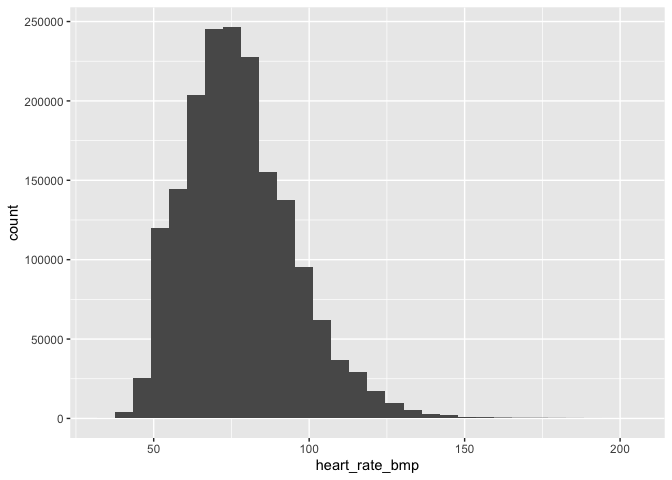
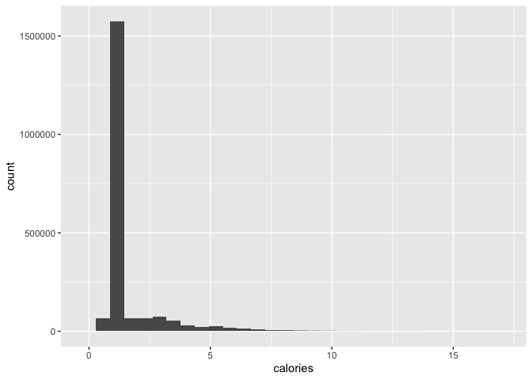
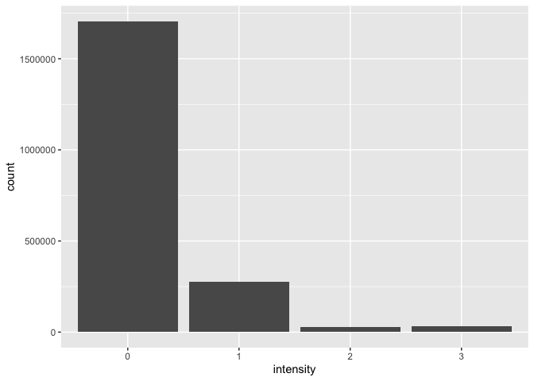
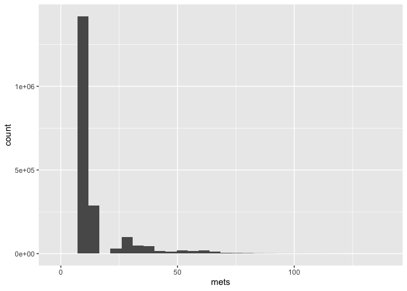
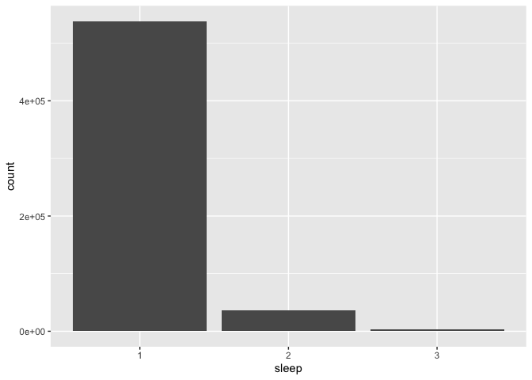
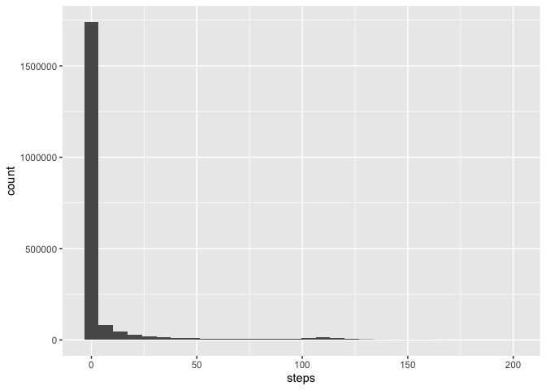
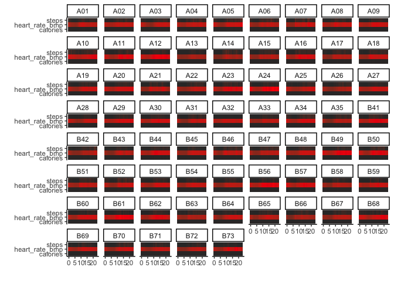
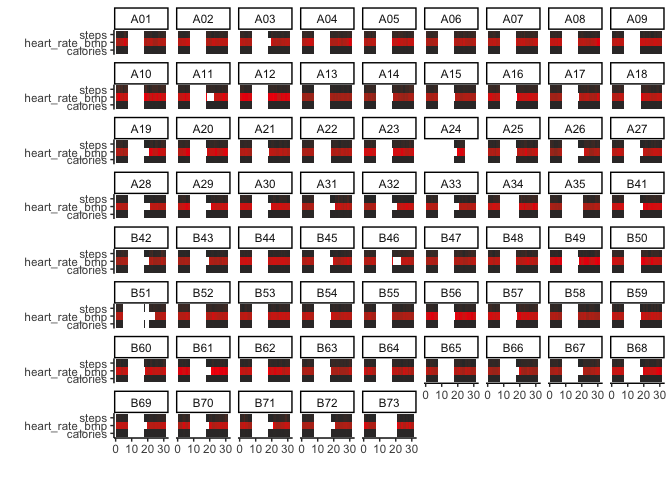

# 24 Hour Movement Guidelines Data Analysis

## Required packages


# Data Description

There are a number of data types and frequencies. Below is a summary: 

1. Minute Frequency Data
    - heartrate_1min_merged
    - minuteCaloriesNarrow_merged
    - minuteIntensitiesNarrow_merged
    - minuteMETsNarrow_merged
    - minuteSleep_merged 
    - minuteStepsNarrow_merged
    
2. Daily Frequency Data
    - dailyCalories_merged
    - dailyIntensities_merged
    - dailySteps_merged
    - sleepDay_merged
    - heartRateZones_merged
        - Daily time in 4 heart rate zones (Out of Range, Fat Burn, Cardio, Peak)

3. Other Frequency data
    - activitylogs_merged 
        - An activity is recorded whenever the user inputs it
    - battery_merged
        - Battery level is recorded whenever there is a sync event
    - syncEvents_merged
        - All Sync events
    - 30secondSleepStages_merged
        - Sleep stages every 30 seconds. 

# To do

1. Combine the minute level data
2. Combine day level data
3. Aggregate minute level data to the day and confirm it makes sense with day level
4. Join battery and sync events to the minute level data
5. Aggregate everything up to the day level

## 1. Combine the minute level data

### Heart rate per minute

```r
hr_data <- read_csv("Data/heartrate_1min_merged.csv")
```

```
## Rows: 1773649 Columns: 3
```

```
## ── Column specification ────────────────────────────────────────────────────────
## Delimiter: ","
## chr (2): Id, Time
## dbl (1): Value
```

```
## 
## ℹ Use `spec()` to retrieve the full column specification for this data.
## ℹ Specify the column types or set `show_col_types = FALSE` to quiet this message.
```

```r
hr_data$time <- mdy_hms(hr_data$Time)
hr_data$Time <- NULL
colnames(hr_data) <- c("id", "heart_rate_bmp", "time")
summary(hr_data$heart_rate_bmp)
```

```
##    Min. 1st Qu.  Median    Mean 3rd Qu.    Max. 
##   36.00   65.00   76.00   77.73   88.00  204.00
```

```r
ggplot(hr_data, aes(heart_rate_bmp)) + 
        geom_histogram() 
```

```
## `stat_bin()` using `bins = 30`. Pick better value with `binwidth`.
```

<!-- -->

### Calories per minute

```r
ee_data <- read_csv("Data/minuteCaloriesNarrow_merged.csv")
```

```
## Rows: 2039924 Columns: 3
```

```
## ── Column specification ────────────────────────────────────────────────────────
## Delimiter: ","
## chr (2): Id, ActivityMinute
## dbl (1): Calories
```

```
## 
## ℹ Use `spec()` to retrieve the full column specification for this data.
## ℹ Specify the column types or set `show_col_types = FALSE` to quiet this message.
```

```r
ee_data$time <- mdy_hms(ee_data$ActivityMinute)
ee_data$ActivityMinute <- NULL
colnames(ee_data) <- c("id", "calories", "time")
summary(ee_data$calories)
```

```
##    Min. 1st Qu.  Median    Mean 3rd Qu.    Max. 
##  0.0000  0.9598  1.0586  1.5370  1.2920 16.8428
```

```r
ggplot(ee_data, aes(calories)) + 
        geom_histogram() 
```

```
## `stat_bin()` using `bins = 30`. Pick better value with `binwidth`.
```

<!-- -->

There is a fixed calories per minute depending on age, gender, height, and weight. We can see this represented in the data.

### Intensity per minute

```r
intense_data <- read_csv("Data/minuteIntensitiesNarrow_merged.csv")
```

```
## Rows: 2039924 Columns: 3
```

```
## ── Column specification ────────────────────────────────────────────────────────
## Delimiter: ","
## chr (2): Id, ActivityMinute
## dbl (1): Intensity
```

```
## 
## ℹ Use `spec()` to retrieve the full column specification for this data.
## ℹ Specify the column types or set `show_col_types = FALSE` to quiet this message.
```

```r
intense_data$time <- mdy_hms(intense_data$ActivityMinute)
intense_data$ActivityMinute <- NULL
colnames(intense_data) <- c("id", "intensity", "time")
intense_data$intensity <- as.factor(intense_data$intensity)
table(intense_data$intensity)
```

```
## 
##       0       1       2       3 
## 1705018  274378   28023   32505
```

```r
ggplot(intense_data, aes(intensity)) + 
        geom_bar() 
```

<!-- -->

This is a four category variable. Looks like it will match up with the heart rate zone data but not sure yet. 

### METS per minute

```r
met_data <- read_csv("Data/minuteMETsNarrow_merged.csv")
```

```
## Rows: 2039924 Columns: 3
```

```
## ── Column specification ────────────────────────────────────────────────────────
## Delimiter: ","
## chr (2): Id, ActivityMinute
## dbl (1): METs
```

```
## 
## ℹ Use `spec()` to retrieve the full column specification for this data.
## ℹ Specify the column types or set `show_col_types = FALSE` to quiet this message.
```

```r
met_data$time <- mdy_hms(met_data$ActivityMinute)
met_data$ActivityMinute <- NULL
colnames(met_data) <- c("id", "mets", "time")
summary(met_data$mets)
```

```
##    Min. 1st Qu.  Median    Mean 3rd Qu.    Max. 
##    0.00   10.00   10.00   15.31   13.00  137.00
```

```r
ggplot(met_data, aes(mets)) + 
        geom_histogram() 
```

```
## `stat_bin()` using `bins = 30`. Pick better value with `binwidth`.
```

<!-- -->

Interesting. Will need to look into how this is calculated. 10 METS as the median and 15 METS as the mean is not right. 

### Sleep per minute

```r
sleep_data <- read_csv("Data/minuteSleep_merged.csv")
```

```
## Rows: 578422 Columns: 4
```

```
## ── Column specification ────────────────────────────────────────────────────────
## Delimiter: ","
## chr (2): Id, date
## dbl (2): value, logId
```

```
## 
## ℹ Use `spec()` to retrieve the full column specification for this data.
## ℹ Specify the column types or set `show_col_types = FALSE` to quiet this message.
```

```r
sleep_data$time <- mdy_hms(sleep_data$date)
sleep_data$date <- NULL
colnames(sleep_data) <- c("id", "sleep", "log_id", "time")
sleep_data$sleep <- as.factor(sleep_data$sleep)
table(sleep_data$sleep)
```

```
## 
##      1      2      3 
## 538051  36612   3759
```

```r
ggplot(sleep_data, aes(sleep)) + 
        geom_bar() 
```

<!-- -->

This is a three category variable. There is a lot of missing here so I'm guessing that these represent sleep stages or something with a null value meaning not sleeping.

### Steps per minute

```r
step_data <- read_csv("Data/minuteStepsNarrow_merged.csv")
```

```
## Rows: 2039924 Columns: 3
```

```
## ── Column specification ────────────────────────────────────────────────────────
## Delimiter: ","
## chr (2): Id, ActivityMinute
## dbl (1): Steps
```

```
## 
## ℹ Use `spec()` to retrieve the full column specification for this data.
## ℹ Specify the column types or set `show_col_types = FALSE` to quiet this message.
```

```r
step_data$time <- mdy_hms(step_data$ActivityMinute)
step_data$ActivityMinute <- NULL
colnames(step_data) <- c("id", "steps", "time")
summary(step_data$steps)
```

```
##    Min. 1st Qu.  Median    Mean 3rd Qu.    Max. 
##   0.000   0.000   0.000   5.998   0.000 199.000
```

```r
ggplot(step_data, aes(steps)) + 
        geom_histogram() 
```

```
## `stat_bin()` using `bins = 30`. Pick better value with `binwidth`.
```

<!-- -->

## Joining the datasets


```r
ee_intense <- full_join(ee_data, intense_data, by = c("id", "time"))
ee_intense_met <- full_join(ee_intense, met_data, by = c("id", "time"))
ee_intense_met_step <- full_join(ee_intense_met, step_data, by = c("id", "time"))
ee_intense_met_step_hr <- full_join(ee_intense_met_step, hr_data, by = c("id", "time"))
data <- full_join(ee_intense_met_step_hr, sleep_data, by = c("id", "time"))

## Filter out coordinator data
data <- filter(data, id != "Study Coordinator QU")

### Create a location variable
data$location <- substr(data$id, 1, 1)

### Create an intervention 
data <- data %>%
              mutate(intervention = case_when(
                          time < "2021-10-25 00:00:00" ~ "pre",
                          time >= "2021-10-25 00:00:00" & time < "2021-12-05 00:00:00" ~ "intervention",
                          time > "2021-12-05 00:00:00" ~ "post"
                        ))
table(data$intervention)
```

```
## 
## intervention          pre 
##      1498466       751117
```

```r
rm(ee_data, ee_intense, ee_intense_met, ee_intense_met_step, ee_intense_met_step_hr, hr_data, intense_data, met_data, sleep_data, step_data)
```

## Quick descriptive stats


```r
data$day <- day(data$time)
data$hour <- hour(data$time)

hourly_summary <- data %>%
          group_by(id, hour) %>%
            get_summary_stats(calories, heart_rate_bmp, steps)

daily_summary <- data %>%
      group_by(id, day) %>%
        get_summary_stats(calories, heart_rate_bmp, steps)
```

## Heat Map over the study period per hour


```r
ggplot(hourly_summary, aes(x = hour, y = variable, fill = mean)) +
  geom_tile() + 
  facet_wrap(~ id) +
  scale_fill_gradient(low = "grey20", high = "red") +
  labs(x = "", y = "") +
  theme_classic() +
  theme(legend.position = "none") 
```

<!-- -->

## Heat Map over the study period per day


```r
ggplot(daily_summary, aes(x = day, y = variable, fill = mean)) +
  geom_tile() + 
  facet_wrap(~ id) +
  scale_fill_gradient(low = "grey20", high = "red") +
  labs(x = "", y = "") +
  theme_classic() +
  theme(legend.position = "none") 
```

<!-- -->

## 2. Combine day level data

